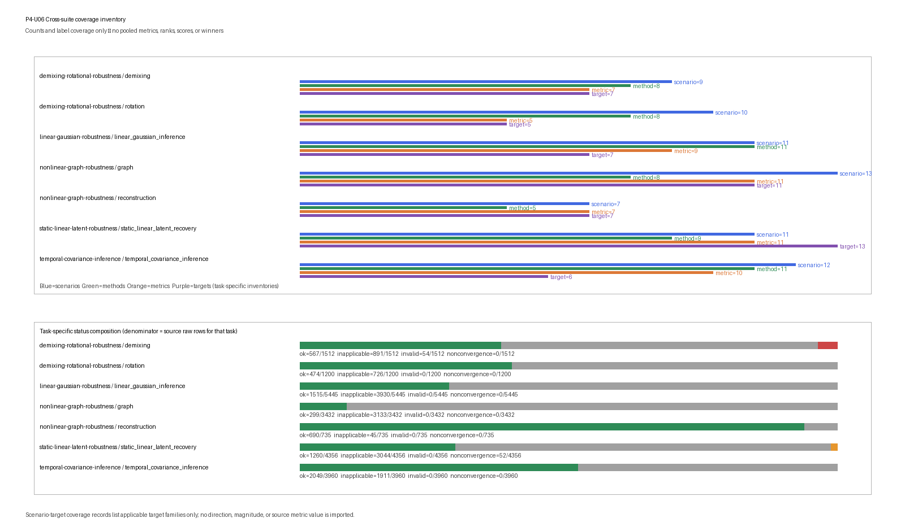

# Cross-Suite Robustness Synthesis

## Scientific question

P4-U06 asks a deliberately non-comparative question: **what task-specific
coverage, applicability/failure patterns, and scenario-to-applicable-target mappings
are present across the five stable Phase 4 synthetic Benchmark Objects?**

This object is an inventory and reconciliation layer. It introduces no new
generator, fitting procedure, parameter selection, inference, recovery,
scoring metric, replicate, or scientific result. It does not copy source metric
values into the synthesis artifacts. Unlike metrics are never normalized,
averaged, pooled, or converted into ranks. No method winner, universal winner,
mechanistic explanation, causal conclusion, or real-data claim is produced.

## Ground truth

There is no new synthetic ground truth at P4-U06. Ground truth remains defined
inside each stable source Benchmark Object and is not merged across tasks:

- scalar latent states and observations for linear-Gaussian inference;
- static rank-two common signal, loading and residual structure;
- temporal latent trajectories, observation layers and covariance priors;
- labelled demixing effects and declared rotational generators;
- curved reconstruction truth and finite graph/operator targets.

These truth objects have different mathematical types. Counting their declared
target families does not make them commensurate and does not create a common
performance target.

## Generation

P4-U06 performs **no data generation and no source-method rerun**. Its parsed
scientific inputs are only `manifest.json`, `results.csv`, and
`diagnostics.json` from each of the five stable Phase 4 source artifact trees.
The source `summary.png` is an **integrity-only attachment**: its presence, byte
count and declared hash are checked and recorded, but its pixels, labels and
plotted values are not parsed or used as scientific input. Before synthesis the
executable requires `maturity: L1`, `status: stable`, verifies the scientific
input hashes, checks the source status vocabulary and reconciles diagnostics
status counts against raw source rows.

The verified stable inputs are:

| Source Benchmark | Source rows | Parsed scientific inputs | Integrity-only attachment |
|---|---:|---|---|
| P4-U01 Linear-Gaussian Robustness | 5,445 | manifest/results/diagnostics | summary PNG |
| P4-U02 Static Linear Latent Recovery | 4,356 | manifest/results/diagnostics | summary PNG |
| P4-U03 Temporal Covariance and Inference | 3,960 | manifest/results/diagnostics | summary PNG |
| P4-U04 Demixing and Rotational Projection | 2,712 | manifest/results/diagnostics | summary PNG |
| P4-U05 Nonlinear Reconstruction and Graph Geometry | 4,167 | manifest/results/diagnostics | summary PNG |

Together these sources contain 20,640 raw source rows. That total is an
inventory count, not a pooled sample size or denominator for cross-task method
comparison. Source file digests and byte counts are frozen in the P4-U06
manifest so later source drift is machine-detectable.

## Scenario grid

The synthesis inventory contains seven task records and 73 declared scenario
records. It preserves source task boundaries rather than constructing a new
cross-suite grid.

| Task | Scenarios | Replicates | Methods | Metrics | Targets | Source rows |
|---|---:|---:|---:|---:|---:|---:|
| Linear-Gaussian inference | 11 | 5 | 11 | 9 | 7 | 5,445 |
| Static linear latent recovery | 11 | 4 | 9 | 11 | 13 | 4,356 |
| Temporal covariance and inference | 12 | 3 | 11 | 10 | 6 | 3,960 |
| Demixing | 9 | 3 | 8 | 7 | 7 | 1,512 |
| Rotation | 10 | 3 | 8 | 5 | 5 | 1,200 |
| Nonlinear reconstruction | 7 | 3 | 5 | 7 | 7 | 735 |
| Graph geometry/operator recovery | 13 | 3 | 8 | 11 | 11 | 3,432 |

The apparent equality of some counts is incidental. A metric count in one task
has no numerical or scientific equivalence to a metric count in another task.

## Negative controls and stress cases

The synthesis emits one `scenario_target_coverage` row for each of the 73
source scenarios. Each row inventories the source-declared stress class and the
**applicable target families** having at least one non-`inapplicable` source
row in that scenario. This is coverage metadata only. It does not estimate
sensitivity, effect magnitude, effect direction, robustness, significance or
causal response.

| Task | Declared stress classes retained |
|---|---|
| Linear-Gaussian inference | transition stability, noise ratio, sequence length, missing blocks, wrong parameters, reset-boundary failure, near-unit-root stress |
| Static linear latent recovery | sample size, signal/eigenvalue separation, heterogeneous or near-zero uniqueness, correlated residuals, high nuisance, outliers, preprocessing leakage, reference |
| Temporal covariance and inference | timescale separation, trial count, channel/time masks, changepoints, correlated residuals, Poisson misspecification, equal kernels, alignment jitter, informative missingness |
| Demixing | balanced reference, near-collinear subspaces, missing/unbalanced cells, label shuffle, pseudo-population, averaging mismatch, sample size |
| Rotation | clean rotation, symmetric decay, latency, common input, short arcs, time jitter, smoothing/subtraction, nonorthogonal metric, covariance control |
| Nonlinear reconstruction | curvature, support family, sample/capacity, nuisance, support shift |
| Graph geometry | reference, gaps, shortcuts, density, connectivity, neighborhood size, bandwidth, metric scaling |

Negative controls remain named source scenarios or methods. P4-U06 does not
retune them, reinterpret them as ordinary competitors, or remove observed
failure and inapplicability labels.

## Replicates and deterministic seeds

No new replicate or random seed is introduced. Replicate counts in the task
inventory are inherited from the stable source artifacts: five for P4-U01, four
for P4-U02, and three for each task in P4-U03--P4-U05. P4-U06 determinism comes
from canonical parsing, stable lexical row ordering and byte-verifiable output,
not from a new stochastic experiment.

The synthesis must not treat source replicates from different tasks as one
exchangeable sample. Source q10/median/q90 summaries are not imported.

## Split discipline

Train, validation, test, diagnostic, online, retrospective and oracle boundaries
remain source-local. P4-U06 reads completed source rows after their own split
discipline has been verified; it receives no raw generated arrays and has no
capability to refit a source method.

The source provenance vocabularies are retained rather than collapsed. They
include test, validation, fit/scenario/leakage/architecture diagnostics,
training design, held-out test, test extension, train diagnostic, oracle
diagnostic and training-selected control provenance. Similar words across
suites do not imply identical data access.

## Methods and information sets

P4-U06 adds no method. It inventories source methods task by task and preserves
source-local information-set labels:

- **Linear-Gaussian inference:** fixed references; several online histories;
  retrospective full interval; oracle retrospective full interval; and an
  explicitly invalid cross-sequence history.
- **Static linear recovery:** fixed reference, train-only, train/validation,
  oracle-parameter and invalid test-preprocessing sets.
- **Temporal covariance:** static observation, online, retrospective and oracle
  retrospective sets.
- **Demixing:** design diagnostic, supervised train, supervised
  train/validation and permuted-label controls.
- **Rotation:** fixed reference, train-fitted projection, known-input fit and
  selected permuted-condition control.
- **Reconstruction:** train/validation fit followed by frozen test recovery.
- **Graph geometry:** training-graph/operator diagnostics and frozen training
  graph with held-out extension.

These labels are reconciled as an inventory, not mapped onto a single ordered
scale of information access. In particular, online, retrospective, oracle,
diagnostic and intentionally invalid controls cannot be ranked as if they solve
one deployment task.

### Explicit method, metric and target vocabularies

The artifacts include one namespaced `method_member`, `metric_member` and
`target_member` inventory row for every distinct task-local vocabulary member:
**60 method-member rows, 60 metric-member rows and 56 target-member rows**.
Names are not deduplicated across tasks because the same surface word can have a
different role or contract.

| Task | Methods | Metrics | Targets |
|---|---|---|---|
| Linear-Gaussian inference | `stationary_mean`, `persistence`, `open_loop`, `known_kalman_filter`, `known_rts_smoother`, `batch_conditioning_oracle`, `selected_kalman_filter`, `selected_rts_smoother`, `misspecified_kalman_filter`, `misspecified_rts_smoother`, `false_continuation_filter` | `latent_rmse`, `interval_95_coverage`, `mean_posterior_variance`, `predictive_nll`, `inside_missing_block_rmse`, `outside_missing_block_rmse`, `selection_parameter_l1`, `oracle_mean_discrepancy`, `reset_first_state_abs_difference` | `point_state`, `online_state`, `retrospective_state`, `one_step_observation_prediction`, `selected_parameter_tuple`, `numerical_correctness_reference`, `boundary_reset_diagnostic` |
| Static linear latent recovery | `mean`, `fixed_projection`, `random_projection`, `pca`, `ppca`, `fa_selected`, `proper_scaled_pca`, `leaked_scaled_pca_control`, `true_gaussian_reference` | `heldout_reconstruction_mse`, `latent_signal_reconstruction_mse`, `heldout_gaussian_nll`, `covariance_relative_frobenius`, `principal_subspace_angle_max_degrees`, `loading_subspace_angle_max_degrees`, `uniqueness_rmse`, `selected_validation_nll`, `optimizer_iterations`, `identification_applicable`, `preprocessing_test_poison_parameter_change` | `observed_coordinate_reconstruction`, `true_common_signal`, `observable_distribution`, `observable_covariance`, `population_principal_subspace`, `identified_true_common_loading_subspace`, `identified_diagonal_uniqueness`, `bounded_fa_selection`, `diagonal_fa_identification_applicability`, `contaminated_observed_coordinate_reconstruction`, `contaminated_observation_gaussian_score`, `nominal_clean_gaussian_covariance`, `preprocessing_leakage_diagnostic` |
| Temporal covariance and inference | `mean_diagonal`, `static_factor`, `two_stage_pca_smooth`, `independent_channel_gp`, `known_gpfa`, `selected_gpfa`, `wrong_timescale_gpfa`, `wrong_ar_gpfa`, `ar_kalman_filter`, `ar_rts_smoother`, `exact_gaussian_oracle` | `marginal_nll_per_entry`, `masked_prediction_nll_per_entry`, `masked_prediction_rmse`, `latent_rmse`, `latent_90_coverage`, `loading_subspace_angle_degrees`, `timescale_l1`, `selected_combined_nll_per_entry`, `covariance_relative_frobenius`, `posterior_mean_oracle_max_abs` | `observation_distribution`, `masked_observation_prediction`, `latent_trajectory`, `loading_subspace`, `timescale_selection`, `numerical_posterior_oracle` |
| Demixing | `condition_mean`, `pca`, `marginal_pca`, `selected_dpca`, `ridge_decoder`, `shuffled_dpca_control`, `shuffled_decoder_control`, `factorial_design_diagnostic` | `stimulus_marginal_nmse`, `decision_marginal_nmse`, `stimulus_subspace_angle_degrees`, `decision_subspace_angle_degrees`, `stimulus_decoding_accuracy`, `decision_decoding_accuracy`, `factorial_design_rank` | `stimulus_marginal_reconstruction`, `decision_marginal_reconstruction`, `stimulus_marginal_subspace`, `decision_marginal_subspace`, `stimulus_label_decoding`, `decision_label_decoding`, `factorial_design_identification` |
| Rotation | 8 members covering PCA/fixed/random planes, unrestricted/skew/symmetric/input-aware fits and covariance control | `plane_angle_degrees`, `angular_rate_abs_error`, `derivative_rmse`, `tangential_velocity_ratio`, `covariance_similarity` | `rotational_plane`, `angular_rate`, `heldout_derivative_prediction`, `plane_tangential_motion`, `condition_covariance_control` |
| Nonlinear reconstruction | `mean`, `pca`, `linear_autoencoder`, `nonlinear_autoencoder`, `frozen_encoder` | `observed_reconstruction_mse`, `noiseless_signal_mse`, `code_variance`, `code_abs_spearman_truth`, `code_collision_rate`, `selected_validation_mse`, `parameter_count` | `observed_test_reconstruction`, `known_noiseless_test_signal`, `deterministic_test_code_activity`, `scoring_only_generator_parameter`, `scoring_only_generator_collision_diagnostic`, `validation_selection_diagnostic`, `architecture_diagnostic` |
| Graph geometry/operator recovery | `mean`, `pca`, `ambient_mds`, `isomap`, `graph_diagnostics`, `diffusion_maps`, `direct_operator`, `nystrom_extension` | `component_count`, `infinite_pair_rate`, `material_shortcut_rate`, `graph_distance_relative_rmse`, `mds_negative_eigenmass`, `heldout_coordinate_rmse`, `diffusion_eigenspace_angle_max_degrees`, `diffusion_truncation_relative_rmse`, `operator_row_sum_max_abs`, `direct_spectral_distance_max_abs`, `heldout_extension_rmse` | `finite_training_graph_connectivity_diagnostic`, `finite_training_graph_disconnection_diagnostic`, `known_hairpin_pairwise_arc_separation`, `known_hairpin_path_underestimation_diagnostic`, `classical_mds_euclideanity_diagnostic`, `scoring_aligned_known_hairpin_arc_length`, `l2_pi_cosine_sine_eigenspace_diagnostic`, `full_finite_operator_diffusion_distance`, `markov_operator_numerical_oracle`, `finite_operator_numerical_oracle`, `heldout_cosine_sine_extension_after_train_alignment` |

The exact full strings are authoritative in the `inventory` rows of
`results.csv`; the compact table above documents their task-local role without
creating a cross-task vocabulary hierarchy.

## Parameter selection

There is no P4-U06 parameter selection. Source-selected hyperparameters and
selection diagnostics remain in their stable source artifacts. The synthesis
records method, task, scenario, status and declared vocabulary only; it neither
selects among source methods nor searches for a cross-suite operating point.

## Inference

There is no P4-U06 inference or recovery. Source posterior states,
reconstructions, subspaces, derivatives, embeddings and extensions are not
recomputed and their metric values are not copied. The executable constructs
only inventory, applicability/failure-pattern and scenario-target coverage rows.

## Scoring

P4-U06 has no common scientific score. Its four record types are:

1. `inventory` — task-specific counts plus explicit method, metric, target,
   information-set and provenance vocabulary members;
2. `applicability_pattern` — task/scenario/method applicability over the raw
   Cartesian method × metric × replicate rows;
3. `failure_pattern` — two separately named failure-label fractions with exact
   denominators; and
4. `scenario_target_coverage` — scenario-level inventory of applicable target
   families, without source metric values or effects.

For a fixed task/scenario/method group, define

- $N_{all}$: all raw Cartesian metric × replicate rows;
- $N_{app}=N_{ok}+N_{invalid}+N_{nonconvergence}$: rows whose status is not
  `inapplicable`; and
- $N_{fail}=N_{invalid}+N_{nonconvergence}$.

The artifact reports:

- applicability rate $N_{app}/N_{all}$;
- **raw Cartesian failure-label fraction** $N_{fail}/N_{all}$; and
- **conditional failure rate** $N_{fail}/N_{app}$.

When $N_{app}=0$, the conditional rate is mathematically undefined. The row is
retained with `status: inapplicable`, blank serialized denominator/rate fields,
and no fabricated zero. There are **104** such zero-applicable-denominator rows;
the other **539** conditional-rate rows have explicit positive denominators.
All 643 raw Cartesian failure-label-fraction rows retain their nonzero
$N_{all}$ denominators.

These fractions describe source labels and Cartesian design, not normalized
method performance. They must not be compared as a leaderboard. A high
`inapplicable` fraction can be the correct result of narrowly typed metrics.

## Failure and applicability labels

The shared vocabulary is reconciled as follows:

| Label | Cross-suite reading |
|---|---|
| `ok` | The source row's declared computation completed and was applicable; it does not mean scientifically correct in general. |
| `inapplicable` | The method/metric/scenario target is not defined under the source contract; it is retained, not treated as missing or zero. |
| `invalid` | A declared design, information-set, identification or finite-value condition failed. |
| `nonconvergence` | A bounded numerical/optimization procedure did not satisfy its source completion rule. |

Task-specific status compositions are:

| Task | `ok` | `inapplicable` | `invalid` | `nonconvergence` | Denominator |
|---|---:|---:|---:|---:|---:|
| Linear-Gaussian inference | 1,515 | 3,930 | 0 | 0 | 5,445 |
| Static linear latent recovery | 1,260 | 3,044 | 0 | 52 | 4,356 |
| Temporal covariance and inference | 2,049 | 1,911 | 0 | 0 | 3,960 |
| Demixing | 567 | 891 | 54 | 0 | 1,512 |
| Rotation | 474 | 726 | 0 | 0 | 1,200 |
| Nonlinear reconstruction | 690 | 45 | 0 | 0 | 735 |
| Graph geometry/operator recovery | 299 | 3,133 | 0 | 0 | 3,432 |

The only natural failure labels in the stable inputs are 52 bounded FA
`nonconvergence` rows in static linear recovery and 54 missing-cell design-rank
`invalid` rows in demixing. Their meanings remain source-specific. The absence
of natural failures in another task is not evidence that the method family is
universally robust; source verifiers separately exercise failure routing by
fault injection.

## Artifact contract

The synthesis artifact directory is limited to:

```text
manifest.json
results.csv
diagnostics.json
summary.png
```

The authoritative artifacts contain **2,308** complete canonical synthesis rows:

- 306 `inventory` rows, including 60 method, 60 metric and 56 target members;
- 643 `applicability_pattern` rows;
- 1,286 `failure_pattern` rows: 643 raw Cartesian fractions and 643
  conditional rates; and
- 73 `scenario_target_coverage` rows.

The manifest records the five stable source trees, all source content hashes
and byte counts, the 17-field raw schema, lexical `row_key` ordering, runtime,
commands and the explicit prohibitions on source method reruns, imported metric
values, cross-task normalization/averaging, scores, ranks and winners.

## Results

The synthesis confirms coverage across five stable Benchmark Objects and seven
separate tasks. The task inventory spans 73 named scenarios and 20,640 source
rows, while the synthesis itself contains 2,308 inventory/pattern/coverage rows. These
are coverage counts only.

The scenario-target coverage inventory shows that Phase 4 deliberately exercises different kinds
of boundaries rather than one repeated benchmark template: temporal stability
and resets; static identification and residual specification; covariance,
missingness and observation-family misspecification; label/design and
rotational controls; nonlinear support/capacity; and finite graph connectivity,
shortcuts, bandwidth and metric dependence. The coverage rows state which target families are applicable in each scenario; they do not state an effect size, direction, sensitivity or robustness result.

The task-specific status table also demonstrates why a pooled rate would be
misleading. Graph geometry has many deliberately typed method-metric pairs and
therefore many `inapplicable` rows, whereas reconstruction has a much denser
applicability design. Demixing's `invalid` rows encode a missing-cell design
failure; static recovery's `nonconvergence` rows encode bounded FA optimization.
Those labels are not interchangeable losses.



The figure displays scenario/method/metric inventory counts and task-specific
status compositions using each task's own source-row denominator. It contains
no source metric values, pooled score, normalized rank or winner.

## Interpretation limits

- Inventory volume is not evidence of scientific quality, maturity or method
  superiority.
- Scenario counts are not comparable measures of difficulty or evidential
  weight.
- Applicability and both failure-label fractions are conditional on each task's method-metric-replicate Cartesian design and their explicitly named denominators.
- A scenario-target coverage entry records applicable target-family coverage, not sensitivity, effect magnitude, direction, significance or causal attribution.
- `ok` is a computation/status label, not proof of model correctness,
  identifiability, mechanism, causality or real-data transfer.
- `inapplicable`, `invalid` and `nonconvergence` have different meanings and are
  never combined into a universal penalty.
- No result supports a universal winner, a cross-task method rank, a common
  latent generator, manifold/topology recovery, biological validity or Phase 5
  readiness.
- This synthesis does not replace reading the source Benchmark Object, its raw
  rows, artifacts, review record and interpretation limits.

## Reproducibility

Run from the repository root with the manifest-recorded runtime:

```bash
/Users/bytedance/.cache/codex-runtimes/codex-primary-runtime/dependencies/python/bin/python3 benchmarks/cross-suite-robustness-synthesis.py --generate
/Users/bytedance/.cache/codex-runtimes/codex-primary-runtime/dependencies/python/bin/python3 benchmarks/cross-suite-robustness-synthesis.py --generate --resume
/Users/bytedance/.cache/codex-runtimes/codex-primary-runtime/dependencies/python/bin/python3 benchmarks/cross-suite-robustness-synthesis.py --verify
```

The verifier checks stable source status; source manifest/content hashes;
source diagnostics/raw-row status reconciliation; the exact four-artifact
inventory; 2,308 unique canonical rows; absence of source metric values and
rank/score/winner fields; explicit denominators; byte-identical clean and
reverse-order generation; valid partial resume; rejection of corrupted,
duplicate, unknown and incomplete resume rows; source-content drift rejection;
and rejection of a non-stable source manifest.

## Review record

Independent scientific and implementation reviewers were read-only and independent of the executors. Their initial
reviews returned `REVISE` on honest scenario-target coverage terminology, raw versus conditional failure denominators, namespaced method/metric/target inventories, and the scientific-input versus integrity-attachment boundary. The bounded correction pass addressed only
those findings; focused scientific and implementation re-reviews both returned
`PASS` with no unresolved finding.

The accepted validation record includes 63-object structural validation, 33 repository tests, the synthesis verifier and adversarial source checks, target/index renders, workflow validation, and `git diff --check`. The recorded review decision then authorized the
mechanical promotion to `L1/stable`. Stable status records bounded acceptance of
this declared synthetic Benchmark Object; it does not expand its evidence,
information-set, target, or interpretation boundaries.

## Maturity checklist

- [x] Reads only five verified `L1/stable` Phase 4 artifact trees.
- [x] Introduces no new generator, replicate, selection, inference, recovery or scientific score.
- [x] Preserves seven task boundaries and source-local information sets/provenance.
- [x] Reconciles the four status labels without treating them as one loss.
- [x] Records task/scenario/method/metric inventories with exact source-row denominators.
- [x] Records 73 scenario-target coverage rows without implying sensitivity or importing effect sizes.
- [x] Produces no metric normalization, cross-task aggregation, score, rank, winner or mechanistic inference.
- [x] Limits output to four deterministic byte-verifiable artifacts.
- [x] Focused scientific re-review passes.
- [x] Focused implementation re-review passes.
- [x] Mechanical `L1/stable` promotion occurs only after both reviews and validation pass.
