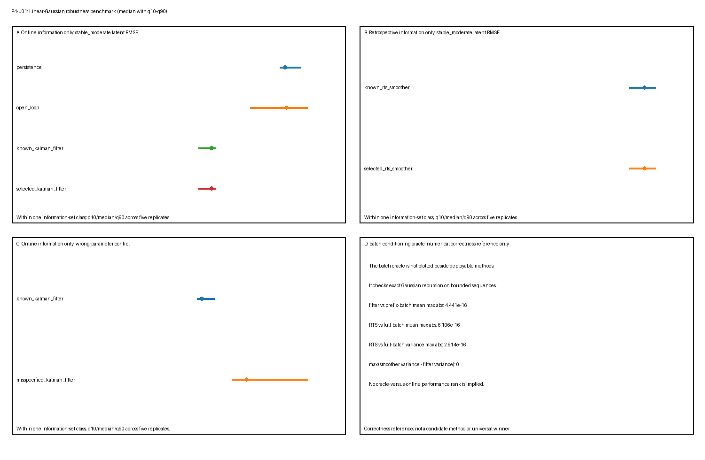

# P4-U01 — Linear-Gaussian Robustness Benchmark

## Scientific question

Across a bounded set of scalar linear-Gaussian state-space models (LGSSMs) with known synthetic ground truth, where are simple references, exact known-parameter inference, direct Gaussian conditioning, and a finite-grid plug-in variant applicable, robust, or observably brittle under their declared information sets?

This is a task-specific robustness study, not a general leaderboard. It compares performance only within the declared simulator, scenarios, metrics, splits, and information sets. It does not establish mechanism, causality, biological validity, real-data validity, or universal method superiority.

## Ground truth

Each independent replicate generates separate train, validation, and test sequences from

$$
z_{t+1}=a z_t+w_t,\qquad w_t\sim\mathcal N(0,q),
$$

$$
x_t=z_t+v_t,\qquad v_t\sim\mathcal N(0,r),
$$

with stationary initialization $z_1\sim\mathcal N(0,q/(1-a^2))$. The generator retains latent truth for scoring, but selection and inference do not receive it. The executable wraps the stable numerical routines in `toy-models/linear-gaussian-inference-ladder.py`; it does not edit or reinterpret the Phase 3 result. The manifest records this relationship as `actual_executable_routine_reuse` and freezes the reused source identity with SHA-256; verification rejects path, role, or digest drift.

## Generation

Generation is a standalone stage that receives only a scenario identifier, replicate, split, and sequence index. It creates independent stationary LGSSM paths and observations, then applies only the scenario's predeclared observation mask. It does not call selection, inference, or scoring.

## Scenario grid

The core-plus-stress grid contains five independent replicates per scenario and two sequences per split. It deliberately remains small enough for byte-level regeneration.

| Scenario class | Predeclared variation |
|---|---|
| Transition stability | $a\in\{0.60,0.85,0.97\}$ at fixed $q=0.10,r=0.40,T=60$ |
| Process/observation noise ratio | process-dominant $(q,r)=(0.40,0.10)$ and observation-dominant $(0.025,0.80)$ |
| Sequence length | $T=24$ and $T=120$ against the $T=60$ reference |
| Missing blocks | a contiguous half-open block $[28,48)$ in $T=80$ sequences |
| Wrong parameters | true $(0.85,0.10,0.40)$ versus predeclared inference $(0.60,0.025,0.80)$ |
| Reset-boundary failure | an intentionally invalid filter continuation across two independent test sequences |
| Near-unit-root stress | $a=0.99,q=0.02,r=0.40,T=120$ |

The grid is fixed in `manifest.json` before interpretation. No scenario is tuned away after seeing a failure.

## Negative controls and stress cases

The wrong-parameter scenario freezes $(a,q,r)=(0.60,0.025,0.80)$ for inference while generation remains at $(0.85,0.10,0.40)$. The reset control deliberately carries a posterior across an independent sequence boundary and compares its first estimate with a correctly reset filter. The near-unit-root scenario tests long-horizon and numerical sensitivity at $a=0.99$. These controls are retained even when they degrade performance.

## Replicates and deterministic seeds

Every scenario has five independent replicates, with two independently generated sequences in each split. A seed is mapped from the master seed, a SHA-256-derived scenario code, replicate, split code, and sequence index. The map does not depend on execution order.

## Split discipline

Train and validation observations are available only to finite-grid selection. Frozen selected parameters are then passed to test inference. Test observations are used by the declared test-time information set; test latent truth is unavailable until the separate scoring stage. Whole independent sequences, not adjacent time points, define the partitions.

## Methods and information sets

- **stationary mean:** fixed zero reference;
- **persistence and open-loop:** online observation-history references;
- **known-parameter Kalman filter:** online posterior using observations through the current time;
- **fixed-interval RTS smoother:** retrospective posterior using the complete declared interval;
- **direct batch Gaussian conditioning:** exact bounded retrospective oracle;
- **finite-grid selected filter and smoother:** parameters selected on train/validation observations and frozen before test inference;
- **wrong-parameter filter/smoother:** scenario-specific misspecification controls; and
- **false-continuation filter:** reset-boundary negative control, explicitly labelled as using an invalid cross-sequence history.

Online, retrospective, and oracle information sets are not pooled. A smoother can use future observations and therefore is not a deployable online competitor to a filter. The batch result is an implementation oracle, not a candidate with the same computational role.

## Parameter selection

The finite grid contains 27 predeclared tuples from $a\in\{0.60,0.85,0.97\}$, $q\in\{0.025,0.10,0.40\}$, and $r\in\{0.10,0.40,0.80\}$. Each tuple is scored by mean train innovation NLL plus mean validation innovation NLL. Ties are broken lexicographically. The selection function accepts exactly four arrays—train observations, train masks, validation observations, and validation masks—and has no argument through which test data or latent truth can be supplied. Poison checks confirm that changing excluded test observations or latent truth leaves all scores and the selected tuple unchanged.

## Inference

Inference receives observations, masks, sequence boundaries, and either known, selected, or predeclared-wrong parameters. Each sequence is normally invoked independently from its stationary prior. The false-continuation control is the sole deliberate boundary violation and is labelled with an invalid cross-sequence information history.

## Scoring

Only after inference outputs are frozen does scoring join test latent truth. Raw `target` metadata is metric-specific rather than inherited only from the method:

| Metric | Raw target and definition |
|---|---|
| `latent_rmse` | point, online, or retrospective state according to the method; square root of mean squared latent-state error |
| `predictive_nll` | `one_step_observation_prediction`; mean one-step predictive negative log likelihood over observed test times only |
| `interval_95_coverage` | pointwise online or retrospective state interval coverage under fixed parameters |
| `mean_posterior_variance` | mean online or retrospective state posterior variance |
| `inside_missing_block_rmse` / `outside_missing_block_rmse` | state RMSE restricted to the declared temporal region |
| `selection_parameter_l1` | `selected_parameter_tuple`; $|\hat a-a|+|\hat q-q|+|\hat r-r|$ |
| `oracle_mean_discrepancy` | `numerical_correctness_reference`; maximum recursion-versus-direct-conditioning mean discrepancy |
| `reset_first_state_abs_difference` | `boundary_reset_diagnostic`; first-state difference between false continuation and correct independent reset |

For each scenario, replicate, method, and metric, the two independent test sequences and all applicable time points are pooled before computing one replicate-level value. Predictive NLL excludes masked times. `diagnostics.json` then computes q10, median, and q90 across the five independent replicate-level values; it does not treat individual time points as replicates. The parameter L1 is deliberately **unnormalized** and adds quantities on the different numerical scales of $a$, $q$, and $r$. It is a transparent grid-selection discrepancy within this benchmark, not a dimensionless distance and not suitable for comparing parameter importance across coordinates or across differently scaled models.

## Failure and applicability labels

`results.csv` contains one raw row per scenario × replicate × method × metric. Every row has exactly one status:

- `ok`: applicable and numerically valid;
- `nonconvergence`: a numerical inference failure;
- `invalid`: malformed or invalid computation;
- `inapplicable`: the method or information set does not support the metric.

Non-`ok` rows retain a machine-readable reason rather than disappearing.

## Artifact contract

The artifact directory contains exactly `manifest.json`, `results.csv`, `diagnostics.json`, and `summary.png`. The manifest fixes scenarios, splits, seeds, methods, metrics, tolerances, commands, ordering, resume semantics, and SHA-256 hashes.

## Results

`diagnostics.json` reports median, 10th percentile, 90th percentile, `ok` rate, failure rate, and applicability rate separately for every scenario × method × metric group. In the moderate reference scenario, known filtering reduces median latent RMSE relative to the online history references. In its separate retrospective information set, RTS smoothing has lower retrospective RMSE. Direct batch conditioning is used separately as a numerical correctness reference and is not visually ranked beside deployable methods. In the missing block, retrospective inference can revise the withheld interval using later observations. Predeclared wrong parameters increase median filter and smoother error. These are conditional observations, not a global ranking.



Each plotted comparison panel contains only one information-set class. The batch-conditioning panel reports numerical discrepancies only; it is not a performance-ranking panel.

## Interpretation limits

The benchmark establishes only simulator-conditional empirical behavior and implementation consistency. Lower latent error under known synthetic truth is not evidence that a method recovered a biological mechanism, discovered a causal law, identified unique latent coordinates, or will transfer to real data. The relative order may change with task definition, information availability, parameter grid, metric, sequence design, and simulator misspecification. No result here authorizes a cross-task total score, a universal winner, Phase 5 work, or real-data claims.

## Reproducibility

The master seed and scenario-hash mapping make replicate generation independent of traversal order. `results.csv` uses a unique canonical row key and deterministic ordering. The verifier checks:

- hashes and the exact four-file artifact set;
- unique row keys and canonical ordering;
- byte-identical clean regeneration;
- byte-identical reversed scenario/replicate traversal;
- byte-identical resume from a valid partial `results.csv`;
- rejection of corrupted, stale, duplicate, unknown-key, and incomplete partial results;
- test-observation and latent-truth poison invariance for selection;
- causal-prefix invariance of filtering;
- independent per-sequence reset equivalence and visible failure of false continuation;
- known-filter agreement with prefix batch conditioning;
- RTS mean and variance agreement with full batch conditioning; and
- finite values or explicit failure labels rather than silent omission; and
- fault-injected nonfinite predictive scores, negative posterior variances, and missing inference results produce explicit `invalid` rows with machine-readable reasons.

Run:

```bash
/Users/bytedance/.cache/codex-runtimes/codex-primary-runtime/dependencies/python/bin/python3 benchmarks/linear-gaussian-robustness.py --generate
/Users/bytedance/.cache/codex-runtimes/codex-primary-runtime/dependencies/python/bin/python3 benchmarks/linear-gaussian-robustness.py --verify
```

These commands intentionally use the bundled workspace Python runtime recorded
as `commands.python_executable` and `runtime.python_executable` in the manifest;
the system `python3` in this shell does not provide the required NumPy runtime.

## Review record

The independent scientific reviewer initially returned `REVISE` on information-set separation in the summary figure and metric-target/aggregation semantics. After one bounded correction round, focused re-review of those findings returned `PASS`.

The independent implementation reviewer initially returned `REVISE` on the selection capability boundary, resume validation, and scoring/non-finite failure labels. After the same bounded correction round, focused re-review returned `PASS`.

Both reviews were read-only and independent of the executor. The object is `L1/stable` after independent scientific and implementation PASS, milestone validation, and explicit owner approval under the recorded review decision. Stable records bounded acceptance of this declared synthetic benchmark; it does not expand the evidence or interpretation boundary.


## Maturity checklist

- [x] Scientific question and scalar synthetic ground truth are bounded.
- [x] Generation, selection, inference, and scoring are separate.
- [x] Train, validation, test, online, retrospective, and oracle information sets are labelled.
- [x] Raw replicate rows and grouped quantile/failure/applicability summaries are retained.
- [x] Deterministic regeneration, reversed order, resume, leakage, reset, and batch-oracle checks pass.
- [x] Independent scientific review verdict recorded by the orchestrator.
- [x] Independent implementation review verdict recorded by the orchestrator.
- [x] Owner approved promotion from `L1/review` to `L1/stable` under the recorded review decision.
