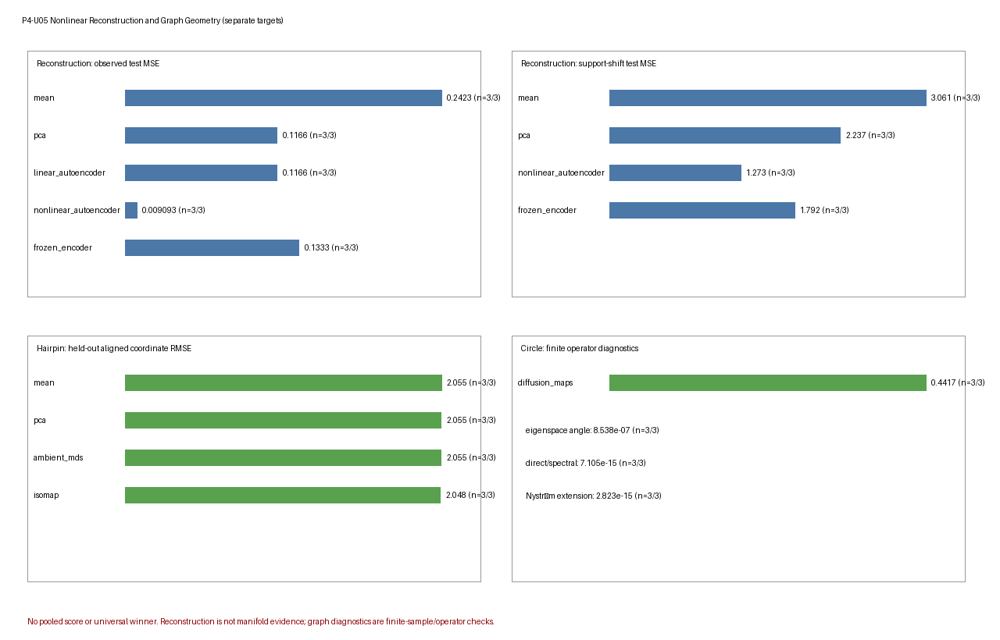

# Nonlinear Reconstruction and Graph Geometry Robustness Benchmark

## Scientific question

P4-U05 asks two separate synthetic questions.

1. **Nonlinear reconstruction:** under a declared curved generator and bounded
   controls, when do a training mean, rank-one PCA/linear autoencoder, a small
   nonlinear autoencoder and a frozen-random-encoder control reconstruct
   held-out observations or noiseless signal, and how do their codes respond to
   curvature, a moment-matched full-dimensional Gaussian, sample/capacity
   stress, nuisance variance and support shift?
2. **Graph geometry:** for a known hairpin or circle simulator, how do ambient
   linear references, classical MDS, Isomap, direct graph diagnostics,
   Diffusion Maps and frozen out-of-sample extensions respond to sampling gaps,
   shortcuts, nonuniform density, graph connectivity, neighborhood size,
   bandwidth, spectral truncation and feature-metric scaling?

The tasks have separate generators, methods, information sets, applicability
rules, metrics, summaries and figure panels. No cross-task normalization,
aggregate score, ranking or universal winner is computed. Reconstruction loss,
code diagnostics, graph-path error, operator eigenspace error and held-out
extension error are not interchangeable targets.

## Ground truth

### Reconstruction task

The ordinary reconstruction scenarios use a scalar scoring variable
$s\in[-1.5,1.5]$ and the six-dimensional noiseless map

$$
f_c(s)=\left[
 s,
 cs^2,
 0.35c\sin(2s),
 0.2cs^3,
 c\left(\cos s-\frac{\sin(1.5)}{1.5}\right),
 0.4c\sin(3s)
\right],
$$

where $c$ is the declared curvature. Independent Gaussian observation noise
with standard deviation $0.06$ is then added. The high-variance nuisance
scenario adds independent standard-deviation-$2.4$ noise to the last two
observed coordinates. The known $s$ and $f_c(s)$ are scoring-only truth; they
are not supplied to preprocessing, fitting, selection or reconstruction.

The moment-matched Gaussian scenario instead samples a full-dimensional
Gaussian with the population mean and covariance of the reference curved
signal plus observation noise. It has no scalar generator parameter or
noiseless one-dimensional signal target, so those rows are explicitly
inapplicable.

The one-dimensional bottleneck width is fixed by the analyst. It is not a
model-free estimate of intrinsic dimension, and the generated curve is not
used as evidence that arbitrary observations lie on a manifold.

### Graph-geometry task

The hairpin generator uses the stable Phase 3 unit-speed planar hairpin,
embedded isometrically in three observed dimensions and perturbed by Gaussian
noise of standard deviation `0.01`. Its scoring truth is analytic arc-length
coordinate $\ell$. The ordinary radius is inherited from the stable Phase 3
implementation; the shortcut stress uses radius `0.06`. Graph construction
receives observed coordinates only. Arc length enters after fitting for graph
or extension scoring.

The circle generator uses the stable Phase 3 three-dimensional isometric
embedding of $(\cos\theta,\sin\theta)$. The finite target is the declared
training affinity/Markov operator and its cosine--sine two-mode subspace, full
finite-operator diffusion distances and frozen Nyström extension. These are
finite graph/operator targets, not inferred topology or a recovered
Riemannian metric.

## Generation

Generation precedes fitting and is split-specific.

- Reconstruction train/validation/test sizes are `120/60/90`, except the
  sample/capacity stress (`28/42/90`). Ordinary $s$ values are independently
  uniform on $[-1.5,1.5]$ within each split. In `support_shift`, train and
  validation are exactly the reference bundles, while test magnitudes are
  sampled in $[1.5,2.35]$ with random sign.
- Hairpin train/validation/test sizes are `108/42/54`. Sampling is uniform in
  arc length unless the scenario declares a training gap or nonuniform
  density. Metric-scaling scenarios reuse the reference random draws before
  applying `diag(1,1,3)`.
- Circle train/validation/test sizes are `64/32/64`. Uniform training points
  form a phase-shifted regular grid; nonuniform training angles use a fixed
  power transform of uniform draws. In every circle scenario and replicate,
  each test angle is the exact circular midpoint between two consecutive
  sorted training angles, including the wrap-around interval. Validation is an
  independent reserved grid and is not used for fitting or selection. Metric
  scaling applies `diag(1,1,3)` to the same reference train/test angles.

The two Phase 3 source roles are deliberately distinct. The stable nonlinear
reconstruction executable is **hash-only design provenance**: it is not loaded
at runtime and there are no `P3_NL` numerical calls. The stable graph-geometry
executable is loaded and **actually reused** for hairpin geometry, graph
fitting, shortest paths/MDS, extension, Diffusion Maps, Nyström and operator
diagnostics. The manifest and verification diagnostics record these roles
separately; neither stable Phase 3 source is modified.

## Scenario grid

Both grids are bounded core-plus-stress designs, not complete factorial
experiments. Differences between named scenarios are conditional observations,
not isolated causal effects of a single factor.

### Reconstruction scenarios

| Scenario | Declared manipulation | Main boundary |
|---|---|---|
| `reference_curved` | curvature $c=1$, sizes `120/60/90` | in-support nonlinear reconstruction |
| `low_curvature` | $c=0.25$ | weak nonlinearity versus rank-one linear references |
| `high_curvature` | $c=1.65$ | stronger curvature |
| `moment_matched_gaussian` | full-dimensional Gaussian with reference population mean/covariance | compression without one-dimensional generator truth |
| `small_sample_high_capacity` | sizes `28/42/90`, hidden width 18 | finite-sample/capacity sensitivity |
| `high_variance_nuisance` | standard deviation 2.4 in the last two coordinates | aggregate reconstruction dominated by nuisance variance |
| `support_shift` | reference train/validation; test outside training support | frozen-model extrapolation |

All scenarios other than `small_sample_high_capacity` use hidden width 8 for
the nonlinear and frozen-encoder networks.

### Graph scenarios

#### Hairpin

| Scenario | Declared manipulation | Main boundary |
|---|---|---|
| `hairpin_reference` | union-$k$NN, $k=6$ | nominal finite graph and extension behavior |
| `hairpin_sparse_gap` | training gap, $k=6$ | disconnected support and failed extension applicability |
| `hairpin_shortcuts` | branch radius `0.06`, $k=6$ | cross-branch shortcuts |
| `hairpin_nonuniform` | nonuniform arc-length sampling, $k=6$ | density/connectivity sensitivity |
| `hairpin_disconnected` | $k=1$ | explicit disconnection |
| `hairpin_large_k` | $k=16$ | overly broad neighborhoods |
| `hairpin_nearly_complete` | $k=100$ | near-complete graph and chord shortcuts |
| `hairpin_metric_scaling` | observed transform `diag(1,1,3)`, $k=6$ | feature-metric dependence |

#### Circle

| Scenario | Declared manipulation | Main boundary |
|---|---|---|
| `circle_reference` | uniform grid, $\varepsilon=0.18$ | finite operator/eigenspace and extension reference |
| `circle_nonuniform` | nonuniform training density, $\varepsilon=0.18$ | density sensitivity |
| `circle_bandwidth_small` | $\varepsilon=0.008$ | narrow affinity bandwidth and spectral truncation |
| `circle_bandwidth_large` | $\varepsilon=4.0$ | broad affinity bandwidth |
| `circle_metric_scaling` | transform `diag(1,1,3)`, $\varepsilon=0.18$ | observed-metric dependence |

Neighborhood sizes and bandwidths are predeclared scenario values; they are
not selected from test truth or test score.

## Negative controls and stress cases

- The moment-matched Gaussian controls first and second moments while removing
  the declared scalar/noiseless reconstruction target.
- The frozen random encoder fixes its encoder and trains only its decoder,
  separating useful random nonlinear features from a learned encoder.
- High-capacity/small-sample and nuisance scenarios expose architecture and
  loss-composition sensitivity without forcing a particular failure story.
- `support_shift` uses the exact reference train/validation observations and an
  exactly identical fitted state; only the exterior-support test bundle differs.
- Hairpin gaps and $k=1$ retain disconnected graphs and infinite shortest-path
  pairs rather than silently repairing connectivity.
- Reduced branch separation, large/nearly-complete neighborhoods and feature
  scaling expose shortcut and metric dependence.
- Circle density, bandwidth and metric-scaling scenarios stress the finite
  Markov operator, spectral truncation and frozen Nyström extension.

Failures and inapplicability remain in the raw Cartesian result inventories and
are not tuned away after inspection.

## Replicates and deterministic seeds

Every scenario uses three independent deterministic replicates under master
seed `20260820`. Seed words include task, a stable SHA-256-derived scenario
code, replicate, stage, split and candidate where relevant. Methods within a
scenario-replicate share generated data for paired descriptive comparison.

Three replicates support only bounded descriptive q10/median/q90 summaries.
They do not provide confidence intervals or stable tail estimates.

## Split discipline

### Reconstruction

- Training observations fit the standardizer, mean and PCA/analytic linear
  autoencoder.
- Training and validation observations fit two deterministic candidate seeds
  for the nonlinear autoencoder and frozen-encoder control; validation MSE
  selects one candidate with deterministic index tie breaking.
- Test observations are passed only to frozen reconstruction.
- Test $s$ and noiseless signal are added only in scoring.
- The support-shift scenario reuses the exact reference train/validation
  observations and fitted state. The verifier records zero fitted-state
  difference.

### Graph geometry

- The training observations alone construct the hairpin graph or circle
  operator. The generated validation split is reserved but is not used for
  hyperparameter selection in this bounded implementation.
- A training-truth affine map is fitted solely as a scoring alignment for
  hairpin one-dimensional coordinates; it does not change the graph,
  embedding or raw extension.
- Test points are extended against the frozen training graph/operator. They are
  never inserted into a transductive refit. For circles, the test set is the
  exact set of circular midpoints of the realized training angles; the maximum
  midpoint-construction error over all 15 scenario-replicate records is `0.0`.
- Test arc length, circle angle and cosine--sine truth enter only after raw
  extension.

The verifier's restricted signatures, test/truth poison checks and support
reuse checks all pass with maximum differences `0.0` in the protected fitted
states or raw recoveries.

## Methods and information sets

### Reconstruction methods

| Method | Fit/parameter source | Information set |
|---|---|---|
| `mean` | training mean after train-only standardization | train fit, frozen test reconstruction |
| `pca` | rank-one training PCA | train fit, frozen test projection/reconstruction |
| `linear_autoencoder` | analytic PCA-equivalent rank-one linear map | train fit, frozen test projection/reconstruction |
| `nonlinear_autoencoder` | hidden width 8 or 18; two seed candidates selected by validation MSE | train/validation fit, frozen test encoding/decoding |
| `frozen_encoder` | random fixed encoder; decoder trained; two candidates selected by validation MSE | train/validation fit, frozen test encoding/decoding |

### Graph methods

| Method | Domain and role | Information set |
|---|---|---|
| `mean` | hairpin arc-coordinate scoring reference | training scoring mean, frozen test prediction |
| `pca` | hairpin rank-one PCA plus frozen linear extension | training fit, test observations only |
| `ambient_mds` | classical MDS of ambient pairwise distances plus Gower extension | training distance fit, frozen test extension |
| `isomap` | union-$k$NN shortest paths, classical MDS and graph-distance Gower extension | training graph fit, frozen test attachment/extension |
| `graph_diagnostics` | connectivity, shortcut and path-distance diagnostics | training graph/operator diagnostic only |
| `diffusion_maps` | circle finite Markov operator and retained two-mode diagnostics | training operator only |
| `direct_operator` | direct finite-operator numerical references | training operator only |
| `nystrom_extension` | normalized extension of the frozen circle operator | frozen training fit, held-out test observations |

Isomap coordinate and MDS diagnostics are inapplicable when the training graph
is disconnected. A connected one-dimensional display is not forced.

## Parameter selection

The reconstruction networks use a fixed architecture per scenario and two
predeclared initialization candidates for each method--scenario--replicate.
The selected candidate minimizes validation transformed-coordinate MSE; ties
use lower candidate index. `diagnostics.json` contains all **42 network-selection records** (seven scenarios $\times$ three replicates $\times$ two network
methods) and all **84 candidate runs**. Each record stores candidate index,
full deterministic PCG64 seed ID, validation loss, best epoch, epochs run,
epoch cap, stop reason, selected candidate/seed/loss/epoch and the tie rule.
The `selected_validation_mse` and `parameter_count` result rows are validation
and architecture diagnostics, not held-out reconstruction scores.

Across the 84 candidate runs, 49 stop at the epoch budget and 35 stop after the
fixed patience rule; among the 42 selected candidates, the counts are 26 and
16. Hidden-width-8 runs have a 260-epoch cap, while the hidden-width-18
small-sample stress has a 340-epoch cap. Reaching `epoch_budget` means only that
no patience stop occurred before the declared cap. A finite selected model at
the epoch cap is **not automatically labelled `nonconvergence`**. The benchmark
reserves `nonconvergence` for an applicable path that raises a numerical
linear-algebra failure; natural execution produced none.

For the reference scenario, the selected nonlinear candidates for replicates
0/1/2 are `0/0/1`, with validation losses
`0.147593/0.0432484/0.0671336`; all have selected best epoch 260 and stop reason
`epoch_budget`. The selected frozen-encoder candidates are `1/0/0`, with losses
`0.408717/0.513976/0.652788`, selected best epochs `260/260/259`, and the same
selected stop reason. The complete seed IDs and both candidates' losses,
epochs and stop reasons remain machine-readable in the diagnostics rather than
being abbreviated in the result CSV.

PCA, the analytic linear autoencoder, mean, $k$, $\varepsilon$, retained circle
modes and extension rules have no data-driven search in this implementation.
Graph scenario parameters are frozen before generation and never selected from
held-out truth.

## Inference

Reconstruction recovery applies the frozen training standardizer and frozen
method state to test observations, returns a six-dimensional reconstruction in
original units and a one-dimensional code. The frozen encoder remains fixed at
test time.

Hairpin recovery applies frozen PCA or Gower extension. Isomap test points
attach to their $k$ nearest training vertices without rebuilding the training
graph; resulting graph distances feed the frozen MDS extension. Circle recovery
uses normalized Nyström extension against the frozen training operator.

Graph fitting, shortest paths, eigendecomposition and extension are distinct
from scoring alignment and truth-based diagnostics.

## Scoring

Each raw row identifies task, scenario, replicate, seed, split/evaluation
stage, method family, information set, parameter source, target, metric,
status/reason, split sizes, selected hyperparameter and domain. Only the metrics
below occur in the artifacts.

### Reconstruction metrics

| Metric | Provenance/target | Definition |
|---|---|---|
| `observed_reconstruction_mse` | test; observed test reconstruction | mean squared error to observed test vectors in original units |
| `noiseless_signal_mse` | test; known noiseless test signal | mean squared error to $f_c(s)$; inapplicable to the full-dimensional Gaussian |
| `code_variance` | test; deterministic test code activity | variance of the one-dimensional test code |
| `code_abs_spearman_truth` | test; scoring-only generator parameter | absolute Spearman correlation between code and known $s$; inapplicable to the Gaussian |
| `code_collision_rate` | test; scoring-only generator collision diagnostic | among code-close test pairs, fraction with $|\Delta s|>0.5$ using the fixed 5%-of-code-range threshold; inapplicable to the Gaussian |
| `selected_validation_mse` | validation | selected or deterministic validation reconstruction MSE in transformed coordinates |
| `parameter_count` | architecture diagnostic | declared fitted architecture/model parameter count |

Code correlation and collision are simulator diagnostics. They do not prove
injectivity, semantic coordinates, representation or intrinsic dimension.

### Graph metrics

| Metric | Provenance/target | Definition |
|---|---|---|
| `heldout_coordinate_rmse` | test extension; aligned known hairpin arc length | held-out RMSE after one training-fitted affine scoring alignment |
| `graph_distance_relative_rmse` | training diagnostic; known pairwise arc separation | RMS shortest-path error divided by RMS analytic arc separation over finite pairs |
| `component_count` | training graph diagnostic | number of finite connected components |
| `material_shortcut_rate` | training graph diagnostic | fraction of graph edges whose arc separation exceeds edge length by the stable Phase 3 material threshold |
| `infinite_pair_rate` | training graph diagnostic | fraction of unordered training pairs with infinite shortest-path distance |
| `mds_negative_eigenmass` | training MDS diagnostic | total absolute negative eigenvalue mass of classical MDS |
| `diffusion_eigenspace_angle_max_degrees` | training finite-operator diagnostic | maximum $L^2(\pi)$ principal angle between the first two nonconstant right-eigenfunction modes and cosine--sine truth |
| `diffusion_truncation_relative_rmse` | training finite-operator diagnostic | relative pairwise RMSE between full finite-operator diffusion distance and its two-mode truncation |
| `direct_spectral_distance_max_abs` | training numerical oracle | maximum discrepancy between spectral and direct finite-operator diffusion distances |
| `heldout_extension_rmse` | test extension | RMSE of frozen Nyström cosine--sine extension after training alignment |
| `operator_row_sum_max_abs` | training numerical oracle | maximum absolute Markov row-sum error from one |

For every task $\times$ scenario $\times$ method $\times$ metric group,
`diagnostics.json` reports q10, median, q90, `ok_rate`, applicability rate and
failure rate across the three replicate rows. No metric is normalized against
or averaged with a metric from the other task.

## Failure and applicability labels

The full task-specific Cartesian inventories are retained:

- reconstruction: $7\times3\times5\times7=735$ rows;
- graph geometry: $13\times3\times8\times11=3{,}432$ rows;
- total: **4,167** unique canonical rows and **1,389** summary groups.

Natural execution produced:

| Task | `ok` | `inapplicable` | `invalid` | `nonconvergence` |
|---|---:|---:|---:|---:|
| Reconstruction | 690 | 45 | 0 | 0 |
| Graph geometry | 299 | 3,133 | 0 | 0 |
| **Total** | **989** | **3,178** | **0** | **0** |

Applicability is resolved before numerical failure. `ok` requires an applicable
finite value; `inapplicable` retains method--metric or truth-target mismatches;
`invalid` represents malformed/non-finite applicable scoring; and
`nonconvergence` represents linear-algebra failure in an applicable path. Every
non-`ok` row has a machine-readable reason and no numeric value.

The natural absence of `invalid` and `nonconvergence` is not a global robustness
claim. Real-path fault injection verifies both labels while preserving
inapplicability precedence. In disconnected hairpin replicates, Isomap
coordinate/MDS rows remain `inapplicable` rather than receiving fabricated
coordinates.

## Artifact contract

`benchmarks/artifacts/nonlinear-graph-robustness/` contains exactly:

```text
manifest.json
results.csv
diagnostics.json
summary.png
```

The manifest freezes scenario/method/metric inventories, stage and status
vocabularies, three-replicate seed contract, canonical lexicographic row order,
runtime, source digests, exact commands and SHA-256 hashes. `results.csv`
retains all replicate-level rows. `diagnostics.json` stores target-specific
summaries and verification checks. `summary.png` is a separated diagnostic view,
not acceptance evidence or a leaderboard. Each plotted value carries an
explicit `n=ok/total` applicability label; an inapplicable group is labelled
`NA` rather than plotted as a zero-valued result.

## Results

The following q10/median/q90 values are read from the authoritative artifact
tree. They are conditional on the declared simulator, split, method, metric and
information set.

### Reconstruction results

| Scenario and target | Method | q10 | Median | q90 |
|---|---|---:|---:|---:|
| Reference observed reconstruction MSE | mean | 0.2234 | 0.2423 | 0.2552 |
| Reference observed reconstruction MSE | PCA | 0.0943 | 0.1166 | 0.1298 |
| Reference observed reconstruction MSE | analytic linear AE | 0.0943 | 0.1166 | 0.1298 |
| Reference observed reconstruction MSE | nonlinear AE | 0.0059 | 0.0091 | 0.0295 |
| Reference observed reconstruction MSE | frozen encoder | 0.0770 | 0.1333 | 0.1405 |
| Moment-matched Gaussian observed MSE | PCA | 0.0948 | 0.1196 | 0.1312 |
| Moment-matched Gaussian observed MSE | nonlinear AE | 0.1045 | 0.1157 | 0.1752 |
| High-curvature observed MSE | PCA | 0.2629 | 0.2702 | 0.3324 |
| High-curvature observed MSE | nonlinear AE | 0.0085 | 0.0091 | 0.0100 |
| High-nuisance observed MSE | nonlinear AE | 1.6526 | 1.7647 | 2.1852 |
| High-nuisance observed MSE | frozen encoder | 1.3691 | 1.4110 | 1.9084 |
| Support-shift observed MSE | PCA | 2.0082 | 2.2370 | 2.3075 |
| Support-shift observed MSE | nonlinear AE | 1.0416 | 1.2731 | 1.5169 |
| Support-shift observed MSE | frozen encoder | 1.7829 | 1.7922 | 1.8110 |

On the reference curved generator, the nonlinear code's absolute Spearman
correlation with scoring-only $s$ has median `0.9975`, and its collision-rate
median is `0.00217`. Under support shift those medians become `0.6451` and
`0.1505`. This deterioration is an extrapolation diagnostic only. The
small-sample/high-capacity nonlinear observed-MSE median is `0.00744`; the
predeclared validation procedure did not force a dramatic failure in these
three replicates.

The moment-matched Gaussian result shows that nonlinear reconstruction behavior
can be discussed without a scalar-manifold target. High nuisance variance also
shows that aggregate observed-space MSE can favor a different method from the
curved-signal question. These rows do not establish a universal reconstruction
order.

### Graph-geometry results

| Scenario and target | Method | q10 | Median | q90 |
|---|---|---:|---:|---:|
| Hairpin reference held-out coordinate RMSE | mean | 2.0374 | 2.0554 | 2.0647 |
| Hairpin reference held-out coordinate RMSE | PCA | 2.0371 | 2.0548 | 2.1343 |
| Hairpin reference held-out coordinate RMSE | ambient MDS | 2.0371 | 2.0548 | 2.1343 |
| Hairpin reference held-out coordinate RMSE | Isomap | 1.9997 | 2.0484 | 2.1207 |
| Hairpin reference graph-distance relative RMSE | graph diagnostic | 0.4936 | 0.5813 | 0.6294 |
| Hairpin reference component count | graph diagnostic | 1.0 | 1.0 | 1.0 |
| Hairpin reference infinite-pair rate | graph diagnostic | 0.0 | 0.0 | 0.0 |
| Sparse-gap infinite-pair rate | graph diagnostic | 0.0942 | 0.4708 | 0.4890 |
| Reduced-separation material-shortcut rate | graph diagnostic | 0.2588 | 0.2687 | 0.2853 |
| $k=1$ component count | graph diagnostic | 35.0 | 35.0 | 35.8 |
| Nearly-complete material-shortcut rate | graph diagnostic | 0.3754 | 0.4128 | 0.4518 |
| Circle reference eigenspace max angle | Diffusion Maps | $1.71\times10^{-7}$° | $8.54\times10^{-7}$° | $1.35\times10^{-6}$° |
| Circle reference two-mode truncation relative RMSE | Diffusion Maps | 0.4417 | 0.4417 | 0.4417 |
| Circle reference exact-midpoint extension RMSE | Nyström | $2.40\times10^{-15}$ | $2.82\times10^{-15}$ | $5.42\times10^{-15}$ |
| Circle nonuniform eigenspace max angle | Diffusion Maps | 15.19° | 20.13° | 26.01° |
| Circle nonuniform exact-midpoint extension RMSE | Nyström | 0.1342 | 0.1718 | 0.2133 |
| Small-bandwidth truncation relative RMSE | Diffusion Maps | 0.7631 | 0.7631 | 0.7631 |
| Metric-scaled circle eigenspace max angle | Diffusion Maps | 5.8798° | 5.8798° | 5.8798° |
| Metric-scaled circle exact-midpoint extension RMSE | Nyström | 0.06285 | 0.06285 | 0.06285 |

With the authoritative nominal $k=6$, all three reference hairpin graphs are
connected: component count is exactly one, infinite-pair rate is zero, and
Isomap held-out-coordinate rows are applicable in all three replicates
(`n=3/3`). The Isomap median `2.0484` is nevertheless close to the mean, PCA and
ambient-MDS coordinate errors, while the graph-distance relative-RMSE median is
`0.5813`. Connectivity and applicability therefore do not imply accurate
recovery. Sparse gaps, nonuniform sampling, $k=1$ and metric scaling expose
stronger connectivity boundaries; large/nearly-complete neighborhoods restore
connectivity but retain path-error or shortcut failures.

For every circle scenario and replicate, the held-out extension target is the
exact circular midpoint set derived from that realized training grid. The
integrity diagnostic reports maximum angular construction error `0.0`. Thus the
Nyström rows evaluate one precise frozen midpoint-extension contract; they do
not establish general out-of-support extension.

The circle direct/spectral distance discrepancy is at most about
`7.55e-15` in the verifier, and Markov row-sum error is about `2.22e-16`.
Those are implementation checks. Accurate reference eigenspaces or Nyström
extension do not establish topology, a manifold, geodesic recovery or a
Riemannian metric.



## Interpretation limits

- Low held-out reconstruction error does **not** prove a manifold, low or
  intrinsic dimension, injective chart, representation, dynamics, mechanism or
  causality.
- A one-dimensional bottleneck is an analyst choice, not an intrinsic-dimension
  estimate. Code correlation or low collision rate on known simulation truth
  does not create a unique coordinate.
- A nonlinear method outperforming a linear reconstruction baseline on one
  curved simulator does not imply universal superiority or real-data validity.
- A visually ordered Isomap coordinate, finite graph-path accuracy or low MDS
  strain does **not** prove topology, geodesics or Riemannian geometry.
- A Diffusion Maps eigenspace is a finite operator output. It does not recover
  circle topology, a manifold Laplacian, intrinsic dimension, physical time or
  dynamics without additional assumptions and evidence.
- Connectivity is a property of the constructed finite graph, not evidence that
  the unknown latent support is topologically connected.
- Frozen extension is not transductive refitting and need not agree with it.
- Three replicates and bounded scenarios do not support significance,
  confidence, causal-factor isolation or a universal leaderboard.

## Reproducibility

Run from the repository root with the manifest-recorded runtime:

```bash
/Users/bytedance/.cache/codex-runtimes/codex-primary-runtime/dependencies/python/bin/python3 benchmarks/nonlinear-graph-robustness.py --generate
/Users/bytedance/.cache/codex-runtimes/codex-primary-runtime/dependencies/python/bin/python3 benchmarks/nonlinear-graph-robustness.py --generate --resume
/Users/bytedance/.cache/codex-runtimes/codex-primary-runtime/dependencies/python/bin/python3 benchmarks/nonlinear-graph-robustness.py --verify
```

The verifier checks the exact four-artifact inventory and hashes; 4,167 unique
complete canonical rows; summary recomputation; byte-identical clean,
reverse-order and valid-resume generation; rejection of corrupted, stale,
duplicate, unknown and incomplete resume rows; restricted fitting/recovery
capabilities; truth/test poison behavior; exact support-shift fitted-state
reuse; graph symmetry, shortest paths, MDS/Gower, Nyström, spectral/direct and
relabeling oracles; exact circle-midpoint integrity; the complete network
candidate/seed/loss/epoch/stop records; distinct Phase 3 provenance roles;
metric-scaling sensitivity; finite values; and real-path
`invalid`/`nonconvergence` fault labels with applicability precedence.

The current verification diagnostics include:

- support-shift train, validation and fitted-state differences: `0.0`;
- metric-scaling hairpin undirected edge symmetric difference: `61`;
- ambient-MDS training extension replay maximum error:
  `2.44e-15`;
- Isomap training extension replay maximum error: `2.22e-15`;
- diffusion training Nyström replay maximum error: `2.44e-15`;
- direct/spectral diffusion-distance maximum error: `7.55e-15`;
- graph-distance relabeling maximum error: `8.88e-16`;
- exact circle midpoint construction maximum error: `0.0`;
- network selection records: `42/42`, containing `84` candidate runs;
- Phase 3 roles: nonlinear `hash_only_design_provenance`, graph
  `actual_executable_routine_reuse`.

## Review record

Independent scientific and implementation reviewers were read-only and independent of the executors. Their initial
reviews returned `REVISE` on the nominal hairpin neighborhood contract, exact circle midpoint extension, auditable network selection/epoch records, applicability-aware visualization, and distinct Phase 3 provenance roles. The bounded correction pass addressed only
those findings; focused scientific and implementation re-reviews both returned
`PASS` with no unresolved finding.

The accepted validation record includes 62-object structural validation, 33 repository tests, the enhanced artifact verifier, target/index renders, workflow validation, and `git diff --check`. The recorded review decision then authorized the
mechanical promotion to `L1/stable`. Stable status records bounded acceptance of
this declared synthetic Benchmark Object; it does not expand its evidence,
information-set, target, or interpretation boundaries.

## Maturity checklist

- [x] Reconstruction and graph-geometry tasks are separate with no pooled score.
- [x] Ground truth, generation, scenarios, replicates and deterministic seeds are declared.
- [x] Train/validation/test, fitting, frozen recovery, scoring and extension boundaries are documented.
- [x] Reconstruction capacity, nuisance, Gaussian and support-shift controls are retained.
- [x] Graph gap, shortcut, density, connectivity, neighborhood, bandwidth, truncation, metric-scaling and held-out-extension boundaries are retained.
- [x] All raw metrics, targets, provenance and applicability/failure labels match the artifacts.
- [x] Exactly four byte-verifiable artifacts and exact commands are recorded.
- [x] Reconstruction is not interpreted as manifold or intrinsic-dimension evidence.
- [x] Graph embedding/operator output is not interpreted as topology or Riemannian geometry.
- [x] Focused scientific re-review passes.
- [x] Focused implementation re-review passes.
- [x] Mechanical stable promotion completed under the recorded review decision after both focused verdicts passed.
