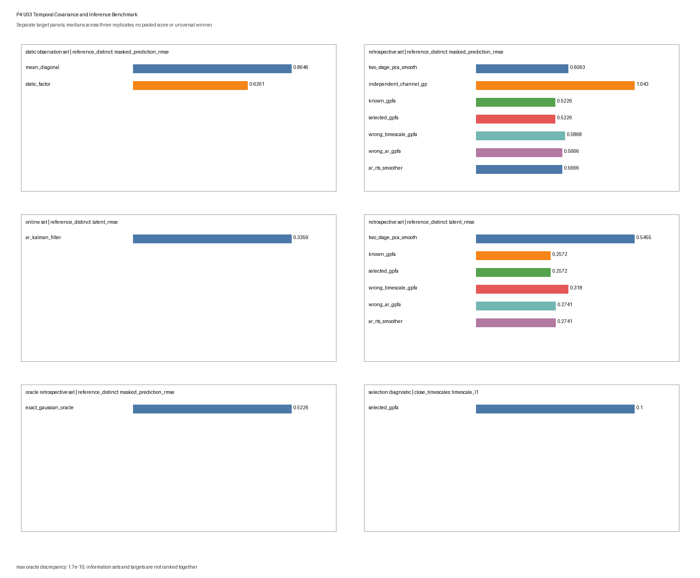

# P4-U03 — Temporal Covariance and Inference Benchmark

## Scientific question

Across a bounded collection of two-latent, six-channel synthetic trajectory
problems, where are static references, two-stage smoothing, known and
validation-selected Gaussian-process factor analysis (GPFA), deliberately
wrong temporal covariances, one-lag-matched linear-Gaussian state-space
inference, and exact finite-Gaussian oracles applicable, robust, or observably
misspecified under their declared information sets?

The benchmark separates observation likelihood, masked observation prediction,
latent-path scoring, loading-subspace recovery, timescale selection, covariance
fit, posterior calibration, and numerical-oracle agreement. It does not combine
them into a total score. A smooth posterior mean is a conditional estimate under
a covariance prior and observation model; it is not a learned transition law,
vector field, physical trajectory, causal mechanism, or proof of dynamics.

## Ground truth

Every trial has $T=16$ points on an equally spaced grid in $[0,1]$, latent
dimension $q=2$, and observed dimension $p=6$. Under the nominal Gaussian
family, the time-major latent vector has zero mean and block-diagonal
coordinate covariance. For coordinate $j$,

$$
k_j(t,t')=(1-0.02)\exp\left[-\frac{(t-t')^2}{2\tau_j^2}\right]
+0.02\,\mathbf 1[t=t'].
$$

The nominal distinct-timescale pair is $(\tau_1,\tau_2)=(0.10,0.32)$. The
observation layer is

$$
y_t=Cz_t+d+\epsilon_t,
\qquad \epsilon_t\sim\mathcal N(0,R),
$$

with the stable Covariance-Prior Trajectories loading matrix, offset, and
diagonal residual covariance:

$$
C=
\begin{pmatrix}
1.00&0.25\\
0.70&-0.45\\
0.30&0.90\\
-0.65&0.40\\
0.80&0.55\\
-0.25&-0.75
\end{pmatrix},
\quad
d=(0.30,-0.20,0.15,0.05,-0.10,0.25)^\top,
$$

$$
R=\operatorname{diag}(0.10,0.16,0.22,0.30,0.38,0.48).
$$

Whole trials are independent. No latent prior, filtering state, smoother state,
or fitted statistic crosses a trial boundary. Latent paths and complete hidden
observations are retained in a scoring-only payload. The stable
`toy-models/covariance-prior-trajectories.py` object supplies scientific and
design provenance for this benchmark, and its SHA-256 digest is recorded and
verified. The benchmark does not import or call that executable source; its
generator, fitting, conditioning, filtering, smoothing, scoring, artifact, and
verification routines are benchmark-local. It does not edit the stable Phase 3
source or promote its illustrative results into general claims.

The stress generators alter specific parts of this truth:

- `latent_changepoint` sets cross-covariance between the first and second halves
  of each latent coordinate to zero, creating two independent Gaussian temporal
  segments; the exact oracle knows this block covariance, while nominal GPFA
  does not;
- `correlated_residuals` retains the nominal residual variances and gives every
  off-diagonal pair residual correlation $0.12$;
- `low_rate_poisson` draws raw counts with
  $\lambda_{tj}=\exp[-2+0.35(Cz_t+d)_j]$ and then applies the bounded Gaussian
  analysis without pretending that the Gaussian observation law is correct;
- `alignment_jitter` shifts each sampled latent path by $-1$, $0$, or $1$ bin,
  fills the exposed edge with the nearest retained value, and still analyzes
  the nominal grid; scoring uses the shifted retained path, so this is a bounded
  prior/alignment perturbation rather than a recovery claim about an unobserved
  event-relative path; and
- `informative_missingness` hides entries above each test trial's empirical
  72nd percentile. The ordinary inference paths ignore information in the mask.

## Generation

Generation receives only scenario, replicate, split, trial index, and a
deterministic seed stream. It draws latent paths, applies the scenario-specific
observation family, and returns separate train, validation, and test trial
collections. Mask construction is a later stage and never changes the frozen
complete realization.

The nominal, close-timescale, sample-size, changepoint, correlated-residual,
Poisson, equal-kernel, and jitter scenarios use a mixed masked-prediction design
unless a mask is named explicitly: alternating test trials hide either one
complete channel or all channels over the middle third of the sequence. The
`channel_mask` scenario hides one complete channel in every test trial; the
`time_block_mask` scenario hides every channel at indices 5--9; and
`informative_missingness` uses the value-dependent rule above.

## Scenario grid

The core-plus-stress grid has 12 predeclared scenarios and three independent
replicates per scenario. Split sizes are numbers of independent trials and are
written as train/validation/test.

| Scenario | Class | Split sizes | Declared change |
|---|---|---:|---|
| `reference_distinct` | timescale separation | 5/3/3 | squared-exponential $(0.10,0.32)$ |
| `close_timescales` | timescale separation | 5/3/3 | $(0.18,0.24)$ |
| `low_trial_count` | trial/sample size | 2/1/2 | fewer independent trials |
| `high_trial_count` | trial/sample size | 8/4/4 | more independent trials |
| `channel_mask` | missing channels | 5/3/3 | one complete channel hidden per test trial |
| `time_block_mask` | missing time block | 5/3/3 | all channels hidden at indices 5--9 |
| `latent_changepoint` | temporal nonstationarity | 5/3/3 | independent pre/post Gaussian covariance blocks |
| `correlated_residuals` | observation covariance | 5/3/3 | non-diagonal Gaussian residual covariance |
| `low_rate_poisson` | observation-family misspecification | 5/3/3 | raw low-rate Poisson counts |
| `equal_kernels` | temporal identifiability | 5/3/3 | $(0.20,0.20)$ |
| `alignment_jitter` | alignment stress | 5/3/3 | seed-derived $-1/0/1$-bin shift and edge fill |
| `informative_missingness` | non-ignorable mask | 5/3/3 | hide upper-tail observed values |

This is not a factorial design. Changes in timescale, split size, observation
law, residual covariance, and mask geometry are scenario-level interventions;
differences between scenario summaries do not isolate causal effects of one
factor.

## Negative controls and stress cases

Two covariance misspecifications are retained in every scenario:

1. `wrong_timescale_gpfa` fixes a common squared-exponential pair
   $(0.06,0.06)$; and
2. `wrong_ar_gpfa` replaces the squared-exponential family with an AR(1)
   covariance whose one-lag coefficient is derived from each declared
   timescale.

The same AR family supplies the online Kalman filter and retrospective RTS
smoother. Matching a one-lag covariance does not make its longer-lag decay equal
to a squared-exponential kernel. The changepoint, correlated-residual, Poisson,
equal-kernel, jitter, and informative-mask scenarios are also retained as
structured assumption failures. None is tuned away after results are seen.

The exact Gaussian oracle is emitted only when the scenario has a finite
Gaussian observation law, no jitter construction, and an ignorable mask. It
uses the true correlated residual or changepoint covariance where applicable.
It is absent—not assigned a fabricated score—for Poisson, jitter, and
informative-missingness scenarios.

## Replicates and deterministic seeds

Each scenario has three independent replicates. Trial draws are independent
within and across train, validation, and test. Random streams use
`PCG64(SeedSequence(...))` with the master seed `20260820`, a SHA-256-derived
scenario code, replicate, stage, split code, and trial index. The mapping is
independent of traversal order.

Three replicates support only bounded descriptive summaries. The reported q10
and q90 are interpolated quantiles of three replicate-level values, not
confidence intervals, uncertainty bands, or stable tail estimates.

## Split discipline

The lawful fitting interface accepts only tuples of train and validation
observations. Training observations fit the static factor/PCA state and channel
means and variances. Every predeclared timescale candidate is scored by the
**combined total train plus validation marginal NLL**; the validation-only
component is also retained as a diagnostic. The selection and fitting interface
has no test or latent-truth argument.

A second interface receives frozen states plus test observations and masks. It
performs test-time filtering, smoothing, conditioning, or deterministic
recovery without access to train/validation arrays or truth. Only the scoring
stage joins latent paths, complete hidden observations, scenario covariance,
or loading truth. Poison checks require excluded test observations and latent
truth to leave fitted states and fixed-observation recoveries unchanged, while
an allowed training perturbation must change the fitted state.

## Methods and information sets

| Method | Role | Parameters | Information set |
|---|---|---|---|
| `mean_diagonal` | independent observation reference | train mean/variance | static observation |
| `static_factor` | pooled-bin rank-two PCA/factor reference | train | static observation |
| `two_stage_pca_smooth` | static PCA scores followed by coordinate-wise GP smoothing | train state plus selected timescales | retrospective |
| `independent_channel_gp` | channel-wise temporal interpolation with no cross-channel borrowing | train mean/variance plus mean selected timescale | retrospective |
| `known_gpfa` | nominal GPFA with declared scenario timescales but nominal $C,d,R$ | known nominal | retrospective |
| `selected_gpfa` | GPFA with known nominal $C,d,R$ and finite-grid selected timescales | train/validation | retrospective |
| `wrong_timescale_gpfa` | common short-timescale squared-exponential control | fixed wrong | retrospective |
| `wrong_ar_gpfa` | batch Gaussian conditioning under the one-lag-matched AR covariance | fixed wrong family | retrospective |
| `ar_kalman_filter` | recursive AR-state estimate | known nominal AR approximation | online |
| `ar_rts_smoother` | fixed-interval smoother under the same AR approximation | known nominal AR approximation | retrospective |
| `exact_gaussian_oracle` | direct true-scenario finite-Gaussian reference | true scenario | oracle retrospective |

Online, retrospective, static, and oracle information sets remain separate. In
particular, the RTS smoother and all GP path posteriors use future observations
within the retained trial and are not online competitors to the Kalman filter.
`wrong_ar_gpfa` and `ar_rts_smoother` share the same AR covariance target but use
batch and recursive computations respectively; their agreement is an
implementation relationship, not evidence that the AR family generated the
data.

The known and selected GPFA variants hold the observation loading, offset, and
nominal diagonal residual covariance fixed. Thus they test temporal covariance
and inference, not full GPFA parameter learning. Under correlated residuals and
changepoints, `known_gpfa` means known **nominal** parameters, whereas
`exact_gaussian_oracle` contains the true scenario covariance.

## Parameter selection

The selected GPFA chooses from seven ordered pairs:

$$
(0.07,0.22), (0.07,0.32), (0.10,0.22), (0.10,0.32),
(0.10,0.45), (0.16,0.32), (0.16,0.45).
$$

Each candidate is scored by total train plus validation marginal Gaussian NLL;
ties are broken by the ordered pair. The selected state and its validation NLL
are frozen before test inference. The grid includes the nominal distinct pair
but not every scenario truth: for example, neither $(0.18,0.24)$ nor
$(0.20,0.20)$ is available. `timescale_l1` is the unnormalized diagnostic
$|\hat\tau_1-\tau_1|+|\hat\tau_2-\tau_2|$ under the externally fixed loading
coordinate convention. It is not a biological timescale error, an optimizer
consistency claim, or a coordinate-identification result under equal kernels.

## Inference

For masked observation prediction, `static_factor` treats time bins as
independent and conditions the training-fitted rank-two Gaussian observation
model on the visible channels at each bin. It can borrow same-bin
cross-channel covariance but has no cross-time interpolation. Its latent output
is likewise an independent-bin factor posterior mean computed from visible
channels only; it does not use hidden targets and is not a temporally smoothed
path posterior.

The two-stage method fills masked entries with the training mean, projects to
two static scores, and smooths each score with the selected squared-exponential
covariance. Its hidden-observation predictive variance is the diagonal of the
training-fitted static residual covariance, frozen before test scoring. The
independent-channel method conditions each channel only on its own visible
times, so it cannot borrow other channels to recover a fully hidden channel.

GPFA-like methods use finite dense Gaussian conditioning. The AR filter uses
observations only through the current time, while RTS and batch AR conditioning
use the full declared interval. Every trial starts from its own prior; no state
is carried across trials.

For `static_factor` and `two_stage_pca_smooth`, one orthogonal scoring rotation
is fitted from all training-trial estimates and training latent truth within
each scenario replicate. That replicate-level rotation is then frozen and
applied unchanged to every test trial. It is never refitted on test truth.
Known-layer GPFA and AR methods retain their declared coordinates and receive
no fitted rotation. This scoring convention handles the broader coordinate
ambiguity of the learned static/two-stage estimates but is not available to
inference and does not establish unique latent coordinates. Reported pointwise
coverage uses the plug-in marginal variances supplied by the original model;
it omits parameter-selection uncertainty and is only a bounded diagnostic,
especially under equal kernels or misspecification.

## Scoring

Every raw row has metric-specific `provenance` and `target` metadata. The
artifact emits exactly the following ten metrics:

| Metric | Provenance | Target and definition |
|---|---|---|
| `marginal_nll_per_entry` | `test` | held-out observation distribution. Joint Gaussian methods score complete test trials; the online AR filter uses sequential visible-entry innovation NLL. These different information/protocol rows are not pooled into one rank |
| `masked_prediction_rmse` | `test` | RMSE on the complete observations hidden from inference by the declared mask |
| `masked_prediction_nll_per_entry` | `test` | Gaussian score on hidden observations when the method supplies a conditional scale. The two-stage method uses the diagonal training-fitted static residual covariance, frozen before test; it does not estimate its scale from hidden test residuals |
| `latent_rmse` | `test` | RMSE of scoring-only orthogonally aligned posterior/score means against retained latent paths |
| `latent_90_coverage` | `test` | pointwise marginal 90% plug-in interval coverage for methods with declared posterior variance |
| `loading_subspace_angle_degrees` | `fit_diagnostic` | maximum principal angle between the training-fitted static/two-stage rank-two basis and $\operatorname{col}(C)$; known-layer methods do not receive zero-valued recovery rows |
| `timescale_l1` | `fit_diagnostic` | selected-pair L1 discrepancy under the fixed coordinate convention |
| `selected_combined_nll_per_entry` | `fit_diagnostic` | combined train-plus-validation Gaussian NLL per entry of the selected timescale candidate; this is the actual selection criterion, not a validation-only score |
| `covariance_relative_frobenius` | `fit_diagnostic` | candidate finite observation covariance versus the declared finite-Gaussian scenario covariance. It is inapplicable to Poisson and jitter scenarios rather than compared to an invented covariance truth |
| `posterior_mean_oracle_max_abs` | `oracle_diagnostic` | maximum known-GPFA covariance-form versus precision-form posterior-mean discrepancy, only where nominal known GPFA is the exact scenario model |

For each scenario-replicate-method-metric key, the relevant held-out trials,
hidden entries, time points, or fitted diagnostic are first combined into one
replicate-level value. `diagnostics.json` then reports median, q10, q90,
`ok` rate, failure rate, and applicability rate across the three independent
replicates for each scenario $\times$ method $\times$ metric group. Trials,
time bins, channels, and hidden entries are not treated as independent
replicates. Unlike metrics and unlike information sets are not normalized,
averaged, or ranked together.

## Failure and applicability labels

`results.csv` retains the full Cartesian product of 12 scenarios, three
replicates, 11 methods, and ten metrics: 3,960 canonical rows. Applicability is
resolved before inference or scoring failure. Every row has exactly one status:

- `ok`: applicable and finite under the declared computation;
- `nonconvergence`: a linear-algebra or bounded numerical procedure failed;
- `invalid`: malformed, missing, non-finite, or otherwise invalid output;
- `inapplicable`: the method or scenario does not define the target.

Every non-`ok` row has a machine-readable reason and no numeric value. Natural
execution produced 2,049 `ok`, 1,911 `inapplicable`, zero `nonconvergence`, and
zero `invalid` rows. This absence is not evidence that numerical failure is
impossible; the verifier separately fault-injects linear-algebra and non-finite
failures and checks their labels.

Examples of principled inapplicability include no latent trajectory for the
mean or independent-channel reference, no latent coverage for deterministic
static/two-stage estimates, no learned-loading target for known-layer methods,
no exact Gaussian oracle for Poisson/jitter/informative masks, and no finite
Gaussian covariance target for Poisson or jitter.

## Artifact contract

`benchmarks/artifacts/temporal-covariance-inference/` contains exactly:

```text
manifest.json
results.csv
diagnostics.json
summary.png
```

The manifest freezes the generator, scenarios, methods, metrics, split sizes,
seed mapping, selection grid, capability boundaries, status vocabulary,
canonical row ordering, strict resume semantics, commands, runtime, Phase 3
source digest, and SHA-256 hashes. The figure is a target-separated diagnostic
view, not acceptance evidence or a leaderboard.

## Results

The following are bounded q10/median/q90 summaries across three replicates.
They describe this simulator and cannot establish general method order.

| Scenario and target | Method | q10 | Median | q90 |
|---|---|---:|---:|---:|
| Reference masked-observation RMSE | mean diagonal | 0.7530 | 0.8646 | 0.9850 |
| Reference masked-observation RMSE | static factor | 0.6091 | 0.6261 | 0.7862 |
| Reference masked-observation RMSE | known GPFA | 0.5058 | 0.5226 | 0.5577 |
| Reference masked-observation RMSE | selected GPFA | 0.5058 | 0.5226 | 0.5577 |
| Reference masked-observation RMSE | wrong common timescale | 0.5754 | 0.5868 | 0.6102 |
| Reference masked-observation RMSE | wrong AR covariance | 0.5161 | 0.5666 | 0.5795 |
| Reference latent RMSE, retrospective | known GPFA | 0.2338 | 0.2572 | 0.2711 |
| Reference latent RMSE, retrospective | RTS smoother | 0.2580 | 0.2741 | 0.2796 |
| Reference latent RMSE, retrospective | two-stage PCA + smoothing | 0.5243 | 0.5455 | 0.6454 |
| Reference latent RMSE, online | AR Kalman filter | 0.3289 | 0.3359 | 0.4239 |

Online and retrospective rows are shown with explicit labels and are not one
rank. In the reference scenario, all three selected-GPFA replicates chose the
nominal pair $(0.10,0.32)$, so selected and known results coincide. This is one
finite-grid outcome, not general hyperparameter recovery.

The mask-specific boundaries remain visible. For a completely hidden channel,
known-GPFA median prediction RMSE is 0.4768, while the no-cross-channel
independent GP median is 0.9267. For the fully hidden time block, known GPFA is
0.6892 and the retrospective AR smoother is 0.7597. These differences are
conditional on their covariance families and the declared masks.

Selection becomes less exact under other grids: median `timescale_l1` is 0.10
for close timescales, 0.10 with low trial count, 0.00 with high trial count, and
0.16 for equal kernels. The equal-kernel value mainly records mismatch between
the fixed candidate grid and $(0.20,0.20)$; it does not identify ordered latent
axes.

The stress scenarios distinguish nominal from scenario-aware references. Under
the covariance changepoint, nominal known-GPFA median latent RMSE is 0.3814,
while the true block-covariance Gaussian oracle is 0.3189. Under correlated
residuals, nominal known-GPFA median held-out Gaussian NLL is 0.9550 per entry,
versus 0.9364 for the true residual-covariance oracle. These are
scenario-specific misspecification diagnostics.

Raw low-rate Poisson counts are a more severe observation-family violation:
nominal known-GPFA median latent RMSE is 1.0815 and its nominal pointwise 90%
coverage is 0.3750. These Gaussian numbers are approximation diagnostics, not a
calibrated count-model evaluation. Under informative missingness, known-GPFA
median hidden-observation RMSE is 0.7129 and independent-channel GP is 1.3320;
the mask is non-ignorable, so neither value validates ordinary missing-at-random
conditioning.

The largest applicable known-GPFA covariance-form versus precision-form
posterior-mean discrepancy is approximately $3.12\times10^{-10}$. Independent
AR recursion-versus-batch checks are below $1.0\times10^{-10}$ for means and
$4.0\times10^{-11}$ for marginal variances. These are implementation checks,
not scientific performance scores.



The figure has six separate panels: static-information-set reference masked
prediction; retrospective reference masked prediction; online reference latent
RMSE; retrospective reference latent RMSE; oracle-retrospective reference
masked prediction; and the close-timescale selection diagnostic. It does not
display informative missingness, combine online with retrospective methods, or
construct a pooled total score.

## Interpretation limits

This benchmark establishes only scenario-, target-, information-set-, metric-,
and implementation-conditional behavior.

- A smooth GPFA or RTS posterior mean is not a learned transition equation,
  vector field, flow, or measured mechanism.
- GPFA covariance kernels and AR/LGSSM transitions can generate visually similar
  estimates while making different temporal assumptions.
- The online filter cannot be ranked as if it had the smoother's future
  observations; the exact oracle cannot be treated as deployable.
- Known/selected GPFA hold the observation layer fixed and therefore do not test
  general full-parameter GPFA learning.
- A replicate-level Procrustes rotation fitted once on training truth and
  frozen for test scoring does not identify latent coordinates. Equal kernels
  preserve an especially important rotational ambiguity.
- Plug-in intervals omit parameter and model-selection uncertainty. Coverage
  under Poisson, residual-correlation, changepoint, jitter, or informative-mask
  misspecification is descriptive, not a calibration guarantee.
- Gaussian NLL on raw Poisson counts is not a count likelihood. Ordinary
  conditioning under informative missingness does not model the missingness
  process.
- Lower prediction or latent error does not prove representation, mechanism,
  causality, intrinsic dimension, manifold structure, biological validity, or
  real-data transfer.

No result authorizes a cross-task total score, universal winner, P4-U04 work,
Phase 5 work, or real-data claims.

## Reproducibility

Generate and verify with the bundled workspace Python runtime:

```bash
/Users/bytedance/.cache/codex-runtimes/codex-primary-runtime/dependencies/python/bin/python3 benchmarks/temporal-covariance-inference.py --generate
/Users/bytedance/.cache/codex-runtimes/codex-primary-runtime/dependencies/python/bin/python3 benchmarks/temporal-covariance-inference.py --verify
```

The verifier checks:

- the exact four-file artifact inventory and SHA-256 hashes;
- all 3,960 expected unique rows, canonical ordering, and recomputed summaries;
- byte-identical clean regeneration and reversed scenario/replicate traversal;
- byte-identical valid partial resume and rejection of corrupted, stale,
  duplicate, unknown-key, or incomplete partial rows;
- fitting/selection and frozen-inference capability boundaries;
- test-observation and latent-truth poison invariance;
- covariance-form versus precision-form GP posterior agreement;
- recursive RTS versus direct AR batch agreement and true-scenario oracle
  covariance wiring; and
- explicit `invalid`/`nonconvergence` labels under non-finite and
  linear-algebra fault injection.

The system `python3` is not the recorded numerical runtime; reproducibility
commands intentionally use the bundled executable written in `manifest.json`.

## Review record

Independent scientific and implementation reviewers were read-only and independent of the executors. Their initial
reviews returned `REVISE` on static-factor hidden-mask fairness, artifact reconciliation, frozen training alignment, selection semantics, source provenance, expanded scenario oracles, and real-path fault routing. The bounded correction pass addressed only
those findings; focused scientific and implementation re-reviews both returned
`PASS` with no unresolved finding.

The accepted validation record includes 60-object structural validation, 33 repository tests, the full artifact verifier, target/index renders, workflow validation, and `git diff --check`. The recorded review decision then authorized the
mechanical promotion to `L1/stable`. Stable status records bounded acceptance of
this declared synthetic Benchmark Object; it does not expand its evidence,
information-set, target, or interpretation boundaries.

## Maturity checklist

- [x] The temporal generator and all 12 scenarios are bounded and explicit.
- [x] Gaussian, correlated-Gaussian, and raw Poisson observation families are
  distinguished.
- [x] Train, validation, test, static, online, retrospective, and oracle
  information sets are labelled.
- [x] Known, selected, nominal-wrong, wrong-family, and true-scenario parameters
  are distinguished.
- [x] Generation, fitting/selection, inference, masking, and scoring have
  separate capability contracts.
- [x] Metric-specific provenance, targets, applicability, and two-level
  summaries are declared without a pooled score.
- [x] All 3,960 raw rows and exactly four byte-verifiable artifacts are retained.
- [x] Full artifact verification passes.
- [x] Verified bounded results and interpretation limits are recorded.
- [x] Focused scientific re-review PASS is recorded.
- [x] Independent implementation review PASS is recorded.
- [x] review-authorized mechanical promotion to `L1/stable` is complete.
