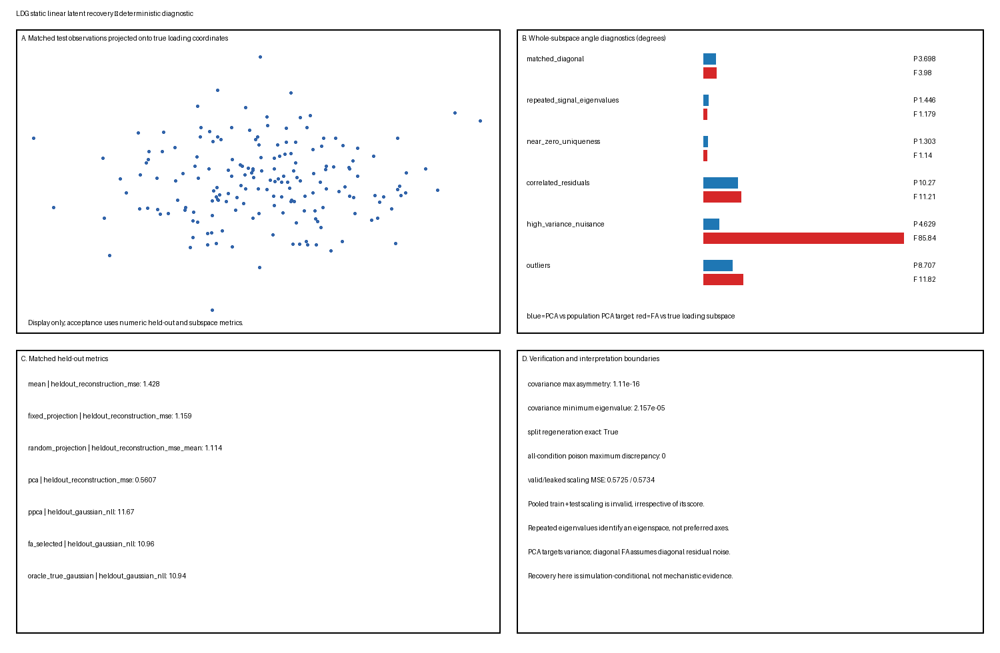

# Static Linear Latent Recovery

This L1/stable Toy Model is the Candidate A generation/recovery slice. It asks whether PCA and Gaussian latent-factor models recover the distinct targets their criteria define, and how residual misspecification, weak uniquenesses, nuisance variance, outliers, and preprocessing leakage make those targets diverge. Numerical values below are deterministic outputs under master seed `20260819`; they are not population theorems or real-data claims.

**Assumed background:** centered covariance PCA, Gaussian likelihood, linear subspaces, principal angles, and the Gaussian factor model. The stable Method Objects provide LDG terminology but do not replace the external evidence inspection recorded below.

## Question

For observations generated by a known rank-two Gaussian factor model:

1. does ordinary PCA recover the leading eigenspace of the **observable covariance**;
2. does correctly specified diagonal-noise FA recover the **common loading subspace**, common covariance, diagonal uniquenesses, and observable covariance up to loading rotations;
3. how does isotropic-noise PPCA differ from heterogeneous-noise FA; and
4. how do repeated signal eigenvalues, near-zero uniquenesses, correlated residuals, high nuisance variance, outliers, and pooled train/test scaling expose criterion or evaluation failures?

The object keeps four targets distinct:

- loading subspace $\mathcal S_\Lambda=\operatorname{col}(\Lambda)$;
- common covariance $\Lambda\Lambda^\top$;
- observable covariance $C=\Lambda\Lambda^\top+\Sigma_\epsilon$; and
- the rank-two population principal subspace of $C$.

PCA is scored against the last target. Diagonal FA is scored against the loading/common-covariance target only where its diagonal residual model is correctly specified **and** the displayed loading matrix passes the sufficient rank diagnostic stated below. Heterogeneous uniqueness means these subspaces need not coincide [@JolliffeCadima2016; @AndersonRubin1956; @TippingBishop1999].

## Ground truth

The ambient dimension is $p=8$ and latent rank is $q=2$. For each independent row,

$$
z_i\sim\mathcal N(0,I_2),\qquad
\epsilon_i\sim\mathcal N(0,\Sigma_\epsilon),\qquad
x_i=\Lambda z_i+\epsilon_i.
$$

The latent draws and residuals are mutually independent. The base loading basis $U$ is the deterministic QR-orthonormalization of

$$
B=\begin{pmatrix}
1.0&0.2\\
0.7&-0.5\\
0.4&1.0\\
-0.6&0.8\\
0.9&0.3\\
-0.2&-0.9\\
0.5&-0.4\\
-0.7&-0.2
\end{pmatrix},
$$

with QR signs chosen so the diagonal of $R$ is nonnegative. The primary loading is

$$
\Lambda=U\operatorname{diag}(2.0,1.25),
$$

and the primary uniqueness vector is

$$
\psi=(0.12,0.20,0.32,0.48,0.70,0.95,1.25,1.60).
$$

The retained truth contains $z$, $\Lambda$, $\Sigma_\epsilon$, $C$, the loading subspace, and the population principal subspace. Latent arrays enter only scoring and poison tests; fitting and model selection receive observations only.

### Structural identification boundary

Correct diagonal residual specification alone is not an identification result. For each displayed loading matrix, the implementation checks the following Anderson--Rubin-style sufficient rank condition: after deleting any one of the eight rows, the remaining rows contain two disjoint two-row submatrices, each of rank two. The diagnostic records witnesses for every deleted row, and all six loading matrices pass [@AndersonRubin1956].

Within conditions that also have an applicable diagonal residual specification, this supports structural identification of the diagonal uniquenesses and common-loading structure up to orthogonal loading rotation. It does **not** guarantee finite-sample accuracy, optimizer convergence, or recovery by the bounded implementation. Uniqueness-error rows are emitted only when both the diagonal residual model and this rank diagnostic apply.

## Generative model

Independent train, validation, and test samples are generated separately for every condition:

| Split | Rows per condition | Use |
|---|---:|---|
| train | 700 | means, PCA/PPCA, and FA fitting |
| validation | 350 | bounded FA floor/restart selection |
| test | 500 | held-out scoring only |

Randomness uses `Generator(PCG64(SeedSequence(words)))` with master seed `20260819` and stage, condition, and split words. Exact split regeneration is verified, and train and validation prefixes are checked not to coincide.

Generation, standardization, fitting, selection, scoring, plotting, and verification are separate functions. Test observations and all latent truth are excluded from lawful fitting and selection. For all six conditions, computed poison tests replace test observations or every retained latent array and verify that PCA, PPCA, every FA candidate, selected FA settings, and observation-only reconstructions remain unchanged.

## Parameters

The fixed numerical contract is:

- rank $q=2$;
- two uniqueness floors, $10^{-5}$ and $10^{-3}$;
- three deterministic initializations per floor;
- at most 250 EM iterations;
- relative per-observation training-NLL tolerance $10^{-8}$;
- validation NLL selects among the six candidates with deterministic floor/restart tie breaking;
- seven deterministic random rank-two projection baselines;
- covariance symmetry tolerance $10^{-10}$;
- covariance PSD tolerance $10^{-9}$; and
- poison-output tolerance $10^{-12}$.

The finite floors, starts, and iteration budget are controlled numerical choices, not general FA maximum-likelihood guarantees.

## Simulation

### Primary matched-diagonal condition

Use the base loading and $\Sigma_\epsilon=\operatorname{diag}(\psi)$. This is the primary correctly specified condition for diagonal FA.

### Repeated signal eigenvalues

Use $\Lambda=1.65U$ and $\Sigma_\epsilon=0.30I_8$. The two common-factor eigenvalues are equal. Only the complete rank-two eigenspace is scored; arbitrary axes inside it are not identified. Repeated eigenvalues inside a retained block permit a subspace target but not a preferred ordered basis [@JolliffeCadima2016; @TippingBishop1999].

### Near-zero uniqueness

Use uniquenesses

$$
(10^{-5},2\times10^{-5},5\times10^{-5},10^{-4},0.02,0.04,0.08,0.12).
$$

This remains positive definite but stresses the declared floors and slow likelihood convergence. A fitted floor is not interpreted as evidence for an exact zero.

### Correlated residuals

Keep the primary loading and marginal uniquenesses, but use residual correlations

$$
R_{ij}=0.42^{|i-j|},\qquad
\Sigma_\epsilon=\operatorname{diag}(\sqrt\psi)R\operatorname{diag}(\sqrt\psi).
$$

Diagonal FA is intentionally misspecified, so uniqueness recovery is not scored.

### High-variance nuisance

Increase the eighth residual variance to $7.5$. The population principal subspace now prioritizes observable variance, while the semantic loading target remains unchanged. PCA is scored against its population covariance target rather than punished for not knowing which variance is scientifically preferred. The selected FA run reaches the fixed 250-iteration bound; its $85.84^\circ$ loading angle is therefore reported as a bounded optimizer nonconvergence/computational failure, not evidence that the correctly specified population FA model cannot represent the loading structure.

### Outliers

Add deterministic random-direction contamination of magnitude `9.0` to 2.5% of every split. This is a contaminated distribution, not a Gaussian FA model. Every PPCA, FA, and reference covariance-error row is compared with and labelled `nominal_clean_gaussian_covariance`, not the covariance of the full contaminated observation law. Held-out NLL rows are labelled as Gaussian scores on the contaminated observation distribution. The true-parameter Gaussian is a nominal reference rather than a robust oracle. The symmetric random-direction construction adds isotropic covariance in population expectation, but no finite contaminated sample is treated as exactly Gaussian.

### Scaling-leakage negative control

Using the primary generated observations, compare:

1. a lawful standardizer fit on training observations only; and
2. an invalid standardizer fit on pooled train and test observations.

Both fit PCA using transformed training rows and score test reconstruction back in original units. Poisoning test features must leave the lawful preprocessing unchanged and must change the pooled preprocessing. Leakage is invalid regardless of whether one finite test MSE improves.

## Visualization

The single composite figure is a diagnostic summary. It shows a bounded score-space display, method-specific whole-subspace angles, matched-condition metrics, and verification/interpretation limits. The score display is not acceptance evidence.



PCA angles are measured against the population PCA target; FA angles are measured against the true loading subspace. Ordinary PCA has no Gaussian likelihood row. All values are conditional on the declared simulator and preprocessing.

## Expected behavior

- Under the primary model, finite-sample PCA should approximate the leading observable-covariance eigenspace, not necessarily $\operatorname{col}(\Lambda)$.
- Under correctly specified diagonal residuals **and the verified sufficient rank condition**, a successful bounded FA fit may approximate the structurally identified loading subspace, common covariance, uniquenesses, and observable covariance up to orthogonal loading rotation. Structural identification does not imply computational recovery.
- PPCA shares the PCA principal-subspace target at its likelihood optimum but restricts residual covariance to one isotropic variance [@TippingBishop1999].
- Equal retained signal eigenvalues identify the retained eigenspace but not ordered axes.
- Correlated residuals and outliers can alter fitted low-rank structure because the models do not know the intended scientific semantics. High nuisance variance directly changes PCA's covariance target; the present FA nuisance result is classified only as bounded optimizer nonconvergence.
- Near-zero uniqueness can slow or prevent convergence within a bounded iteration budget.
- Lawful training-only preprocessing is invariant to test poisoning; pooled train/test preprocessing is not.

These expectations do not guarantee a particular finite-sample ranking.

## Parameter manipulations

| Condition | Changed assumption | Primary diagnostic |
|---|---|---|
| `matched_diagonal` | none | correct-model loading/covariance recovery |
| `repeated_signal_eigenvalues` | equal common-factor strengths, isotropic residual | whole-eigenspace recovery only |
| `near_zero_uniqueness` | uniquenesses near boundary | floors, convergence, covariance validity |
| `correlated_residuals` | residual covariance not diagonal | residual off-diagonal error and NLL |
| `high_variance_nuisance` | one large residual variance | PCA target versus semantic loading target |
| `outliers` | non-Gaussian contamination | mean/covariance/likelihood sensitivity |
| `scaling_leakage_negative_control` | test data enters preprocessing | computed test-poison dependence |

No parameter was retuned after observing the result.

## Sanity checks

The verifier asserts:

1. all generated and fitted covariance matrices are finite, symmetric within $10^{-10}$, and not below the declared PSD tolerance;
2. all independent splits regenerate exactly from their seed words;
3. across every condition, test-observation poisoning leaves PCA, PPCA, all FA candidates, selected FA settings, and fixed-test observation-only reconstructions unchanged;
4. across every condition, poisoning all retained latent arrays leaves the same fitted states, selection records, and reconstructions unchanged;
5. lawful training-only scaling is invariant to test poisoning, while invalid pooled scaling changes materially;
6. every condition has the complete six-candidate FA selection record;
7. the Anderson--Rubin-style row-deletion rank diagnostic passes before uniqueness metrics are emitted;
8. observed-data NLL does not increase by more than $10^{-10}$ across stored EM updates;
9. selected floor and restart equal the minimum validation-NLL candidate under the deterministic tie rule;
10. metrics have the exact seven-field schema, nonempty labels, finite numeric values, and no duplicate composite keys; and
11. manifest hashes and a temporary clean regeneration are byte-identical.

These checks establish implementation consistency, not real-data adequacy or global FA optimization.

## Failure cases

- **Cross-target scoring:** calling PCA wrong because it differs from the loading subspace under heterogeneous residual variance.
- **Axis recovery inside a repeat:** treating arbitrary axes within an equal-eigenvalue eigenspace as identified.
- **Residual misspecification hidden by factors:** interpreting factors forced by correlated residuals as true common causes.
- **Nuisance variance called signal:** assuming a leading variance direction has semantic relevance.
- **Boundary convergence concealed:** reporting the near-zero condition as an ordinary converged interior fit.
- **Outlier oracle overclaim:** calling the nominal Gaussian generating parameters the true contaminated distribution.
- **Leakage ranked as a method:** treating pooled train/test scaling as legitimate because of one score.
- **Reconstruction substituted for likelihood or covariance recovery:** conflating different evaluation targets.
- **Latent truth leakage:** using $z$ to initialize, fit, select, or preprocess.
- **Low-dimensional overclaim:** inferring intrinsic dimension, manifold structure, mechanism, or representation from a rank-two fit.

## Recovery task

### PCA

Fit the training mean and sample covariance using divisor $n$, then retain the top two eigenvectors. Reconstruct test rows by orthogonal projection. Compare the fitted projector with the population leading eigenspace by principal angles.

### PPCA

Use the closed-form isotropic-noise maximum-likelihood solution based on the PCA eigensystem. Report held-out Gaussian NLL, observable-covariance error, reconstruction, and maximum/RMS principal-subspace alignment. The PPCA angle rows equal the PCA angle rows because the closed-form fit uses the same leading eigenspace; the verifier checks that equality. This is a probabilistic model distinct from ordinary PCA [@TippingBishop1999].

### Diagonal-noise FA

Fit a zero-mean-latent Gaussian FA model by bounded deterministic EM. Each iteration updates posterior factor moments, loadings, and diagonal uniquenesses, applying the declared floor. Six floor/restart candidates are fit on training observations and selected by validation NLL. This is a controlled fitting baseline, not proof of the global maximum.

### Oracle Gaussian

Use the declared condition mean, loading, and residual covariance for a reference Gaussian NLL and posterior reconstruction. In the outlier condition its machine-readable method is `nominal_clean_gaussian_reference` and its covariance target is `nominal_clean_gaussian_covariance`; it remains misspecified for the contaminated law.

## Candidate analysis methods

1. training mean reconstruction;
2. one fixed rank-two orthonormal projection;
3. seven fixed deterministic random rank-two projections summarized by mean/minimum/maximum/standard deviation;
4. ordinary covariance PCA;
5. closed-form PPCA;
6. bounded diagonal-noise FA; and
7. the condition-specific true-parameter Gaussian reference.

The fixed/random projections are rank-matched compression baselines and do not define likelihoods.

## Evaluation

`metrics.csv` contains exactly:

```text
split,condition,preprocessing,method,target,metric,value
```

Metrics include:

- held-out original-coordinate reconstruction MSE;
- held-out Gaussian NLL for PPCA, FA, and oracle models;
- maximum and RMS principal angles for the method-specific target;
- observable-covariance relative Frobenius error;
- residual off-diagonal RMSE;
- uniqueness RMSE and relative error only in conditions marked identified;
- FA selected floor, restart, iterations, convergence flag, train NLL, and validation NLL; and
- proper-versus-leaked scaling MSE and preprocessing dependence.

### Empirical results

| Result | Value |
|---|---:|
| Primary PCA angle to population PCA target | $3.70^\circ$ |
| Primary FA angle to true loading subspace | $3.98^\circ$ |
| Primary PCA test reconstruction MSE | 0.5607 |
| Primary FA test reconstruction MSE | 0.6565 |
| Primary FA test Gaussian NLL | 10.9603 |
| Primary oracle Gaussian NLL | 10.9413 |
| Primary FA observable-covariance relative error | 0.0617 |
| Primary FA uniqueness relative error | 0.0668 |
| Maximum covariance asymmetry | $1.11\times10^{-16}$ |
| Minimum checked covariance eigenvalue | $2.16\times10^{-5}$ |

Failure diagnostics include:

- correlated-residual FA loading angle $11.21^\circ$ and NLL 10.6014 versus oracle 10.2750;
- nuisance-variance PCA remains $4.63^\circ$ from the population PCA target; the FA loading angle $85.84^\circ$ is explicitly a nonconverged bounded-optimizer result and supports no method-level population conclusion;
- outlier FA loading angle $11.82^\circ$;
- repeated-eigenvalue whole-subspace PCA/FA angles $1.45^\circ/1.18^\circ$;
- near-zero FA loading angle $1.14^\circ$, with the selected run reaching the 250-iteration bound rather than satisfying the strict convergence tolerance; and
- lawful/leaked scaling MSE 0.5725/0.5734. Lawful preprocessing changed by zero under test poison; leaked mean and scale changed by 20.83 and 23.53.

The primary PCA reconstruction is lower than FA posterior-mean reconstruction because the methods optimize different losses. This is not evidence that PCA better recovers the FA generative decomposition. The near-zero and high-variance-nuisance FA fits reach the iteration bound; both are machine-labelled bounded optimizer nonconvergence/computational failure and are retained rather than hidden.

## Interpretation

The correct-model result supports a bounded distinction: PCA closely recovers the observable covariance's principal subspace, while diagonal FA closely recovers the structurally identified common loading subspace and Gaussian covariance under the diagonal-residual and sufficient-rank assumptions. Structural identification, finite-sample recovery, and optimizer convergence remain distinct. The selected FA NLL remains above the oracle reference, as expected for a fitted finite-sample model.

The negative controls show why target definitions matter. PCA can be correct about variance while scientifically unhelpful under nuisance variance. A converged diagonal FA fit can allocate correlated residual structure to common factors under misspecification; the nonconverged nuisance FA fit supports only a computational-failure statement. A whole repeated eigenspace can be recovered even though its displayed axes are arbitrary. Leakage is proven by dependence on test values, not by assuming that invalid preprocessing must improve one finite score.

::: {.callout-warning title="What this does NOT imply"}
Small principal angles, covariance fit, likelihood, or reconstruction do not establish a unique latent cause, intrinsic dimension, manifold, biological representation, dynamics, or mechanism.
:::

## What this toy model does NOT establish

- a model-free latent dimension;
- a manifold or nonlinear geometry;
- uniquely identified loading columns beyond orthogonal equivalence;
- causal, physical, neural, or biological factors;
- robustness to arbitrary contamination or residual dependence;
- a globally optimal FA likelihood solution;
- validity of pooled train/test preprocessing;
- that the largest variance direction is the desired scientific signal; or
- that reconstruction is interchangeable with likelihood or covariance recovery.

## Extensions to real data

A real-data analysis must define independent sampling units, feature units, scaling, missing-data policy, rank selection, residual covariance assumptions, and held-out splits. Preprocessing must be fitted inside training folds. PCA requires scale, outlier, and eigengap sensitivity checks. Diagonal FA requires residual-covariance, tail, subgroup, convergence, floor, and multistart checks. Loading axes should not receive mechanistic names solely because one rotation is convenient.

Temporal, hierarchical, robust, sparse, confirmatory, nonlinear, or correlated-residual variants require separate contracts.

## Reproducibility

The bounded artifact set is:

```text
toy-models/static-linear-latent-recovery.py
toy-models/artifacts/static-linear-latent-recovery/manifest.json
toy-models/artifacts/static-linear-latent-recovery/metrics.csv
toy-models/artifacts/static-linear-latent-recovery/diagnostics.json
toy-models/artifacts/static-linear-latent-recovery/summary.png
```

The bundled-runtime command is:

```bash
/Users/bytedance/.cache/codex-runtimes/codex-primary-runtime/dependencies/python/bin/python3 toy-models/static-linear-latent-recovery.py
```

Default execution generates and verifies, including a byte-identical temporary regeneration. Explicit `--generate` and `--verify` modes are available. The manifest records seeds, dimensions, split sizes, methods, FA search bounds, tolerances, versions, commands, and hashes.

### Evidence inspected

- **Jolliffe and Cadima (2016):** abstract, introduction, and the basic PCA sections on covariance eigendecomposition, centered SVD, principal-subspace approximation, sign ambiguity, rank, and covariance-versus-correlation scaling were inspected. Specialized adaptations were not inspected exhaustively [@JolliffeCadima2016].
- **Anderson and Rubin (1956):** the 40-page proceedings PDF was inspected at equation level for the Gaussian factor model, covariance decomposition, loading rotation, identification conditions, likelihood, diagonal-uniqueness iteration, isotropic-noise/PCA connection, and measurement-unit discussion. Part II proofs and all testing/asymptotic sections were not read line by line [@AndersonRubin1956].
- **Tipping and Bishop (1999):** the complete 12-page article was inspected for the FA/PCA distinction, PPCA model and likelihood, maximum-likelihood principal subspace, isotropic residual estimate, loading rotation ambiguity, reconstruction distinction, discussion, and Appendix A equal-eigenvalue boundaries. Applied examples and Appendix B were inspected only at overview level [@TippingBishop1999].

These sources do not supply the simulator dimensions, seeds, stress magnitudes, optimizer budget, or numerical tolerances; those are LDG design choices.

## Maturity checklist

- [x] Complete Toy Model schema at L1/stable.
- [x] Generation, preprocessing, fitting, selection, and scoring are separate.
- [x] PCA and FA targets are explicitly distinct.
- [x] Independent train/validation/test data and latent-leakage poison checks are present.
- [x] Mean, fixed/random projection, PCA, PPCA, bounded FA, and oracle baselines are implemented.
- [x] Repeated eigenvalues, near-zero uniqueness, correlated residuals, nuisance variance, outliers, and scaling leakage are implemented.
- [x] Deterministic bounded artifacts and byte-identical verification pass.
- [x] Independent scientific review PASS after focused re-review of identification, outlier-target, and nuisance-optimizer findings.
- [x] Independent implementation review PASS after focused re-review of poison scope, PPCA metrics, CSV verification, and outlier labels.
- [x] Repository validation and renders PASS after review.
- [x] Mechanical L1/stable promotion authorized under the recorded review decision.
