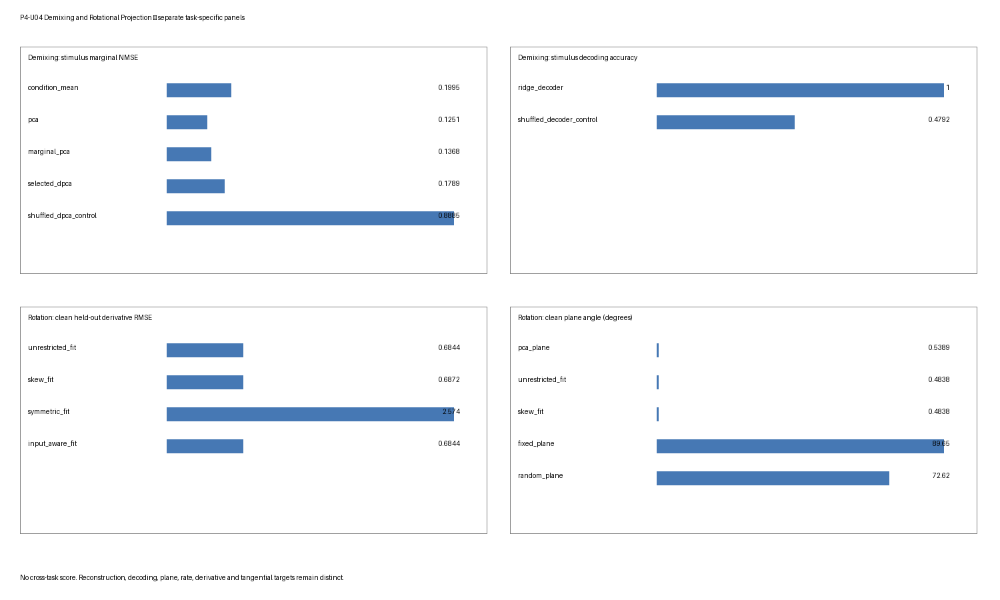

# 解混与旋转投影鲁棒性基准测试

## 科学问题

P4-U04 询问两个独立合成问题。

1. **标签依赖解混：** 在已知刺激与决策依赖线性效应下，条件均值、PCA、边际 PCA、有界 dPCA 与岭解码何时恢复其自己声明的留出目标，以及这些目标如何响应共线性、单元失衡、标签置换、伪群体、试次平均与样本量？
2. **旋转投影：** 在已知旋转与非旋转轨迹族下，PCA 平面、无限制导数回归、斜约束 jPCA 式拟合、对称拟合、输入感知拟合与固定/随机/对照平面何时恢复留出导数、平面、角速率、切向运动或协方差对照目标？

两个任务具有单独生成器、场景网格、方法、适用性规则、度量、摘要与图面板。不计算跨任务归一化、聚合得分、排名或胜者。边际重构、标签解码、边际子空间恢复、旋转平面恢复、角速率恢复与导数预测也永不被组合为单一得分。

## 真值

### 解混任务

解混生成器具有八个观测特征、12 个对齐时间箱与参考场景中平衡二元刺激 $s\in\{-1,1\}$ 与决策 $d\in\{-1,1\}$ 设计。试次具有干净信号

$$
y_{s,d}(t)
= \mu(t)
+0.9\,s\,f_s(t)v_s
+0.75\,d\,f_d(t)v_d,
$$

加标准差 $0.42$ 的独立高斯观测噪声。参考 $v_s$ 与 $v_d$ 标准正交。近共线场景把第二个方向替换为第一个方向的归一化扰动。该有界生成器没有交互效应。试次移位、逐特征试次重分配与标签置换是场景操作，不是参考目标的隐藏改变。

已知目标是刺激与决策条件均值边际化及其生成一维特征方向。标签是拟合的有监督观测；干净信号与生成方向对拟合不可用，只进入评分或验证。

### 旋转任务

旋转生成器具有四个潜坐标、八个观测特征、六个条件、$[0,1.2]$ 上 31 个物理时间样本与独立试次。参考潜矩阵包含速率四平面旋转与第二个更慢阻尼旋转块。主平面/速率目标是第一个已知观测空间平面与角速率 $4$。其他场景把潜族替换为对称衰减、时滞序列或输入驱动轨迹，或改变观测度量与预处理。

观测映射在普通场景是八乘四标准正交嵌入，在度量压力中是声明非正交嵌入。高斯潜与观测扰动独立添加。已知潜状态、嵌入与生成矩阵只是评分/验证真值。它们不被提供给拟合投影。

## 生成

生成是任务特定且先于所有拟合。

- **解混：** 每个场景-重复独立生成训练、验证与测试试次。参考每单元计数为 20/10/12，实际划分总数 80/40/48。小样本每单元计数 5/4/12 给出总数 20/16/48；大样本计数 45/18/18 给出总数 180/72/72。缺失单元训练矩阵为 `[[20,20],[20,0]]`，总数 60、设计秩三；验证/测试保持平衡，总数 40/48。不平衡训练矩阵为 `[[40,5],[6,20]]`，总数 71、设计秩四；其验证/测试总数 40/48。
- **旋转：** 每个场景-重复为训练/验证/测试每条件独立生成 7/4/5 试次。跨六个条件，实际总数 42/24/30。条件轨迹共享声明场景族，但接收独立扰动。

解混条件均值是每个观测单元内的算术均值。完整设计边际化随后给四个单元等权重，而非按试次数加权。旋转预处理首先在条件内平均试次；启用减法时，它在每个时间点分别减去跨条件均值。

可执行是基准本地的。它把稳定 Phase 3 解混与旋转对照可执行的 SHA-256 摘要记录为科学设计出处，但不声称调用或可执行复用其数值例程。

## 场景网格

### 解混场景

| 场景 | 声明操控 | 主边界 |
|---|---|---|
| `balanced_reference` | 带正交生成方向的完整 $2\times2$ 设计 | 有界参考 |
| `near_collinear` | 决策方向几乎与刺激方向对齐 | 目标重叠与不稳定分离 |
| `missing_cell` | 训练计数 `[[20,20],[20,0]]`；因子设计秩四中三 | 平衡边际恢复未定义 |
| `unbalanced_cells` | 训练计数 `[[40,5],[6,20]]`，完整秩四支撑 | 等单元边际化对不等精度 |
| `label_shuffle` | 合法拟合前训练标签的确定性置换 | 监督破坏对照 |
| `pseudo_population` | 每个划分与条件单元内，每个特征的完整试次轨迹被独立置换 | 单元均值保留，同时试次协方差改变 |
| `averaging_mismatch` | 独立试次级 $-1,0,+1$ 箱移位，最近边填充且无循环包裹 | 对齐条件均值模糊试次结构 |
| `small_sample` | 每单元 5/4 训练/验证试次 | 估计压力 |
| `large_sample` | 每单元 45/18/18 试次 | 更高信息比较 |

网格是核心加压力，不是单个原因的因子隔离。缺失单元训练设计秩三而非所需秩四。基准因此报告设计秩诊断并保留留出解码器得分，但把每个其他适用平衡边际重构与边际子空间行标记 `invalid`，原因 `incomplete_factorial_design_rank_3_of_4`。它不用总均值填充声称已辨识平衡边际恢复。

### 旋转场景

| 场景 | 声明操控 | 主边界 |
|---|---|---|
| `clean_rotation` | 参考旋转生成器与标准预处理 | 有界正参考 |
| `symmetric_decay` | 无真实旋转平面的对角负生成器 | 结构特定阴性对照 |
| `latency_sequence` | 顺序瞬态隆起而非自治旋转 | 时滞诱导表观序列 |
| `common_input` | 带已知二维输入的输入驱动状态方程 | 仅状态对输入感知预测 |
| `short_arcs` | 只取前 12 个时间点 | 有限角占用 |
| `time_jitter` | 条件依赖 $(-1,0,+1)$ 移位应用于潜路径与输入，最近边填充，永不完全包裹 | 对齐压力 |
| `smoothed` | 投影前拟合/应用三点移动平均 | 预处理依赖 |
| `no_condition_subtraction` | 省略跨条件时间均值减法 | 减法依赖 |
| `nonorthogonal_metric` | 非正交观测映射 | 欧氏度量依赖 |
| `covariance_control` | 通过协方差余弦在可许仅训练逐特征循环条件移位提案中选择；排除均匀全局移位 | 阈值协方差匹配对照 |

平面与角速率真值只对声明旋转场景报告，对衰减、时滞、输入与协方差对照族省略，因为那里未定义该目标。

## 阴性对照与压力情形

解混对照包括置换标签、不完整与不等单元、单元内伪群体重分配与无包裹试次对齐失配。洗牌 dPCA 对照独立置换训练与验证标签、在洗牌验证目标上重新选择其自身 dPCA 岭参数，然后重拟合。每个洗牌解码器同样从洗牌训练/验证标签独立重新选择其自身岭参数。因此洗牌对照不继承合法方法的所选参数。标签置换预期改变有监督拟合状态；它不是另一个独立重复。

伪群体操作只在相同划分与条件单元内的试次间置换每个特征的完整轨迹。标签与单元均值跨所有重复保持到数值精度（最大差异 $3.33\times10^{-16}$）。跨三个重复，非对角试次噪声协方差改变范围训练为 0.0523–0.0644、验证为 0.0685–0.0766、测试为 0.0690–0.0772。因此它隔离同时单元内试次协方差的丢失，而非破坏条件均值。

旋转对照包括对称动力学、时滞序列、公共输入、短弧、无包裹时序抖动、平滑与减法替代、非正交度量畸变、确定性种子推导随机平面与所选协方差对照。后者尝试 24 个预先声明种子推导提案，每个对每个 PCA 坐标分别应用循环条件移位。提案只有在至少两个坐标移位不同且实质改变跨坐标条件对应时才可许；均匀全坐标移位被排除为全局重标签/空操作。选择只在可许提案中最大化训练协方差余弦相似性，匹配阈值 0.97。重复 0/1/2 具有 23/24/24 个可许提案，选择提案 0/19/4，相似性 0.999995、0.999990 与 0.999985。所有所选对照使用多个不同移位、实质改变跨坐标对应，并被标记 `matched`。选择与匹配发生在训练得分上；对照不保留条件配对，也不确立动力学。

没有压力情形因削弱首选方法而被丢弃，也不执行事后场景特定参数搜索。

## 重复与确定性种子

19 个场景每个三个独立重复。PCG64 种子从主种子 `20260820`、任务、稳定场景哈希、重复、阶段、划分以及需要处的试次/对照索引确定性推导。重复内方法共享相同生成数据以配对比较。

因此 q10、中位数与 q90 摘要使用三个重复级值。它们是描述性有限样本摘要，不是置信区间或稳定尾部估计。试次、条件、单元与时间点不被提升为独立重复。

## 划分纪律

生成、拟合/选择、冻结恢复与评分是独立阶段。

- 解混拟合只接受训练/验证观测与标签。dPCA 正则化与岭解码器正则化在无测试数据下选择。冻结恢复接受拟合状态与测试观测/标签；真值只在评分中加入。
- 旋转预处理、PCA 与导数模型从训练观测与声明已知训练输入拟合。冻结恢复接受拟合状态、测试观测与测试输入。测试潜状态与真实嵌入保持仅评分。
- 被排除测试观测与真值不能按函数签名进入拟合。投毒诊断报告测试排除的零拟合状态差异与真值投毒的零固定观测恢复差异。
- 完整试次保持在单个划分内。相邻时间箱永不过跨训练与测试。

标签与条件置换对照是显式替代拟合路径，不是合法路径中的泄漏。

## 方法与信息集

### 解混方法

| 方法 | 角色 | 参数来源 | 记录信息集 |
|---|---|---|---|
| `condition_mean` | 训练条件均值边际参考 | 训练标签 | 有监督训练 |
| `pca` | 每个边际目标的秩二全局 PCA 投影 | 训练拟合 | 有监督训练 |
| `marginal_pca` | 分别对每个训练边际拟合的秩一 PCA | 训练标签 | 有监督训练 |
| `selected_dpca` | 岭降秩边际映射 | 训练加验证 | 有监督训练，带 `parameter_source=train_validation` |
| `ridge_decoder` | 单独刺激与决策试次分类器 | 训练加验证 | 有监督训练/验证 |
| `shuffled_dpca_control` | 确定性训练/验证标签置换后独立选择岭的边际映射 | 置换训练/验证标签 | 置换训练/验证对照 |
| `shuffled_decoder_control` | 确定性训练/验证标签置换后独立选择岭的解码器 | 置换训练/验证标签 | 置换训练/验证对照 |
| `factorial_design_diagnostic` | 训练设计 $[1,s,d,sd]$ 的秩 | 训练标签 | 设计诊断 |

重构/子空间方法不被赋予解码得分。解码器不被赋予边际重构或边际子空间得分。

### 旋转方法

| 方法 | 角色 | 参数来源 | 信息集 |
|---|---|---|---|
| `pca_plane` | 训练 PCA 表示的前两个坐标 | 训练拟合 | 训练拟合投影 |
| `unrestricted_fit` | 无限制线性导数回归；从其斜部分提取平面 | 训练拟合 | 训练拟合投影 |
| `skew_fit` | 斜约束导数回归 | 训练拟合 | 训练拟合投影 |
| `symmetric_fit` | 对称导数回归对照 | 训练拟合 | 训练拟合投影 |
| `input_aware_fit` | 状态与已知输入上的导数回归 | 训练拟合加已知输入 | 训练拟合投影 |
| `fixed_plane` | 预先声明 PCA 坐标轴 0 与 2 | 预先声明 | 固定参考 |
| `random_plane` | 确定性种子推导秩二平面 | 确定性种子 | 训练拟合投影 |
| `covariance_shuffle_control` | 最高相似性可许仅训练条件移位提案的平面/对照；排除均匀全局移位 | 所选置换条件 | 所选置换对照 |

无限制、斜、对称与输入感知模型共享相同训练 PCA 坐标系。其导数预测在留出中心有限差分上评估。`pca_plane` 是坐标 `[0,1]`，而 `fixed_plane` 是刻意不同的坐标 `[0,2]`；它们不是别名。验证器最大投影器差异为 1.0，其干净平面角度中位数分别为 0.5389° 与 89.6500°。回顾性条件均值投影不是在线状态估计器，不作在线主张。

## 参数选择

对 `selected_dpca`，岭网格是

$$
\lambda\in\{10^{-4},10^{-2},10^{-1},1\}.
$$

每个候选在训练条件均值上拟合，并由验证刺激与决策边际均方误差之和评分；并列使用更小有序 $\lambda$。每个岭解码器使用相同网格与验证分类误差和相同确定性并列规则。合法与洗牌 dPCA/解码器路径各自在其自身标签上执行自身选择，然后冻结其状态。在验证器使用的参考重复中，合法/洗牌 dPCA 都选择 1.0；合法刺激/决策解码器选择 $10^{-4}/10^{-4}$，而洗牌解码器选择 $10^{-4}/1.0$。这些值是那个重复的诊断，不是普遍超参数。

旋转方法在该有界实现中没有拟合超参数搜索。窗口、平滑、减法、固定/随机平面与条件置换是预先声明场景或方法选择，不是从测试表现选择。

## 推断

解混恢复从完整测试试次重建留出条件均值与边际化。随后按固定角色应用训练条件均值、全局/边际 PCA 投影器、所选 dPCA 映射与洗牌对照映射。试次解码器使用每个特征三个预先声明时间平均。干净试次信号与生成方向永不是恢复输入。

旋转恢复把训练拟合平滑/减法统计量、特征均值与秩四 PCA 基应用于留出条件均值。中心有限差分定义留出导数目标。拟合导数映射在冻结 PCA 坐标系中预测。平面方法投影那些相同留出得分。输入感知模型单独接收声明留出输入序列。

## 评分

每个 `results.csv` 行具有任务、场景、重复、种子、度量特定出处/划分/评估阶段、方法族、信息集、参数来源、目标、状态/原因、每单元计数数组与实际划分总数。相关处还记录所选超参数、设计秩、协方差对照匹配状态与提案索引。产物只包含以下度量。

### 解混度量

| 度量 | 目标 | 定义 |
|---|---|---|
| `stimulus_marginal_nmse` | 刺激边际重构 | 留出边际重构 MSE 除以留出刺激边际均方 |
| `decision_marginal_nmse` | 决策边际重构 | 类似留出决策得分 |
| `stimulus_subspace_angle_degrees` | 刺激边际子空间 | 领先恢复刺激边际方向与已知 $v_s$ 之间的主角度 |
| `decision_subspace_angle_degrees` | 决策边际子空间 | 与已知 $v_d$ 的类似角度 |
| `stimulus_decoding_accuracy` | 刺激标签解码 | 留出完整试次准确率 |
| `decision_decoding_accuracy` | 决策标签解码 | 留出完整试次准确率 |
| `factorial_design_rank` | 因子设计辨识 | 训练设计 $[1,s,d,sd]$ 的秩；它是训练诊断而非测试得分 |

边际 NMSE、子空间角度与解码准确率回答不同问题。解码器可以预测标签而不重构其条件均值边际，低边际误差不确立单试次解码。

### 旋转度量

| 度量 | 目标 | 定义 |
|---|---|---|
| `plane_angle_degrees` | 旋转平面 | 到第一已知旋转平面的观测空间主角度；只在适用旋转场景中 |
| `angular_rate_abs_error` | 角速率 | 与已知第一平面速率 $4$ 的绝对误差；只在适用旋转场景中 |
| `derivative_rmse` | 留出导数预测 | 训练 PCA 坐标中预测与中心差分留出导数之间的 RMSE |
| `tangential_velocity_ratio` | 平面切向运动 | 切向投影速度范数除以总投影速度范数 |
| `covariance_similarity` | 条件协方差对照 | 条件置换前后展平得分协方差的 Frobenius 余弦相似性 |

导数 RMSE、平面角度、角速率误差与切向比不是可互换证据。特别地，所选平面中的切向运动可以出现在瞬态或输入驱动序列中。

每个度量先在其声明留出单元/试次、条件或导数对上聚合为单一场景-重复-方法值。`diagnostics.json` 随后为每个任务 $\times$ 场景 $\times$ 方法 $\times$ 度量组跨三个重复报告 q10、中位数、q90、适用性率与失败率。

## 失效与适用性标签

保留完整笛卡尔任务特定清单：

- 解混：$9\times3\times8\times7=1{,}512$ 行；
- 旋转：$10\times3\times8\times5=1{,}200$ 行；
- 总计：2,712 个唯一规范行。

适用性在数值失败前解决。每行一个状态：

- `ok`：适用且有限；
- `nonconvergence`：适用路径中的线性代数失败；
- `invalid`：畸形、缺失或非有限适用得分；
- `inapplicable`：方法/场景不定义度量目标。

自然执行产生 1,041 `ok`、1,617 `inapplicable`、54 `invalid` 与零 `nonconvergence` 行。按任务，解混有 567 `ok`、891 `inapplicable` 与 54 `invalid`；旋转有 474 `ok` 与 726 `inapplicable`。全部 54 个自然 invalid 行是三个缺失单元重复的其他适用平衡边际重构/子空间组合；设计秩四中三。每个非 `ok` 行具有机器可读原因且无数值。自然 nonconvergence 缺失不是鲁棒性主张：真实路径故障注入验证 `invalid` 与 `nonconvergence` 两者，同时保留 `inapplicable` 优先级。

不适用示例是：边际重构上的解码器方法、解码上的重构方法、平面或速率目标上的对称/输入感知拟合，以及非旋转场景中的平面/速率真值。

## 产物契约

`benchmarks/artifacts/demixing-rotational-robustness/` 精确包含：

```text
manifest.json
results.csv
diagnostics.json
summary.png
```

清单冻结两个任务清单、三重复种子契约、阶段/划分/状态词汇、规范字典行顺序、命令、运行时、Phase 3 出处摘要与产物哈希。`results.csv` 保留所有原始重复行。`diagnostics.json` 只包含任务特定摘要与验证诊断。`summary.png` 使用四个分离任务/目标面板，是诊断视图而非验收证据或排行榜。

## 结果

以下值是从权威 `diagnostics.json` 重算的三个重复 q10/中位数/q90。它们是场景与目标条件的。

### 解混结果

| 场景与目标 | 方法 | q10 | 中位数 | q90 |
|---|---|---:|---:|---:|
| 参考刺激边际 NMSE | 条件均值 | 0.1808 | 0.1995 | 0.2691 |
| 参考刺激边际 NMSE | PCA | 0.1187 | 0.1251 | 0.1362 |
| 参考刺激边际 NMSE | 边际 PCA | 0.1278 | 0.1368 | 0.1496 |
| 参考刺激边际 NMSE | 所选 dPCA | 0.1787 | 0.1789 | 0.1934 |
| 参考刺激边际 NMSE | 独立选择洗牌 dPCA 对照 | 0.7650 | 0.8885 | 1.0291 |
| 参考决策边际 NMSE | 所选 dPCA | 0.0925 | 0.1045 | 0.1302 |
| 参考刺激子空间角度 | 所选 dPCA | 5.0274° | 5.2335° | 7.9515° |
| 参考决策子空间角度 | 所选 dPCA | 1.5773° | 1.7486° | 1.8960° |
| 参考刺激解码 | 岭解码器 | 1.0000 | 1.0000 | 1.0000 |
| 参考刺激解码 | 独立选择洗牌解码器对照 | 0.4625 | 0.4792 | 0.5792 |

这些行不定义单一方法顺序：PCA 的参考边际 NMSE、dPCA 的有监督边际映射与解码器的标签准确率是不同目标。在 `label_shuffle` 场景下，所选 dPCA 刺激边际 NMSE 中位数为 0.9821。完整但不等设计中位数为 0.1739。缺失单元设计报告秩 3。其 54 个平衡边际重构与子空间行是 `invalid`，因此不报告缺失单元边际恢复中位数；其留出解码器行保持有效。

单元内伪群体保留条件均值但改变同时协方差。因此其所选 dPCA 刺激边际 NMSE 保持有限，中位数 0.1917，其刺激解码器位数保持 1.0000；这些值不显示联合试次级群体信息的保留。无包裹平均失配中位数为 0.1819。小与大样本所选 dPCA 刺激 NMSE 中位数为 0.2230 与 0.1679。这些是有界压力观测，不是隔离因果效应。

### 旋转结果

| 场景与目标 | 方法 | q10 | 中位数 | q90 |
|---|---|---:|---:|---:|
| 干净导数 RMSE | 无限制拟合 | 0.6680 | 0.6844 | 0.6926 |
| 干净导数 RMSE | 斜拟合 | 0.6726 | 0.6872 | 0.6948 |
| 干净导数 RMSE | 对称拟合 | 2.5650 | 2.5741 | 2.5858 |
| 干净导数 RMSE | 输入感知拟合 | 0.6680 | 0.6844 | 0.6926 |
| 干净平面角度 | PCA 平面 `[0,1]` | 0.4619° | 0.5389° | 0.6176° |
| 干净平面角度 | 固定平面 `[0,2]` | 89.5811° | 89.6500° | 89.9175° |
| 干净平面角度 | 斜拟合 | 0.3565° | 0.4838° | 0.7605° |
| 干净平面角度 | 随机平面 | 57.1430° | 72.6218° | 82.8646° |
| 干净角速率误差 | 斜拟合 | 0.0082 | 0.0083 | 0.0309 |
| 干净切向比 | 斜拟合 | 0.9556 | 0.9647 | 0.9677 |
| 对称衰减导数 RMSE | 对称拟合 | 0.6519 | 0.6738 | 0.6863 |
| 公共输入导数 RMSE | 输入感知拟合 | 0.6861 | 0.6866 | 0.6933 |
| 协方差对照相似性 | 所选可许协方差对照 | 0.999986 | 0.999990 | 0.999994 |

匹配仅状态公共输入导数 RMSE 中位数为 0.7001，是小的场景特定差异，而非自治或输入驱动机制的证明。短弧与无包裹抖动斜平面中位角度为 1.0015° 与 0.8561°。平滑把斜导数 RMSE 中位数降至 0.3413，显示预处理依赖而非改善机制真值。在非正交观测度量下，斜平面中位角度为 12.2467°，斜导数 RMSE 为 5.3649。

对协方差对照，重复 0 排除提案 17，因为其移位 `[3,3,3,3]` 是单一全局公共重标签；重复 1 与 2 不含均匀提案。重复 0/1/2 所选可许提案为 0/19/4，移位 `[5,5,3,3]`、`[3,3,5,5]` 与 `[1,4,2,2]`。其协方差相似性为 0.999995、0.999990 与 0.999985；全部超过预先声明 0.97 阈值，因此具有机器可读状态 `matched`。所选跨坐标对应改变比例为 2/3、2/3 与 5/6，所选得分数组改变非零量。这些是从可许训练提案族选择的接近匹配，不是条件身份保留或旋转机制的证据。



上面板只显示参考刺激边际 NMSE 与参考刺激解码。下面板只显示干净留出导数 RMSE 与干净旋转平面角度。`pca_plane` 与 `fixed_plane` 可见且数值上不同。没有面板混合两个任务或把一个目标当作另一个的代理。

## 解读界限

本对象只确立声明生成器、划分、场景网格、目标、度量与拟合信息集下的行为。

- **解混是标签与损失依赖的。** 它不确立统计独立、盲源分离、唯一潜原因、神经模块、解剖、机制或因果性。
- 解码准确率不是表示、边际重构或解混。洗牌标签对照是监督对照，不是对数据生成系统的因果干预。
- 缺失/不等单元与伪群体改变估计目标与可用联合信息。有限输出不恢复未辨识因子效应或同时噪声结构。
- 试次平均与对齐光滑条件均值可以隐藏试次级变异性。它们不是潜动力学的证据。
- **旋转投影不是振荡器、自治动力系统、向量场或机制。** 斜约束导数拟合描述声明预处理与度量下的投影。
- 好平面角度不蕴含好导数预测；高切向比不蕴含真实旋转生成器；好导数预测不蕴含自治性或因果性。
- 时滞序列、公共输入、平滑、减法、短窗口、时序抖动与非正交坐标可以制造、移除或畸变旋转摘要。
- 没有结果确立流形结构、本征维数、生物有效性、真实数据迁移或普遍方法优越性。

## 可复现性

使用记录捆绑运行时：

```bash
/Users/bytedance/.cache/codex-runtimes/codex-primary-runtime/dependencies/python/bin/python3 benchmarks/demixing-rotational-robustness.py --generate
/Users/bytedance/.cache/codex-runtimes/codex-primary-runtime/dependencies/python/bin/python3 benchmarks/demixing-rotational-robustness.py --verify
/Users/bytedance/.cache/codex-runtimes/codex-primary-runtime/dependencies/python/bin/python3 benchmarks/demixing-rotational-robustness.py --generate --resume
```

验证器检查：

- 精确四产物清单与 SHA-256 哈希；
- 全部 2,712 完整、唯一、规范原始行与全部 904 个重算摘要；
- 逐字节相同干净再生与反转任务/场景遍历；
- 逐字节相同有效部分恢复，并拒绝损坏、重复、未知键或不完整恢复行；
- 测试/真值从拟合的能力排除；
- 真值投毒下固定恢复不变性；
- 洗牌 dPCA/解码器对照的确定性重放与独立超参数选择；
- 缺失单元秩/invalid 路由、单元内伪群体保留、无包裹移位重放与协方差提案 argmax/阈值检查；
- 直接解混方向、旋转嵌入、生成器与解析导数诊断；以及
- 真实路径非有限与线性代数故障标签，带适用性优先级。

最大干净生成器诊断是：刺激/决策方向内积约 $2.08\times10^{-17}$、实际嵌入平面角度约 $1.21\times10^{-6}$ 度、直接生成器恢复误差约 $2.35\times10^{-15}$、中心有限差分对解析导数差异约 $2.04\times10^{-2}$。最后值是有限网格离散化诊断，不是表现得分。

## 审查记录

独立科学与实现审查员是只读且独立于执行者。其初始审查在缺失单元设计秩无效性、单元内伪群体、独立洗牌对照选择、无包裹移位、划分元数据、不同平面参考与非平凡协方差匹配提案上返回 `REVISE`。有界修正轮次只处理那些发现；聚焦科学与实现复审都返回 `PASS`，无未解决发现。

已接受验证记录包括 61 对象结构验证、33 仓库测试、增强产物验证器、目标/索引渲染、工作流验证与 `git diff --check`。记录的审查决定随后授权机械晋升到 `L1/stable`。稳定状态记录该声明合成基准对象的有界验收；它不扩大其证据、信息集、目标或解读边界。

## 成熟度检查表

- [x] 解混与旋转投影是带分离网格、方法、目标、度量、摘要与面板的独立任务。
- [x] 声明全部 19 个场景与三个独立重复。
- [x] 生成、拟合/选择、冻结恢复与评分边界显式。
- [x] 标签与条件置换是显式阴性对照路径。
- [x] 边际重构、解码、子空间、平面、速率、导数、切向与协方差目标保持不同。
- [x] 适用性先于失败，保留原始重复行。
- [x] 记录精确四个字节可验证产物与权威命令。
- [x] 有界结果与解读界限与产物调和。
- [x] 记录最终聚焦科学复审 PASS。
- [x] 记录最终聚焦实现复审 PASS。
- [x] 审查授权机械晋升到 `L1/stable` 完成。
