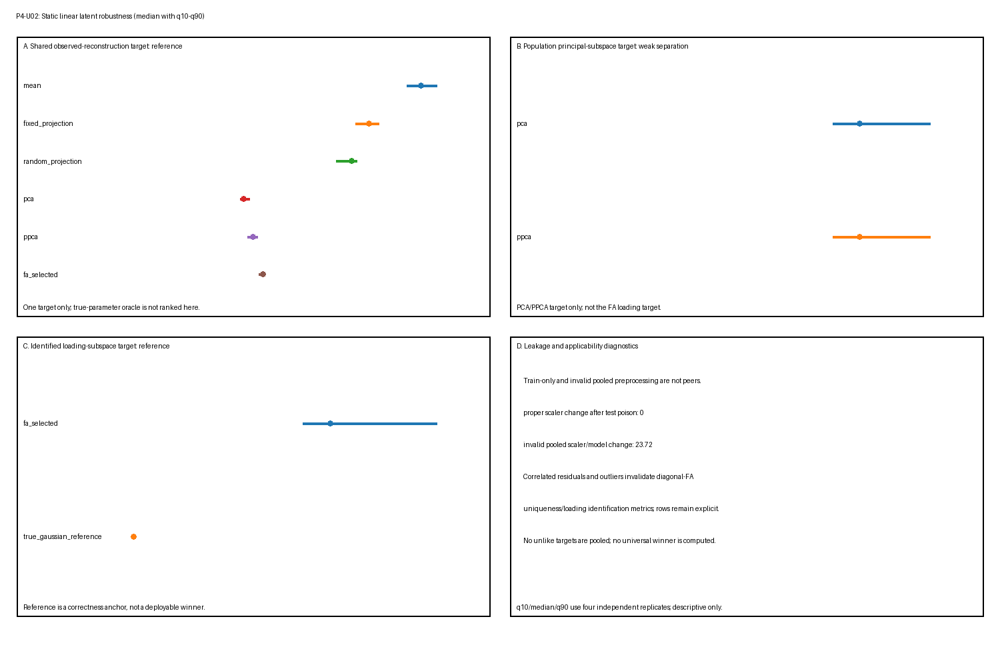

# P4-U02 — 静态线性潜恢复基准测试

## 科学问题

在一组有界独立秩二高斯因子模拟与声明误设对照网格中，均值与秩匹配投影参考、普通 PCA、概率 PCA（PPCA）、有界对角噪声因子分析（FA）与已知参数高斯参考何时恢复**其准则定义的不同目标**，以及何处不适用、数值不收敛或可观测地脆弱？

这不是共享目标排行榜。特别地，普通 PCA 对照可观测协方差的总体主子空间评判，而 FA 载荷恢复只在对角残差模型与声明结构辨识诊断适用时对照公共载荷结构评判。重构、似然、协方差恢复、子空间恢复、唯一性恢复、收敛与泄漏是不同任务，永不被合并为单一得分。

## 真值

每个独立行在外围维数 $p=8$、潜秩 $q=2$ 下生成：

$$
z_i\sim\mathcal N(0,I_2),\qquad
\epsilon_i\sim\mathcal N(0,\Sigma_\epsilon),\qquad
x_i=\Lambda z_i+\epsilon_i.
$$

保留真值包含 $z$、$\Lambda$、公共协方差
$C_{\mathrm{common}}=\Lambda\Lambda^\top$、残差协方差
$\Sigma_\epsilon$、可观测协方差
$C=C_{\mathrm{common}}+\Sigma_\epsilon$、载荷子空间
$\operatorname{col}(\Lambda)$ 与 $C$ 的秩二总体主子空间。这些是不可互换目标。

总体参数与潜数组只对生成、评分与实现神谕检查可用。它们不被提供给合法预处理、拟合、验证选择或留出恢复。可执行复用 `toy-models/static-linear-latent-recovery.py` 中的稳定数值定义与例程，不编辑稳定玩具模型或改变其科学结论。

### 辨识、恢复与收敛是不同主张

三个边界被分别记录：

1. **结构辨识适用性。** 对对角噪声 FA，唯一性与公共载荷目标只在残差协方差对角且显示载荷矩阵通过保留 Anderson–Rubin 式充分行删除秩诊断时合格。载荷列在正交旋转下保持等价。
2. **有限样本恢复。** 主角度与协方差误差描述一个相对已知合成真值的有界拟合样本。辨识不保证这些误差小。
3. **优化器收敛。** 有界 EM 实现可以达到其迭代上限或数值边界。收敛是计算标签，不是结构辨识、总体正确性或全局最大似然的证明；不收敛不是总体模型类无法表示真值的证据。

## 生成

生成只接收场景标识符、重复标识符、划分与确定性种子词语。它产生独立训练、验证与测试观测，并在单独评分载荷中保留真值。离群值污染与残差相关只在其预先声明场景类中应用。生成不调用预处理、拟合、选择、恢复或评分。

主模型使用稳定玩具模型的确定性秩二载荷基与异质对角唯一性。场景特定改变在结果解读前固定，并记录于 `manifest.json`。

## 场景网格

网格是有界核心加压力设计，而非完整因子实验。它覆盖每个 Phase 4 契约因子，同时保持独立重复与字节级再生实用。

| 场景类 | 声明变化 | 主要目标边界 |
|---|---|---|
| 样本量 | `small_sample`：60/60/180 行；`reference`：240/120/180；`large_sample`：600/200/240 | 有限恢复与优化器稳定性 |
| 信号强度 / 特征值分离 | `weak_separation`：$(1.25,0.95)$；`repeated_signal`：$(1.50,1.50)$ 带均匀唯一性 $0.45I$ | 完整主/载荷子空间，永不含重复块内任意轴 |
| 异质唯一性 | 强度 $(2.0,1.25)$ 带 $(0.12,0.20,0.32,0.48,0.70,0.95,1.25,1.60)$ | FA 载荷/公共结构目标对 PCA 总体主目标 |
| 近零唯一性 | $(10^{-5},2\times10^{-5},5\times10^{-5},10^{-4},0.02,0.04,0.08,0.12)$ | 边界行为与有界收敛 |
| 相关残差 | $R_{ij}=0.42^{|i-j|}$ 带异质边际唯一性 | 故意对角 FA 误设；载荷/唯一性辨识度量不适用 |
| 高方差干扰 | 第八残差方差设为 $7.5$ | 即使科学载荷目标不变，总体 PCA 目标也改变 |
| 离群值 | 每个划分 2.5% 中幅度 $9.0$ 的随机方向污染 | 高斯模型与协方差敏感性；名义干净参考不是污染神谕 |
| 预处理泄漏 | 仅训练缩放对池化训练/测试缩放 | 合法不变性对无效测试依赖 |

改变一个命名场景也可以改变可观测协方差、特征间隙或有效信噪比。因此跨场景行差异是有条件鲁棒性观测，不是单一因素的隔离因果效应。精确场景值、划分大小、预期适用性、重复数与种子映射冻结在清单中。

## 阴性对照与压力情形

- **固定与种子推导随机秩二投影** 显示仅秩匹配在不估计总体目标的情况下能实现什么。每个场景-重复恰好一个随机基。
- **相关残差** 故意违反对角噪声 FA。该条件下拟合因子不得被称为恢复公共原因。
- **高方差干扰** 检验方差定义 PCA 目标是否偏离未变载荷目标；正确 PCA 恢复不是语义错误。
- **近零唯一性** 压力正性下限、边界行为与有限迭代预算。
- **离群值** 违反干净高斯律。真实干净参数保持仅为名义参考，不是受污染数据的真实分布。
- **池化训练/测试预处理** 显式无效。泄漏由对投毒测试观测的依赖证明，而非某个有限测试得分是否改善。

失败被保留并标记，而非调走。

## 重复与确定性种子

11 个声明场景每个使用四个独立确定性重复。种子词语包括主种子、稳定场景代码、重复、划分与生成器所需的任何序列或基线索引。映射不依赖执行顺序。方法共享一个重复的生成数据以支持配对、目标特定比较，而不同重复使用独立随机流。

每个场景 $\times$ 重复 $\times$ 方法 $\times$ 度量产生一个原始记录。其值从 **Scoring** 下声明的度量特定出处计算——按适用为测试行、验证行、训练优化、总体真值或训练/测试投毒干预。重复身份永不被丢弃。

## 划分纪律

训练、验证与测试样本独立生成。训练数据拟合均值、合法预处理、PCA/PPCA 与每个有界 FA 候选。验证观测只在预先声明 FA 下限与重启中选择。测试观测只由冻结测试时间恢复或似然计算使用。保留干净测试信号与总体参数只在单独度量特定评分阶段加入。

合法选择接受受限训练/验证观测载荷。它没有读取测试观测或任何潜/总体真值的能力。投毒检查替换被排除测试观测与保留潜数组，并要求合法拟合状态、所选 FA 设置与仅观测恢复不变。池化缩放阴性对照保持单独并显式标记无效。

## 方法与信息集

- **Training mean（训练均值）：** 在训练观测上拟合的秩零重构参考。
- **Fixed rank-two projection（固定秩二投影）：** 预先声明标准正交压缩参考；不对结果拟合。
- **Random rank-two projection（随机秩二投影）：** 恰好一个秩二标准正交基从场景与重复种子确定性推导，独立于该重复生成观测。它是秩匹配参考，不是验证选择方法。跨重复，生成数据与种子推导基都联合变化；因此重复摘要不隔离基变异性与采样变异性，也不在单重复内平均基族。
- **Ordinary covariance PCA（普通协方差 PCA）：** 在训练观测上拟合的确定性秩二正交投影。其总体目标是声明预处理与欧氏度量下可观测协方差的领先秩二特征空间。
- **PPCA：** 各向同性残差高斯限制
  $C=WW^\top+\sigma^2I$。其最大似然载荷空间是 PCA 主子空间，但它额外提供高斯协方差、似然与后验均值。它不是一般对角噪声 FA，其似然不追溯使普通 PCA 概率化。
- **Bounded diagonal-noise FA（有界对角噪声 FA）：** 由确定性有界 EM 候选与验证选择拟合的秩二高斯模型
  $C=\Lambda\Lambda^\top+\operatorname{diag}(\psi)$。载荷列只通过旋转不变子空间/公共协方差目标比较。
- **True-parameter Gaussian reference（真参数高斯参考）：** 使用已知模拟器参数做似然与后验重构。它是不可用实现/参考神谕，不是可部署拟合竞争者。在离群值污染下它被命名并解读为名义干净高斯参考。

所有合法方法使用相同冻结测试观测。总体特征空间、载荷、协方差、唯一性与潜得分是评分真值或神谕输入，永不是拟合信息。

## 参数选择

PCA 与闭式 PPCA 使用预先声明秩二，不需要验证选择。固定/随机投影在数据生成前冻结。对 FA，训练划分拟合每个预先声明唯一性下限 $\times$ 重启候选；验证高斯 NLL 以确定性并列规则选择一个候选。所选下限与重启在测试恢复与评分前冻结。

该有限候选集是有界数值规程。它不证明全局优化，验证选择不能把误设对角残差模型变成正确模型。

## 推断

对重构方法，恢复接收冻结预处理与拟合状态加测试观测。PCA 与投影基线返回原始坐标欧氏重构。PPCA 与 FA 返回模型条件高斯后验均值重构。即使同秩，它们也是不同估计器。

没有方法接收测试潜真值。真参数高斯参考通过显式神谕标记路径调用。没有时间信息集：观测是独立静态行，其排序没有科学意义。

## 评分

原始行使用度量特定 `target` 元数据。以下任务族保持分离：

| 原始度量 | 出处、目标与解读 |
|---|---|
| `heldout_reconstruction_mse` | 测试观测与冻结重构；原始坐标观测重构，包括 `outliers` 中受污染观测；不是载荷或协方差恢复 |
| `latent_signal_reconstruction_mse` | 生成器保留的测试干净公共信号 $\Lambda z$，与减去声明总体均值后的拟合重构比较；对每个返回有限测试重构的方法定义，包括均值、固定/随机投影、PCA、PPCA、所选 FA 与真参数参考。两个缩放 PCA 对照只适用于 `preprocessing_leakage`。在 `outliers` 中，观测与拟合重构包含污染，而目标保持未污染 $\Lambda z$，因此该度量测量干净模拟公共贡献的恢复，而非受污染观测律的重构 |
| `heldout_gaussian_nll` | 冻结 PPCA、FA 或真参数高斯密度下的测试观测；普通 PCA 与纯投影不定义该得分。在 `outliers` 中，这是受污染观测上的高斯得分，干净真参数模型只是名义参考 |
| `covariance_relative_frobenius` | 拟合模型协方差对总体可观测协方差；对 `outliers`，目标显式为名义干净高斯协方差，而非受污染律的协方差 |
| `principal_subspace_angle_max_degrees` | 训练拟合 PCA/PPCA 空间对可观测 $C$ 的总体秩二主子空间；该值组合拟合训练输出与总体评分真值，而非测试观测 |
| `loading_subspace_angle_max_degrees` | 训练/验证所选 FA 载荷空间对 $\operatorname{col}(\Lambda)$，或精确参考对其自身，只在对角残差与充分秩辨识条件适用处；总体真值评分，非测试划分损失 |
| `uniqueness_rmse` | 所选 FA 对角唯一性对总体对角唯一性，只在相同辨识条件适用处；实现发出 RMSE，而非唯一性相对误差 |
| `selected_validation_nll` | 验证观测与所选有界 FA 候选；选择诊断，非留出测试表现 |
| `optimizer_iterations` | 所选 FA 候选的训练优化历史；计算诊断。达到界的运行被标记 `nonconvergence` |
| `identification_applicable` | 总体场景规格加充分秩诊断；二元适用性记录，非经验恢复表现 |
| `preprocessing_test_poison_parameter_change` | 确定性测试投毒前后预处理/模型参数差异；只对声明泄漏对照使用训练与测试观测，不是候选方法得分 |

因此出处是度量特定的：只有留出重构、干净信号重构与高斯 NLL 度量是直接测试行聚合。子空间、协方差、唯一性与辨识度量把拟合状态与总体真值连接；验证 NLL 来自验证数据；优化器迭代来自训练优化；投毒度量是训练/测试扰动诊断。原始 `split`/出处字段必须与度量和目标一起阅读，而非解读为每个数值都是测试损失。

对观测级损失，相关行先在一个场景-重复内聚合。每个其他度量同样为该场景-重复-方法-度量键贡献至多一个值。`diagnostics.json` 随后跨四个独立重复级值报告中位数、q10 与 q90，连同每个场景 $\times$ 方法 $\times$ 度量组的 `ok`、失败与适用性率。测试行、特征与 EM 迭代不被当作独立重复。随机投影行每个场景-重复使用一个种子推导基，因此其跨重复分位数反映数据与基的联合变异。不同目标不被归一化、平均、排名或合并。

FA **载荷子空间**与**公共协方差**概念上不同：前者忽略载荷幅度，而
$\Lambda\Lambda^\top$ 保留幅度同时对正交载荷旋转不变。该首个有界实现直接发出载荷子空间角度、可观测协方差误差与唯一性误差，但不发出单独公共协方差范数。因此它不作数值公共协方差幅度恢复主张；报告结果中的「公共结构」只指声明载荷子空间目标。

同样，残差非对角误差与唯一性相对误差不是该基准的原始度量。所选下限、重启与收敛状态是识别冻结 FA 候选的行元数据；收敛状态也用于分配失败标签。候选训练 NLL 可以保留在有界选择诊断中供验证，但训练 NLL 与独立收敛标志都不作为已评分原始度量发出。唯一已评分 FA 选择/计算度量是 `selected_validation_nll` 与 `optimizer_iterations`。

## 失效与适用性标签

每个预期场景 $\times$ 重复 $\times$ 方法 $\times$ 度量行被保留并恰好一个状态：

- `ok`：目标适用且值有限有效；
- `nonconvergence`：有界优化器或数值规程未满足其声明收敛契约；
- `invalid`：计算、协方差、预处理或值无效，包括故意池化预处理对照（适用处）；
- `inapplicable`：方法在该场景下不定义该似然、目标或已辨识量。

每个非 `ok` 行具有机器可读原因。结构辨识不适用、模型误设、有限恢复误差与优化器不收敛使用不同原因，不相互替代。行不会因为方法失败或目标不适用而消失。

## 产物契约

生成目录是 `benchmarks/artifacts/static-linear-latent-robustness/`，精确包含：

```text
manifest.json
results.csv
diagnostics.json
summary.png
```

清单冻结场景、方法/目标适用性、划分大小、重复与种子规则、FA 搜索界、容差、命令、规范行排序、严格恢复语义、运行时版本与 SHA-256 哈希。图仅是诊断视图并分离目标族；它不是验收证据或排名。

## 结果

验证原始产物包含来自 11 个场景、四个重复、九种方法与 11 个度量的 4,356 个唯一规范行。状态计数在自然运行为 1,260 `ok`、3,044 `inapplicable`、52 `nonconvergence`、零 `invalid`。故障注入单独验证 `invalid` 路径。以下 q10/中位数/q90 值只是四个独立重复级值上的描述性摘要，不是置信区间或稳定尾部估计。

| 场景与目标 | 方法 | q10 | 中位数 | q90 | 适用性 / 失败 |
|---|---|---:|---:|---:|---:|
| 参考观测重构 MSE | 均值 | 1.2943 | 1.3591 | 1.4349 | 1.00 / 0.00 |
| 参考观测重构 MSE | PCA | 0.5049 | 0.5225 | 0.5507 | 1.00 / 0.00 |
| 参考观测重构 MSE | PPCA 后验均值 | 0.5400 | 0.5653 | 0.5885 | 1.00 / 0.00 |
| 参考观测重构 MSE | 所选 FA 后验均值 | 0.5946 | 0.6133 | 0.6155 | 1.00 / 0.00 |
| 参考总体主角度 | PCA / PPCA | $6.27^\circ$ | $7.28^\circ$ | $13.46^\circ$ | 1.00 / 0.00 |
| 参考已辨识载荷子空间角度 | 所选 FA | $5.34^\circ$ | $6.21^\circ$ | $9.55^\circ$ | 1.00 / 0.00 |
| 参考可观测协方差相对误差 | 所选 FA | 0.0843 | 0.0949 | 0.1143 | 1.00 / 0.00 |
| 参考唯一性 RMSE | 所选 FA | 0.0472 | 0.0733 | 0.0938 | 1.00 / 0.00 |
| 参考留出高斯 NLL | PPCA | 11.2800 | 11.4920 | 11.5296 | 1.00 / 0.00 |
| 参考留出高斯 NLL | 所选 FA | 10.7271 | 10.7888 | 10.8820 | 1.00 / 0.00 |
| 参考留出高斯 NLL | 真参数参考 | 10.6654 | 10.7450 | 10.8299 | 1.00 / 0.00 |

在该冻结模拟器内，PCA 中位总体主角度在 `small_sample` 为 $15.10^\circ$、`large_sample` 为 $4.00^\circ$。这些是不同划分大小下的有限样本观测，不是速率定理。重复信号场景报告完整秩二子空间；其 PCA 中位角度为 $5.65^\circ$，不辨识该块内有序轴。

失败标签暴露仅成功表会隐藏的边界：

- 所选 FA 在四个 `small_sample` 重复之一、四个 `near_zero_uniqueness` 重复之三、四个 `correlated_residuals` 重复之二与四个 `high_nuisance` 重复之一中未满足其有界收敛契约；
- 在 `near_zero_uniqueness` 中，适用 FA 恢复与似然度量的 `ok` 率只有 0.25；唯一收敛重复不能确立鲁棒总体恢复；
- FA 载荷子空间与唯一性恢复在 `correlated_residuals` 与 `outliers` 中显式不适用，即使有界数值拟合收敛；
- 合法仅训练缩放器中位测试投毒参数改变为 $0.0$，而无效池化训练/测试对照中位改变为 $23.6590$；后者是泄漏诊断，不是改善候选；以及
- 真参数参考在独立数值检查中可观测协方差相对误差 $0.0$、载荷投影器差异 $0.0$。它是正确性锚点，不是可部署胜者。



图分离共享观测重构目标、PCA/PPCA 总体主目标、FA 载荷目标与泄漏/适用性诊断。它不显示跨目标得分或排名。

## 解读界限

该基准只能确立模拟器、场景、预处理、目标、度量与实现条件行为。

- 紧密 PCA 恢复总体主子空间不蕴含残差方差异质时恢复 $\operatorname{col}(\Lambda)$。
- 适用假设下紧密 FA 载荷子空间恢复不辨识唯一朝向载荷列或潜原因。可观测协方差恢复被单独报告，且不发出公共协方差幅度恢复度量。
- PPCA 限于各向同性残差方差；其主子空间关系不使它等价于异质噪声 FA。
- 结构辨识不蕴含准确有限恢复或优化器收敛；收敛不证明辨识或正确规格。
- 更低重构误差不是更好似然模型、潜机制或科学表示的证据。
- 更好留出高斯 NLL 不证明因果因子、对污染的鲁棒性或声明分布之外的正确性。
- 高干扰方差可以使 PCA 科学上无用，同时对其方差定义目标仍正确。
- 秩二与紧凑恢复都不证明与模型无关本征维数、流形、拓扑、动力学、机制、生物表示或真实数据迁移。

没有跨目标总分、普遍胜者或 Phase 5 授权。

## 可复现性

用捆绑工作区 Python 运行时生成与验证：

```bash
/Users/bytedance/.cache/codex-runtimes/codex-primary-runtime/dependencies/python/bin/python3 benchmarks/static-linear-latent-robustness.py --generate
/Users/bytedance/.cache/codex-runtimes/codex-primary-runtime/dependencies/python/bin/python3 benchmarks/static-linear-latent-robustness.py --verify
```

验证器契约包括：

- 精确四文件产物清单与 SHA-256 一致性；
- 唯一预期原始键、完整行与规范排序；
- 逐字节相同干净再生；
- 逐字节相同反转场景/重复遍历；
- 从有效部分结果逐字节相同恢复，并拒绝损坏、陈旧、重复、未知键或不完整部分行；
- 受限拟合/选择能力加测试观测与潜真值投毒检查；
- 独立于遍历顺序的确定性划分与基线再生；
- PCA/PPCA 主空间一致性与独立总体目标检查；
- 协方差对称性、半正定性与有限值检查；
- FA 验证选择一致性、容差内似然单调性与显式有界收敛标签；
- 发出公共载荷或唯一性度量前的充分秩/应用检查；以及
- 数值或非有限故障注入下的显式失败标签，而非静默行省略。

## 审查记录

独立科学与实现审查员是只读且独立于执行者。其初始审查在适用性优先级、度量出处与清单、拟合/恢复能力分离、完整投毒覆盖、实际真参考检查与记录调和上返回 `REVISE`。有界修正轮次只处理那些发现；聚焦科学与实现复审都返回 `PASS`，无未解决发现。

已接受验证记录包括 59 对象结构验证、33 仓库测试、完整产物验证器、目标/索引渲染、工作流验证与 `git diff --check`。记录的审查决定随后授权机械晋升到 `L1/stable`。稳定状态记录该声明合成基准对象的有界验收；它不扩大其证据、信息集、目标或解读边界。

## 成熟度检查表

- [x] 科学问题与已知静态合成真值有界。
- [x] PCA 总体主、FA 载荷子空间、可观测协方差、未报告公共协方差幅度、PPCA、似然、重构、收敛与泄漏目标被区分。
- [x] 结构辨识、有限样本恢复与优化器收敛显式分离。
- [x] 生成、预处理、拟合/选择、恢复与评分具有单独契约。
- [x] 声明训练、验证、测试、重复、神谕与泄漏边界。
- [x] 场景类覆盖样本量、信号/特征间隙、异质与近零唯一性、相关残差、干扰方差、离群值与预处理泄漏。
- [x] 定义原始度量目标、两级摘要与失败/适用性标签，无池化得分。
- [x] 存在四个产物且完整验证器通过。
- [x] 有界数值结果已从验证产物调和。
- [x] 记录独立科学审查 PASS。
- [x] 记录独立实现审查 PASS。
- [x] 审查授权机械晋升到 `L1/stable` 完成。
