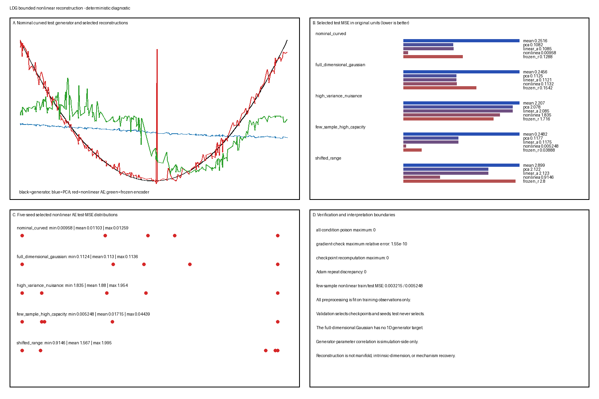

# 有界非线性重构

这个 L1/stable Candidate G 玩具模型询问：一个固定小非线性自编码器是否在已知弯曲模拟器上比秩匹配线性方法改善留出重构，同时对照暴露全维数据、干扰方差、有限样本容量与外推。数值是在主种子 `20260819` 下的确定性输出；它们以声明架构、优化器、预处理、划分与损失为条件。

**假定背景：** 中心化/缩放 PCA、确定性前馈网络、反向模式微分、全批 Adam 与防泄漏训练/验证/测试评估。

## 问题

对从一个标量经固定弯曲映射生成到六个特征的观测：

1. 单坐标非线性瓶颈是否在相同标准化度量中比训练均值、秩一 PCA 与训练线性自编码器改善留出 MSE；
2. 学习编码器是否优于带训练解码器的冻结随机非线性编码器；
3. 重构、码活动与检查点选择是否跨五个预先声明种子稳定；
4. 结果如何随全维高斯数据、独立高方差干扰特征、更大架构的少样本与移位测试支撑变化；以及
5. 哪些结论严格关乎重构，而非流形结构、本征维数、唯一坐标、表示或机制？

## 真值

外围维数是 $p=6$，仅评分参数是 $s$。对弯曲条件，

$$
g(s)=
\begin{pmatrix}
s\\ s^2\\0.35\sin(2s)\\0.2s^3\\\cos(s)-\sin(1.5)/1.5\\0.4\sin(3s)
\end{pmatrix},
$$

且

$$
x=g(s)+\epsilon,\qquad \epsilon\sim\mathcal N(0,0.06^2I_6).
$$

名义训练、验证与测试值使用 $s\sim\operatorname{Uniform}[-1.5,1.5]$。移位范围测试抽取两个符号且 $|s|\sim\operatorname{Uniform}[1.5,2.4]$，而其训练与验证样本保持在范围内。实现保留 $s$ 与 $g(s)$ 仅用于模拟评分；两者都不是训练目标。

全维对照从满秩高斯抽取，其总体均值与协方差精确匹配名义弯曲**可观测**分布，包括 $0.06^2I_6$ 噪声。在 $[-1.5,1.5]$ 上的固定 256 节点 Gauss–Legendre 规则计算那些矩。所得协方差特征值约为

$$
(0.85225,0.53472,0.10844,0.00563,0.00378,0.00360),
$$

因此高斯保持满秩，同时没有标量生成器真值。可执行目标矩差异为零；有限采样划分允许普通采样偏差。对该条件应用一维瓶颈是施加的压缩，不是维数估计。

## 生成模型

独立划分大小是：

| 条件 | 训练 | 验证 | 测试 |
|---|---:|---:|---:|
| 名义弯曲 | 320 | 160 | 240 |
| 全维高斯 | 320 | 160 | 240 |
| 高方差干扰 | 320 | 160 | 240 |
| 少样本/高容量 | 40 | 80 | 240 |
| 移位范围 | 320 | 160 | 240 |

对干扰条件，在弯曲信号与普通噪声之后向特征 5–6 添加标准差 2.5 的独立高斯噪声。这把标准化目标表现与由科学上无信息方差主导的原始单位误差分开。

所有流使用 `Generator(PCG64(SeedSequence(words)))`。生成、仅训练标准化、初始化、优化、验证检查点、种子选择、评分、绘图与验证是独立函数。

## 参数

每个条件使用训练拟合特征均值与总体除数标准差。所有确定性方法在相同变换坐标欧氏 MSE 中优化或被评分，重构也返回原始单位。

瓶颈宽度为一。没有跳跃连接、随机层、去噪、稀疏性或输出非线性。

| 族 | 架构 | 可训练参数 |
|---|---|---:|
| 训练线性 AE | $6\to1\to6$ | 19 |
| 小非线性 AE | $6\to8\to1\to8\to6$ | 135 |
| 冻结随机编码器，普通条件 | 冻结 $6\to8\to1$，训练 $1\to8\to6$ | 70 训练，65 冻结，共 135 |
| 少样本非线性 AE | $6\to32\to1\to32\to6$ | 519 可训练 |
| 少样本冻结编码器 | 冻结 $6\to32\to1$，训练 $1\to32\to6$ | 262 训练，257 冻结，共 519 |

五个预先声明种子是 `0,1,2,3,4`。初始化是族特定的并记录在清单中：

- 线性 AE 是 **PCA 热启动优化对照**：编码器/解码器权重从训练秩一 PCA 方向加种子特定 $\mathcal N(0,0.02^2)$ 扰动开始，偏置为零；
- 非线性 AE 权重使用独立中心化 Normal 抽样，Glorot 式尺度 $\sqrt{2/(fan_{in}+fan_{out})}$，偏置为零；以及
- 冻结编码器使用方差 $1/6$ 与 $1/H$ 的固定中心化 Normal 权重与小的随机编码器偏置，而其可训练解码器使用 Glorot 式中心化 Normal 权重与零解码器偏置。

训练使用手动全批 Adam，$(\beta_1,\beta_2,\epsilon)=(0.9,0.999,10^{-8})$，无权重衰减，线性输出。学习率对线性 AE 为 0.025、非线性 AE 为 0.012、冻结编码器解码器为 0.015。每个族最多 900 轮、耐心 120。验证按种子选择最早严格最小值，然后选择验证损失最小且低种子破并列的种子。测试数据永不选择轮次或种子。

这些是 LDG 设计选择，不是文献提供的优化设置。

## 模拟

### 名义弯曲条件

这是主非线性重构条件。生成器代码相关只在拟合后允许作为模拟诊断。

### 全维高斯

矩匹配满秩高斯没有 $s$ 或无噪一维映射。省略码–$s$、单调性与生成器恢复行。任何非线性重构优势在控制第一与第二总体矩后仍是压缩结果。

### 高方差干扰

前四个特征保留弯曲信号；后两个接收大独立干扰方差。分别报告结构特征与干扰特征 MSE。标准化与原始单位 MSE 都不被声明普遍正确。

### 少样本/高容量

只有 40 行训练 519 参数非线性模型与架构匹配的宽度 32 冻结编码器对照（257 冻结、262 训练解码器参数）。报告完整训练、验证与测试误差及种子变异。在此实现数据集中，验证选择阻止戏剧性记忆差距；该阴性对照仍具信息性，尽管预期失败未被强迫。

### 移位范围

模型与标准化器只在范围内拟合，并原样应用于训练支撑之外。这是外推，不是另一个验证划分。

## 可视化

单一复合 `summary.png` 显示有界名义重构、跨条件所选测试重构度量、所选损失历史以及名义与移位测试的码对 $s$ 诊断。



该图仅具诊断性。所有方法使用仅训练标准化；验证选择检查点/种子；测试数据不选择模型。码图是模拟侧诊断，不是流形或本征坐标证据。

## 预期行为

- 秩一 PCA 是解析线性重构参考。训练良好的线性 AE 应接近其重构子空间与损失 [@BourlardKamp1988; @BaldiHornik1989]。
- 小非线性 AE 可以在弯曲生成器上改善插值，而不证明任意数据集一维或流形值。
- 冻结随机非线性特征可以重构一些结构，因此在归功学习编码之前需要其完整种子分布。
- 即使灵活模型改善 MSE，全维高斯数据也不提供有效标量生成器恢复主张。
- 标准化可以防止干扰特征主导优化度量，而原始单位误差仍由干扰主导。
- 范围外重构与码排序可以急剧退化，尽管范围内验证良好。
- 大网络配少样本可以过拟合，但预先声明验证停止也可能阻止预期戏剧性失败。阴性对照被报告，而非被调优保证故事。

## 参数操控

| 条件 | 改变的假设 | 诊断 |
|---|---|---|
| `nominal_curved` | 无 | 有界非线性留出增益 |
| `full_dimensional_gaussian` | 无标量弯曲生成器 | 施加单码压缩 |
| `high_variance_nuisance` | 特征 5–6 的大独立方差 | 结构/干扰与度量依赖 |
| `few_sample_high_capacity` | 40 训练行与宽度 32 | 容量、种子与泛化差距 |
| `shifted_range` | 训练范围外测试支撑 | 外推与码排序 |

没有条件、架构、种子集、优化器预算或噪声幅度根据测试结果重调。

## 健全性检查

验证器检查：

1. 观测、$s$ 与无噪曲线的精确划分再生；
2. 测试观测投毒使标准化、所有候选、检查点历史与所选种子不变；
3. 投毒每个 $s$ 与无噪真值数组使所有仅观测拟合与重构不变；
4. PCA 与解析线性重构相同；
5. 所选训练线性 AE 复合投影器、子空间角与训练 MSE 在声明容差内接近 PCA；失败将被标记为优化失败；
6. 线性、非线性与冻结解码器网络的中心化有限差分梯度与分析反向传播一致；
7. 验证检查点损失与最早最小值轮次精确重算；
8. 验证种子选择精确重放；
9. 重复全批 Adam 训练确定性；
10. 冻结编码器参数永不变；
11. 瓶颈形状恰好 $n\times1$、参数数与架构匹配，且不存在跳跃路径；
12. 所有损失、参数、码、重构与度量值有限；
13. 度量行具有精确 schema、非空标签、有限值与唯一复合键；以及
14. 干净临时再生成产生逐字节相同生成产物。

这些检查支持实现完整性，而非流形或机制主张。

## 失效情形

- **PCA 与 AE 度量不同：** 预处理或测试拟合缩放使比较无效。
- **把糟糕线性优化称为非线性增益：** 解析 PCA 保持为权威线性基线。
- **最佳测试种子选择：** 所有检查点与种子选择必须只用验证。
- **把低训练误差称为恢复：** 完整训练/验证/测试差距必须保持可见。
- **静默更新冻结编码器：** 编码器不可变性被可执行检查。
- **隐藏死或塌缩码：** 报告码方差、范围与碰撞诊断。
- **把干扰重构称为科学信号：** 结构与干扰误差保持分离。
- **把全高斯称为一维：** 该条件不存在标量真值行。
- **把范围内插值泛化到移位支撑：** 移位度量显式是外推。
- **把码相关称为坐标辨识：** 与 $s$ 的相关仅评分，不辨识唯一码。
- **把单个活跃瓶颈称为本征维数：** 瓶颈宽度由分析者固定。

## 恢复任务

### 均值与 PCA

变换训练均值为零。秩一 PCA 拟合领先右奇异向量并应用其正交投影器。

### 线性自编码器

可训练线性编码器与解码器在相同 MSE 下优化。复合映射而非单个因子与 PCA 投影器比较。

### 非线性自编码器

对隐藏宽度 $h$，编码器是 $\tanh(W_eu+b_e)$ 后接一个线性码；解码器应用一个 tanh 隐藏层与线性输出。所有可训练参数使用固定优化器规程。

### 冻结随机编码器

非线性编码器在训练前初始化并复制。只优化解码器。这控制通用冻结非线性特征是否充分。

## 候选分析方法

1. 训练均值；
2. 秩一 PCA；
3. 训练秩一线性 AE；
4. 固定小非线性 tanh AE；
5. 带训练解码器的冻结随机 tanh 编码器；以及
6. 少样本压力中的更大非线性架构。

没有方法接收 $s$、无噪 $g(s)$、测试预处理统计量或测试选择轮次。

## 评估

`metrics.csv` 包含：

```text
split,condition,preprocessing,method,seed,selection,target,metric,value
```

它报告按划分的变换与原始单位 MSE、逐特征 MSE、训练–测试差距、参数数、所选种子/轮次、所有种子验证记录、码均值/方差/范围与塌缩/死指示器，以及条件特定结构/干扰或生成器诊断。

### 经验结果

所选模型测试原始单位 MSE：

| 条件 | PCA | 线性 AE | 非线性 AE | 冻结编码器 |
|---|---:|---:|---:|---:|
| 名义弯曲 | 0.1082 | 0.1085 | **0.00958** | 0.1288 |
| 矩匹配全维高斯 | 0.11245 | 0.11213 | 0.11318 | 0.15416 |
| 高方差干扰 | 2.0780 | 2.0854 | 1.8351 | **1.7160** |
| 少样本/高容量 | 0.1177 | 0.1175 | **0.00525** | 0.0389 |
| 移位范围 | 2.1218 | 2.1228 | **0.9146** | 2.7996 |

名义非线性码与仅评分 $s$ 的绝对 Pearson/Spearman 相关为 0.901/0.846。报告的碰撞诊断是非标准 LDG 阈值检查：在所有 $n(n-1)/2=28{,}680$ 个测试对中，用 $|\Delta z|\le0.05$ 的观测码范围定义近码分母；碰撞额外要求 $|\Delta s|>0.5$。所选名义模型有 4,135 个近码对与 39 个碰撞，比例 0.00943。这些阈值与值不确立单射性或唯一坐标。在干扰方差下，非线性结构特征 MSE 为 0.0125，而干扰特征 MSE 为 5.48，显示聚合原始单位损失为何可以掩盖科学结构。少样本非线性训练/测试 MSE 为 0.00321/0.00525：更大网络拟合良好，但预先声明验证规程避免戏剧性记忆失败。移位非线性测试 MSE 用精确名义训练/验证捆绑、标准化器、候选历史、检查点、所选种子与拟合模型计算；只有外部支撑测试捆绑不同。其所选码有 13,390 个近码对与 1,852 个碰撞，比例 0.1383，暴露外推界限。

矩匹配高斯非线性结果在该实现中略差于 PCA/线性 AE，不是一维结构的证据。种子变异保留在完整度量表中，选择仅验证。

## 解读

名义结果只确立：所选有限非线性网络在声明标准化 MSE 下比秩一 PCA 更好地重构来自该弯曲模拟器的留出样本。全维、干扰、少样本、冻结特征与移位对照显示重构增益可以与一维真值缺失、无关方差、容量敏感性、有用随机特征或差外推共存。

::: {.callout-warning title="这并不蕴含"}
低重构误差、活跃一维码或与已知模拟器参数的相关不证明流形、本征维数、唯一潜坐标、表示、因果变量、动力学或机制。
:::

## 这个玩具模型并不确立

- 与模型无关的本征维数；
- 光滑或单射流形坐标卡；
- 唯一编码器/解码器参数或码轴；
- 概率模型、后验或不确定性分布；
- 动力学、时间顺序、向量场或状态转移；
- 因果、生物或物理机制；
- 非线性对 PCA 的普遍优越性；或
- 在测试范围之外的可靠外推。

## 向真实数据的扩展

真实数据使用必须定义独立单元、特征缩放、缺失、架构/容量搜索、嵌套验证、受试者/会话移位、干扰特征与逐特征错误的科学代价。重构基线应伴随 PCA、随机特征、容量、种子、泄漏与分布移位检查。码不应仅从几何获得语义或机制名称。

## 可复现性

有界产物集是：

```text
toy-models/bounded-nonlinear-reconstruction.py
toy-models/artifacts/bounded-nonlinear-reconstruction/manifest.json
toy-models/artifacts/bounded-nonlinear-reconstruction/metrics.csv
toy-models/artifacts/bounded-nonlinear-reconstruction/diagnostics.json
toy-models/artifacts/bounded-nonlinear-reconstruction/summary.png
```

捆绑运行时命令是：

```bash
/Users/bytedance/.cache/codex-runtimes/codex-primary-runtime/dependencies/python/bin/python3 toy-models/bounded-nonlinear-reconstruction.py
```

默认执行生成并验证，包括临时逐字节相同再生。清单记录生成器与划分契约、预处理、架构、参数数、种子、优化器/检查点规则、适用性、运行时、命令与哈希。

### 经核查证据

- **Bourlard 与 Kamp（1988）：** 完整四页文章经核查 SVD 解、中心化/偏置处理、线性隐单元关系、小信号 sigmoid 讨论、实验与结论 [@BourlardKamp1988]。
- **Baldi 与 Hornik（1989）：** 完整六页文章经核查平方误差景观、主子空间最优、因子非唯一性、边界情形、算法讨论与附录 [@BaldiHornik1989]。
- **Kramer（1991）：** 非线性自联想架构、重构目标、容量/过拟合讨论、训练规程、示例与结论经核查；序列因子与相关工作细节仅以概览深度阅读 [@Kramer1991]。
- **Goodfellow、Bengio 与 Courville（2016）第 14 章：** 引言、欠完整自编码器、容量与复制失败、相关实值/MSE 材料、流形学习解读界限与优化/泛化讨论经核查。被排除的自编码器变体未逐方程核查 [@GoodfellowBengioCourville2016, chap. 14]。

这些来源不提供该模拟器、架构、种子、优化器预算、阈值或产物格式；那些是 LDG 设计选择。

## 成熟度检查表

- [x] 完整 L1/stable 玩具模型 schema 与产物契约。
- [x] 已知弯曲生成器、全维、干扰、少样本与移位对照显式。
- [x] 均值、PCA、线性 AE、非线性 AE 与冻结编码器比较共享仅训练预处理与 MSE 几何。
- [x] 架构、参数数、优化器、预算、耐心、种子、检查点与选择固定。
- [x] 报告划分损失、特征误差、种子分布、码活动、生成器与外推诊断。
- [x] 梯度、检查点、种子、泄漏、PCA/线性、架构与确定性神谕通过。
- [x] 禁止流形、维数、坐标、动力学、机制、表示与因果过度宣称。
- [x] 独立科学审查 PASS。
- [x] 独立实现审查 PASS。
- [x] 审查后仓库验证与渲染 PASS。
- [x] 在记录的审查决定下机械 L1/stable 晋升。
