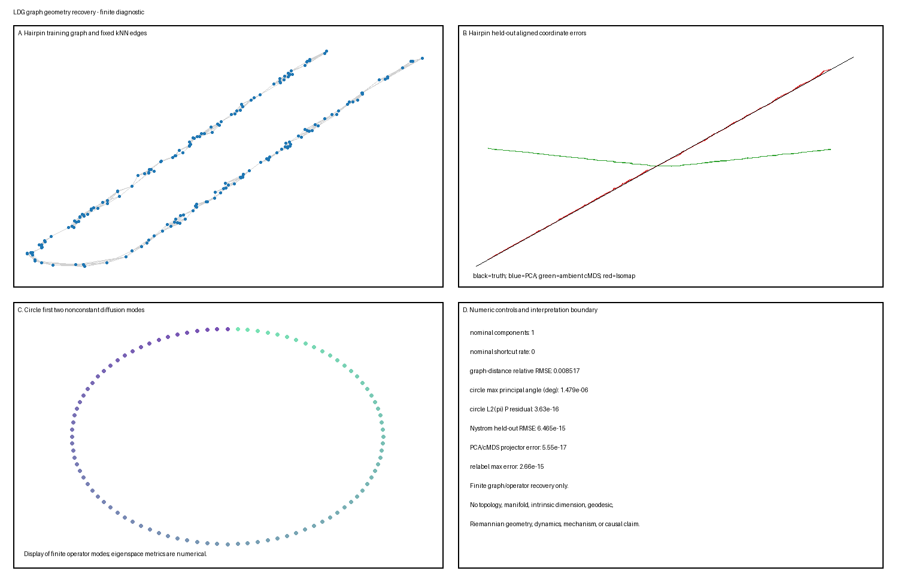

# 不宣称流形的图几何恢复

这个 L1/stable Candidate B 玩具模型分离有限图构造、最短路径距离、经典多维标度（MDS）、亲和算子特征空间、扩散距离截断与留出扩展。它使用两个具有已知评分目标的模拟器：解析弧长的单位速度发卡，以及均匀高斯亲和为循环矩阵的干净采样圆。数值是主种子 `20260820` 下的确定性输出；修正生成产物包含 197 个有限、唯一键度量。

**假定背景：** 欧氏距离、连通加权图、全对最短路径、对称特征分解、经典 MDS、可逆马尔可夫算子、主角度与防泄漏训练/测试评估。

## 问题

对象询问两个有界问题。

1. **发卡：** 当观测描出已知折叠区间时，固定 $k$ 最近邻 Isomap 图是否近似解析弧长距离，并支持 PCA 与外围距离 MDS 之外的有用一维留出扩展？连接器间隙、非均匀采样、减小支分离、错误 $k$ 与各向异性特征缩放如何破坏该结果？
2. **圆：** 对有限干净均匀圆样本，声明 $\alpha=1$ 扩散映射算子是否恢复已知第一非恒定二维傅里叶特征空间，只保留两个模态损失多少扩散距离，归一化 Nyström 扩展多准确地恢复留出中点角度？非均匀密度与极端带宽如何改变那些有限算子结果？

目标是声明模拟器距离与有限图/算子量。图成功不是拓扑、流形结构、本征维数、测地线或黎曼几何、唯一坐标、动力学、机制或因果性的证明。

## 真值

### 单位速度垂直发卡

设

$$
r=0.175,
\qquad
L=6+\pi r=6.549778714378213.
$$

两条直支长度为 $3$，分离 $2r=0.35$。对真实弧长参数 $\ell\in[0,L]$，定义

$$
c_r(\ell)=
\begin{cases}
(0,\ell), & 0\leq\ell\leq3,\\[3pt]
\left(r+r\cos\theta,\ 3+r\sin\theta\right),
&3<\ell\leq3+\pi r,\\[3pt]
(2r,3-v), &3+\pi r<\ell\leq L,
\end{cases}
$$

其中

$$
\theta=\pi-\frac{\ell-3}{r},
\qquad
v=\ell-(3+\pi r).
$$

连接连续且 $\lVert c_r'(\ell)\rVert_2=1$ 在三个光滑内部。因此模拟器路径距离精确为

$$
d_\ell(i,j)=|\ell_i-\ell_j|.
$$

固定 QR 推导等距把平面嵌入 $\mathbb R^3$。NumPy QR 应用于

$$
A=
\begin{pmatrix}
1.0&0.3\\
-0.2&0.9\\
0.45&-0.35
\end{pmatrix},
$$

保留两列是

$$
Q=
\begin{pmatrix}
-0.8971226080&-0.3267089443\\
 0.1794245216&-0.8845629735\\
-0.4037051736& 0.3328807769
\end{pmatrix},
\qquad Q^\top Q=I_2.
$$

带固定偏移 $o=(0.4,-0.7,0.2)^\top$，

$$
x^0(\ell)=Qc_r(\ell)+o,
\qquad
x(\ell)=x^0(\ell)+\epsilon,
\qquad
\epsilon\sim\mathcal N(0,0.01^2I_3).
$$

实现只为评分与神谕保留 $\ell$。图拟合、PCA、MDS 与原始扩展只接收带噪观测。

### 圆与声明有限算子目标

圆使用 96 个干净、均匀间隔训练角度与 96 个留出中点角度：

$$
\theta_j=\frac{2\pi j}{96},
\qquad
\theta_j^*=\frac{2\pi(j+1/2)}{96},
\qquad j=0,\ldots,95.
$$

平面点 $(\cos\theta,\sin\theta)$ 使用相同 $Q$ 等距嵌入 $\mathbb R^3$，无发卡偏移。对训练点，高斯亲和是

$$
W_{ij}=\exp\left(-\frac{\lVert y_i-y_j\rVert_2^2}{\varepsilon}\right).
$$

均匀圆间距使干净距离与亲和矩阵循环。因此

$$
\mathcal F_1
=\operatorname{span}\{(\cos\theta_j)_j,(\sin\theta_j)_j\}
$$

是声明第一非恒定有限算子特征空间。实现检查循环结构、特征值排序、子空间角度与算子残差，而非硬编码恢复。这是有限矩阵神谕，不是拓扑推断结果。

## 生成模型

### 发卡划分

对名义发卡数据，在每个划分内独立抽取并排序

$$
\ell_i\sim\operatorname{Uniform}[0,L]
$$

划分大小是：

| 划分 | 行 | 用途 |
|---|---:|---|
| 训练 | 180 | 图、PCA、MDS 与评分对齐拟合 |
| 验证 | 80 | 固定规则扩展评估 |
| 测试 | 80 | 最终固定规则扩展评估 |

单独 `Generator(PCG64(SeedSequence(words)))` 流生成训练、验证、测试、对照与观测噪声抽样。排序只是存储约定；没有方法接收行顺序作为路径边。

### 圆样本

名义训练与中点网格确定性。非均匀圆对照抽取 96 个确定性种子值、排序并应用

$$
\theta=2\pi u^{2.4},
\qquad u\sim\operatorname{Uniform}[0,1].
$$

没有圆验证网格，没有圆度量重标条件。

生成、特征变换、图/亲和构造、谱拟合、扩展、评分对齐、产物写入与验证是独立函数。测试真值永不入图、算子、嵌入或原始扩展。

## 参数

### 发卡图

- 相异度：所提供 $\mathbb R^3$ 特征中的欧氏距离；
- 名义图：$k=6$ 的无向**并** $k$NN 图；
- 邻居候选：在稳定 mergesort 前把距离对角设为 $+\infty$，然后保留前 $k$ 个索引；
- 精确距离并列：稳定排序先保留较低行索引；
- 有向候选通过其并对称化，每个保留边赋予其精确外围距离；
- 边权：外围欧氏距离；
- 最短路径：确定性向量化 Floyd–Warshall；
- 嵌入维数：一；
- 不连通对：在诊断中保留 $+\infty$，不传给经典 MDS；
- **长弧分离边**满足
  $$
  |\ell_i-\ell_j|>0.70;
  $$
- **实质路径捷径**满足
  $$
  |\ell_i-\ell_j|-w_{ij}>0.50,
  $$
  其中 $w_{ij}$ 是保留外围边权；以及
- 两个比率都以唯一无向非对角图边数作为分母。

两个边标签只在图构造后使用模拟器真值。长弧标签记录分离而不断言低估；**shortcut**（捷径）一词保留给实质路径低估准则。没有 $k$ 从 $\ell$、验证或测试结果选择。

### 经典 MDS 与扩展

对有限距离矩阵 $D$，

$$
J=I-\frac1n\mathbf1\mathbf1^\top,
\qquad
B=-\frac12JD^{\circ2}J.
$$

对领先特征对 $(\lambda_1,v_1)$，一维坐标是

$$
z=\sqrt{\max(\lambda_1,0)}v_1.
$$

实现报告两个直接数值诊断：

$$
\text{negative eigenmass}=\sum_{\lambda_j<0}|\lambda_j|
$$

与

$$
\text{strain}
=\sqrt{\operatorname{mean}\left(B-zz^\top\right)^2}.
$$

这些不是归一化比例。

对具有到训练点平方距离 $\delta_*^2$ 的留出点，实现 Gower 扩展形成

$$
b_*
=-\frac12\left[
\delta_*^2
-\operatorname{mean}(\delta_*^2)\mathbf1
-\operatorname{rowmean}(D^{\circ2})
+\operatorname{mean}(D^{\circ2})\mathbf1
\right]
$$

并返回

$$
z_*=\frac{b_*^\top v_1}{\sqrt{\max(\lambda_1,10^{-15})}}.
$$

外围 MDS 使用 $\delta_{*j}=\lVert x_*-x_j\rVert_2$。Isomap 把新点连接到其六个最近训练顶点而不改变训练图，然后使用

$$
\delta_{*j}
=\min_{i\in N_6(x_*)}
\left(\lVert x_*-x_i\rVert_2+d_G(i,j)\right).
$$

### 发卡评分对齐

对 PCA、外围 MDS 与 Isomap 各自，在训练坐标与训练 $\ell$ 上最小二乘拟合

$$
\ell_i=az_i+b
$$

冻结 $(a,b)$ 并原样应用于验证与测试原始坐标。仿射映射只为评分处理符号、原点与尺度；它不是仅观测拟合的一部分，不辨识唯一潜坐标。

### 扩散映射

固定名义参数是

$$
\varepsilon=0.18,
\qquad
\alpha=1,
\qquad
t=1,
\qquad
m=2.
$$

保留自亲和。定义

$$
q_i=\sum_jW_{ij},
\qquad
K_{ij}=\frac{W_{ij}}{q_iq_j},
\qquad
d_i=\sum_jK_{ij},
$$

$$
P=D^{-1}K,
\qquad
\pi_i=\frac{d_i}{\sum_rd_r},
\qquad
S=D^{-1/2}KD^{-1/2}.
$$

对角化实对称 $S$，带欧氏标准正交特征向量 $\phi_l$。实现把它们变换为右特征函数

$$
\psi_l
=\sqrt{\sum_i d_i}\,D^{-1/2}\phi_l,
$$

因此

$$
\psi_l^\top\Pi\psi_m=\delta_{lm}.
$$

双模态坐标排除平凡常值模态：

$$
\Phi_{1,2}(y_i)
=\left(\lambda_1\psi_1(i),\lambda_2\psi_2(i)\right).
$$

完整有限算子扩散距离使用所有非恒定模态，

$$
D_1(i,j)^2
=\sum_{l=1}^{95}\lambda_l^2
\left(\psi_l(i)-\psi_l(j)\right)^2,
$$

并从 $P$ 的行独立重算为

$$
D_1(i,j)^2
=\sum_k\frac{(P_{ik}-P_{jk})^2}{\pi_k}.
$$

扩散时间是一个图算子步，不是物理时间或已发现动力学 [@CoifmanLafon2006]。

### 归一化 Nyström 扩展与圆对齐

对留出 $y_*$，计算训练亲和与

$$
q_*=\sum_jw_{*j},
\qquad
k_{*j}=\frac{w_{*j}}{q_*q_j},
\qquad
p_{*j}=\frac{k_{*j}}{\sum_rk_{*r}}.
$$

对非零模态，

$$
\psi_l(y_*)
=\frac1{\lambda_l}\sum_jp_{*j}\psi_l(j).
$$

两个保留坐标通过一个无约束最小二乘 $2\times2$ 映射线性对齐到训练行 $(\cos\theta_i,\sin\theta_i)$。同一映射评分所有中点扩展。实现中没有第二次 Procrustes、径向、角度或验证对齐。谱样本外扩展是额外算法，不必等于直推式完整重拟合 [@BengioEtAl2003]。

## 模拟

### 名义发卡

在带噪训练观测上拟合训练均值、秩一 PCA、外围距离 MDS 与 $k=6$ Isomap。不重建图地扩展验证与测试观测。

### 发卡对照

实现对照精确且预先声明：

1. **稀疏连接器间隙：** 拒绝采样区间
   $$
   [3-0.18,\ 3+\pi r+0.18].
   $$
   之外的 180 个训练 $\ell$ 值。
2. **减小支分离：** 设置
   $$
   r_r=0.06,
   \qquad
   L_r=6+\pi r_r=6.188495559215387,
   $$
   并通过
   $$
   \ell_r=\frac{\ell_{\mathrm{nominal}}}{L}\,L_r.
   $$
   保留名义训练分位数。在 $[0,L_r]$ 上评估相同分段公式 $c_{r_r}$ 并使用 $k=6$。这保留两条长度为 3 的直支与端点 $c_{r_r}(L_r)=(0.12,0)$。
3. **非均匀采样：** 抽取 $u\sim U[0,1]$ 并变换
   $$
   \ell=
   \begin{cases}
   L\,0.55(u/0.65)^2,&u<0.65,\\
   L\left[0.55+0.45((u-0.65)/0.35)^{0.55}\right],&u\geq0.65.
   \end{cases}
   $$
4. **断开小邻域：** 并 $k=1$ 的名义观测。
5. **错误更大邻域：** 并 $k=18$ 的名义观测。
6. **近完整图：** $k=n_{\mathrm{train}}-2=178$ 的名义观测。
7. **各向异性特征缩放：** 在距离与图构造前把名义观测行右乘
   $$
   \operatorname{diag}(1,1,3)
   $$
   然后保持 $k=6$。这改变特征几何与邻居身份；它不是无害全局标量。

### 圆条件

1. **均匀名义：** 96 个干净训练角度，$\varepsilon=0.18$。
2. **非均匀密度：** 种子排序 $2\pi u^{2.4}$ 角度，$\varepsilon=0.18$。
3. **带宽太小：** 均匀角度，$\varepsilon=0.005$。
4. **带宽太大：** 均匀角度，$\varepsilon=5.0$。

失败被报告而非调走。没有圆度量重标条件。

## 可视化

单一生成 `summary.png` 精确四个面板：

1. 名义带噪发卡训练点与固定 $k=6$ 图边；
2. 名义测试真实 $\ell$ 对训练对齐 PCA、外围 MDS 与 Isomap 坐标；
3. 名义圆的前两个非恒定扩散特征函数；以及
4. 所选数值对照加解读边界。



图不绘制稀疏间隙、减小分离、非均匀或带宽对照。它仅具诊断性；真值排序与对齐是评分/显示辅助，而非拟合输入。

## 预期行为

- 发卡单位速度且固定 $Q$ 等距，因此无噪路径距离精确为 $|\Delta\ell|$。
- PCA 与外围距离经典 MDS 对欧氏距离应恢复等价训练一维样本坐标子空间。这是实现神谕，不是路径距离结果。
- 无跨支边的连通局部图可以比外围弦更好地近似解析弧长。Isomap 分离图构造、最短路径与 MDS [@TenenbaumDeSilvaLangford2000]。
- 稀疏间隙或 $k=1$ 可以使图断开。减小分离、$k=18$ 或 $k=178$ 可以制造实质路径捷径。图近似依赖采样、分离、曲率与路径条件 [@BernsteinEtAl2000]。
- 在干净均匀圆上，循环亲和使余弦/正弦张成空间成为精确有限算子目标，至浮点与基旋转。
- 即使特征空间被精确恢复，两个模态也不必复现完整有限算子扩散距离。
- 非均匀密度与极端带宽改变度、谱、扩散尺度、截断与有限样本特征空间。$\alpha=1$ 连续统解读仍依赖假设，而非有限保证 [@CoifmanLafon2006]。

经验结果（包括相反行为）被保留而不调参。

## 参数操控

| 条件 | 实现改变 | 主诊断 |
|---|---|---|
| `hairpin/nominal` | $r=0.175$，$k=6$ | 弧长与留出坐标 RMSE |
| `sparse_connector_gap` | 排除声明连接器区间 | 分量与无限对 |
| `reduced_branch_separation` | $r=0.06$，$L_r=6+\pi r$，重用名义分位数 | 长弧分离边与实质路径捷径 |
| `nonuniform_sampling` | $u$ 的固定分段变换 | 间隙/分量/距离误差 |
| `disconnected_small_k` | $k=1$ | 断开分量 |
| `wrong_k` | $k=18$ | 实质路径捷径与距离畸变 |
| `nearly_complete_large_k` | $k=178$ | 外围弦塌缩 |
| `anisotropic_feature_scaling_z3` | 特征变换 $\operatorname{diag}(1,1,3)$ | 邻居变化与度量依赖 |
| `circle/uniform` | $\varepsilon=0.18$ | 傅里叶特征空间与中点扩展 |
| `nonuniform_density` | $\theta=2\pi u^{2.4}$ | 密度敏感有限算子 |
| `epsilon_too_small` | $\varepsilon=0.005$ | 近局部化谱与截断 |
| `epsilon_too_large` | $\varepsilon=5.0$ | 近均匀亲和与谱塌缩 |

没有条件是对 $k$ 或 $\varepsilon$ 的验证搜索。

## 健全性检查

可执行验证器只断言以下实现神谕：

1. 发卡连接连续性、有限差分单位速度、总长度与声明容差内 $Q^\top Q=I$；
2. 图邻接对称性、最短路径对称性与零对角、名义连通图的有限距离、断开对照的显式无限距离，以及 500 个确定性采样三元组上的三角不等式；
3. 合成精确并列/重复 $k$NN 情形，点 $(0,0),(0,0),(1,0),(-1,0)$，验证没有行选择自身、稳定并列偏好较低索引、并对称化精确、保留边权精确等于原始距离；
4. 减小分离生成器具有 $L_r=6+\pi(0.06)$、两条长度 3 支、端点 $(0.12,0)$、零定义域违反，并在数值精度内重用名义分位数；
5. PCA/外围 MDS 样本投影器等价与仿射坐标一致；
6. 外围 MDS 与 Isomap 训练点 Gower 扩展重放；
7. 均匀圆亲和与马尔可夫循环差异；
8. 马尔可夫行和、平稳性 $\pi^\top P=\pi^\top$、细致平衡、$L^2(\pi)$ 特征函数 Gram 矩阵与直接行对谱扩散距离；
9. 均匀圆训练点 Nyström 重放；
10. 发卡图距离与圆双模态投影器在确定性重标签下不变；
11. 发卡划分/对照与圆网格的精确再生；
12. 发卡真值投毒使拟合与原始扩展不变；
13. 圆角度真值投毒改变真值，同时保持观测训练与中点点、拟合与原始 Nyström 扩展不变；
14. 测试观测投毒使发卡训练拟合不变；
15. 各向异性缩放改变至少一个无向邻居边；
16. 图诊断/度量记录（包括两个边语义）与 $L^2(\pi)$ 圆角度/残差记录在 CSV 与 JSON 间精确一致；
17. 精确 CSV schema、有限值、非空标签、唯一键、产物哈希与逐字节相同临时再生。

这些检查只确立有界数值与泄漏性质。

## 失效情形

- **好图隐藏实质捷径：** 外围权低估模拟器路径分离超过 0.50 的边可以在许多图距离上损坏，而一维显示保持视觉有序。
- **把长分离与捷径混淆：** $|\Delta\ell|>0.70$ 被单独报告，但其本身不证明实质路径低估。
- **插补断开距离：** 用任意有限值替换 $+\infty$ 会发明几何；本实现对断开对照省略 MDS。
- **隐藏负特征结构：** 原始负特征质量与应变被报告，而非静默地把每个距离矩阵称为欧氏。
- **用训练真值选邻居：** $\ell$ 与角度值只是评分与神谕输入。
- **把直推式重拟合称为扩展：** 留出点不被插入训练图或算子。
- **字面比较未对齐轴：** 训练拟合仿射/线性映射只在评分时处理坐标约定。
- **把双模态坐标称为完整扩散几何：** 截断误差对照所有有限非恒定模态显式测量。
- **把密度归一化当作有限保证：** $\alpha=1$ 不证明非均匀有限样本中的无密度几何。
- **把圆特征空间称为拓扑恢复：** 结果来自生成循环矩阵，而非拓扑估计器。
- **把扩散时间称为物理时间：** $t=1$ 是一个马尔可夫算子步。
- **忽略特征重标：** 各向异性缩放在该实现中改变 85 条无向邻居边。

## 恢复任务

### 发卡基线与 Isomap

均值基线只为评分预测 $\ell$ 的训练均值。PCA 中心化训练观测并投影到领先右奇异向量。外围 MDS 直接对训练欧氏距离应用经典 MDS。Isomap 构造并 $k$ 图、计算全对最短路径，并只在连通时应用相同 MDS 例程。留出点使用上述固定 Gower 规则。

### 圆扩散映射

圆分析构造带自环的稠密高斯亲和、应用 $\alpha=1$ 归一化、对角化对称共轭、在 $L^2(\pi)$ 中归一化右特征函数，并保留前两个非恒定模态。它计算完整与截断扩散距离，并使用固定归一化 Nyström 扩展而不重拟合。

## 候选分析方法

### 发卡

1. 训练均值评分参考；
2. 秩一 PCA；
3. 一维外围距离经典 MDS；
4. 并 $k$ Isomap 加一维经典 MDS；以及
5. 无嵌入的直接图诊断。

### 圆

1. 原始高斯亲和与归一化马尔可夫诊断；
2. 完整 $\alpha=1$ 有限算子扩散距离；
3. $t=1$ 处前二非恒定模态扩散映射；
4. 归一化 Nyström 中点扩展；以及
5. 直接傅里叶子空间/算子诊断。

没有方法用真值选择 $k$、$\varepsilon$、保留模态、图边或扩展参数。

## 评估

每个 `metrics.csv` 行精确具有：

```text
domain,condition,split,method,target,metric,value
```

最终产物包含 197 个有限、非空、唯一键行。无限图距离由有限对数表示，而非非有限 CSV 值。

### 实现发卡度量

对有限无序训练对，图距离相对 RMSE 是

$$
\frac{\sqrt{\operatorname{mean}(d_G-d_\ell)^2}}
{\sqrt{\operatorname{mean}d_\ell^2}},
$$

并伴随报告 Pearson 相关。每个图条件还报告边数；长弧分离边数/率/阈值/分母；实质路径捷径数/率/低估阈值/分母；分量数；与有限/无限对数。连通 Isomap 条件还报告原始 MDS 负特征质量与应变。各向异性条件报告无向邻居边对称差数与率。减小分离与精确并列生成器/神谕量也作为度量发出。

名义均值、PCA、外围 MDS 与 Isomap 只报告训练/验证/测试仿射对齐坐标 RMSE。不发出端点/内部、MAE、坐标相关、度分位数或额外压力度量。

### 实现圆度量

均匀条件报告两个 $L^2(\pi)$ 主角度、加权 $P$ 不变子空间残差、双模态截断相对 RMSE、直接对谱最大差异、中点 Nyström RMSE、领先八个特征值与五个马尔可夫/算子神谕差异。每个圆对照报告相同加权残差、截断相对 RMSE、全谱逐对距离 RMS、四个领先特征值与两个加权主角度。不发出径向/角度扩展度量或圆验证度量。

声明 $L^2(\pi)$ 主角度在 $\sqrt\Pi\Psi_{1:2}$ 与 $\sqrt\Pi C$ 之间计算，其中 $C=(\cos\theta,\sin\theta)$。实现不变子空间残差使用 $P$ 且为

$$
\min_A\frac{\lVert PC-CA\rVert_{F,\pi}}{\lVert C\rVert_{F,\pi}},
\qquad
\lVert M\rVert_{F,\pi}=\lVert\sqrt\Pi M\rVert_F.
$$

### 经验结果

名义发卡结果是：

| 结果 | 值 |
|---|---:|
| 分量 | 1 |
| 无向边 | 622 |
| 长弧分离边 / 分母 | 0 / 622 |
| 实质路径捷径 / 分母 | 0 / 622 |
| 图距离相对 RMSE | 0.00851665 |
| 图距离相关 | 0.99989924 |
| Isomap 训练 / 验证 / 测试 RMSE | 0.0148988 / 0.0153847 / 0.0176344 |
| PCA 测试 RMSE | 1.63981 |
| 外围 MDS 测试 RMSE | 1.63981 |
| 均值测试 RMSE | 1.64913 |
| PCA/外围 MDS 投影器差异 | $5.55\times10^{-17}$ |
| 外围 MDS / Isomap 重放差异 | $2.44\times10^{-15}$ / $4.88\times10^{-15}$ |
| 外围 MDS 负特征质量 / 应变 | $4.92\times10^{-13}$ / 0.0295864 |
| Isomap 负特征质量 / 应变 | 0.290124 / 0.00258654 |

发卡对照结果是：

| 条件 | 分量 | 无限对 | 长边 / 分母 | 实质捷径 / 分母 | 相对 RMSE | 相关 |
|---|---:|---:|---:|---:|---:|---:|
| 稀疏连接器间隙 | 2 | 8,064 | 0 / 632 | 0 / 632 | 有限对内 0.01613 | 0.99977 |
| 减小分离，$r=0.06$ | 1 | 0 | 80 / 626 (0.12780) | 81 / 626 (0.12939) | 0.67882 | 0.30233 |
| 非均匀采样 | 2 | 1,859 | 1 / 630 (0.00159) | 1 / 630 (0.00159) | 0.28507 | 0.96685 |
| $k=1$ | 57 | 15,883 | 0 / 123 | 0 / 123 | 有限对内 0.34740 | 0.90867 |
| $k=18$ | 1 | 0 | 148 / 1,786 (0.08287) | 142 / 1,786 (0.07951) | 0.63832 | 0.41212 |
| $k=178$ | 1 | 0 | 12,841 / 16,109 (0.79713) | 6,822 / 16,109 (0.42349) | 0.67861 | 0.32399 |
| 各向异性 $\operatorname{diag}(1,1,3)$ | 1 | 0 | 0 / 625 | 0 / 625 | 0.36367 | 0.99962 |

各向异性变换改变 85 条无向图边，相对名义边分母的对称差率为 0.13666。

对修正减小分离生成器，$L_r=6.188495559215387$，端点误差与最大定义域违反均为零，归一化名义分位数重用差异至多 $1.11\times10^{-16}$。其评估端点在存储算术下精确为 $(0.12,0)$。

名义均匀圆结果是：

| 结果 | 值 |
|---|---:|
| 领先非恒定特征值 | 0.9538803685 / 0.9538803685 |
| $L^2(\pi)$ 傅里叶子空间主角度 | $0^\circ / 1.48\times10^{-6}\,{}^\circ$ |
| $L^2(\pi)$ $P$ 不变残差 | $3.63\times10^{-16}$ |
| 双模态扩散距离相对 RMSE | 0.441705 |
| 训练线性对齐后中点 Nyström RMSE | $6.47\times10^{-15}$ |
| 直接行对谱距离差异 | $8.88\times10^{-15}$ |

有限特征空间主张在数值容差下作出，而非精确符号计算。

圆对照是：

| 条件 | 第一非恒定特征值 | $L^2(\pi)$ 角度 | $P$ 不变残差 | 截断相对 RMSE | 全距离 RMS |
|---|---:|---:|---:|---:|---:|
| 非均匀密度 | 0.98250 / 0.93951 | $7.48065^\circ / 13.57104^\circ$ | 0.0460802 | 0.45053 | 2.86095 |
| $\varepsilon=0.005$ | 0.99875 / 0.99875 | $0^\circ / 0^\circ$ | $2.61\times10^{-16}$ | 0.78720 | 8.36897 |
| $\varepsilon=5.0$ | 0.19610 / 0.19610 | $0^\circ / 0^\circ$ | $1.31\times10^{-16}$ | 0.00693 | 0.39622 |

最终名义算子神谕是：

| 神谕 | 最大差异 |
|---|---:|
| 马尔可夫行和 | $2.22\times10^{-16}$ |
| 平稳性 | $8.67\times10^{-18}$ |
| 细致平衡 | $2.17\times10^{-19}$ |
| $L^2(\pi)$ 特征函数 Gram | $3.11\times10^{-15}$ |
| 训练 Nyström 重放 | $7.99\times10^{-15}$ |
| 谱/直接扩散距离 | $8.88\times10^{-15}$ |
| 发卡重标签 | $2.66\times10^{-15}$ |
| 圆投影器重标签 | $2.95\times10^{-16}$ |
| 拟合输出的真值/测试投毒 | 0 |
| 精确并列无自选 / 稳定低索引 / 并对称化检查 | PASS / PASS / PASS |
| 精确并列保留边权差异 | 0 |
| 干净临时产物再生 | 逐字节相同 PASS |

## 解读

名义发卡图紧密近似该模拟器的弧长距离，其冻结 Isomap 扩展在独立验证与测试样本上保持低 RMSE。PCA 与外围 MDS 是等价线性/弦基线，具有大得多的对齐坐标误差。阴性对照显示该结果依赖连接器覆盖、支分离、邻域大小、采样密度与特征度量。

均匀圆提供代数有限算子神谕：其第一非恒定右特征函数特征空间在 $L^2(\pi)$ 表示中匹配余弦/正弦张成空间，中点 Nyström 扩展精确到浮点精度。尽管如此，两个模态在 $\varepsilon=0.18$ 下省略大量完整扩散距离内容。非均匀密度使有限领先特征空间偏离均匀傅里叶目标，而极端带宽改变谱与扩散尺度，即使循环对称保留傅里叶轴。

图最短路径保持有限组合距离，不自动是光滑测地线。训练拟合对齐只改变评分坐标，不辨识科学特权轴。

::: {.callout-warning title="这并不蕴含"}
准确图距离、低 MDS 应变、傅里叶特征空间恢复、圆图或低留出扩展误差不证明拓扑、流形结构、本征维数、测地线或黎曼恢复、唯一坐标、动力学、机制、因果性或生物有效性。
:::

## 这个玩具模型并不确立

- 它不证明未知数据从流形采样。
- 它不从真实数据恢复区间或圆拓扑。
- 它不估计与模型无关的本征维数。
- 它不使图最短路径成为光滑或全局最小测地线。
- 它不估计黎曼度量张量、曲率、切空间或图册。
- 它不使图连通性成为连通潜拓扑的证据。
- 它不使重复特征空间成为两个唯一坐标。
- 它不使扩散时间成为物理时间。
- 它不发现动力学、向量场、转移律、机制或因果结构。
- 它不确立 Isomap 或扩散映射的普遍优越性。
- 它不保证冻结扩展与直推式重拟合相等。

## 向真实数据的扩展

真实数据图几何需要独立论证的观测单元、特征表示、缩放、缺失数据策略、距离、邻域或带宽、密度归一化、分量策略、坐标数与样本外使用。受试者、会话、试次或轨迹等依赖单元应完整划分。在训练与测试上构建一个图是直推式的，不能报告为留出部署。

在解读坐标前，报告邻居示例、分量、边与度分布、负特征结构、谱稳定性、截断与度量/超参数敏感性。没有模拟器真值时，图质量需要外部科学论证、稳定性或留出任务，而非引人注目的可视化。

## 可复现性

### 有界实现与产物

精确清单是：

```text
toy-models/graph-geometry-recovery.py
toy-models/artifacts/graph-geometry-recovery/manifest.json
toy-models/artifacts/graph-geometry-recovery/metrics.csv
toy-models/artifacts/graph-geometry-recovery/diagnostics.json
toy-models/artifacts/graph-geometry-recovery/summary.png
```

精确四个生成产物。实现使用捆绑 Python、NumPy 与 Pillow，并直接实现图构造、分量、最短路径、MDS、Isomap 扩展、扩散映射与 Nyström 扩展。

确定性命令是：

```bash
/Users/bytedance/.cache/codex-runtimes/codex-primary-runtime/dependencies/python/bin/python3 toy-models/graph-geometry-recovery.py
```

默认执行生成并验证产物，包括临时逐字节相同再生。显式 `--generate` 与 `--verify` 模式也可用。清单记录划分/生成器契约、图与圆参数、方法清单、确定性默认/生成/验证命令、各向异性变换、精确度量字段、容差、运行时、哈希与产物清单。`diagnostics.json` 存储生成器、减小分离、精确并列 $k$NN、名义/对照、加权算子、扩展、重标签、再生与投毒神谕记录。

最终生成产物 SHA-256 值是：

| 产物 | SHA-256 |
|---|---|
| `metrics.csv` | `83bd6ee740ce384a5071916e463f8095f067f099e874b6cbfd6429843bd4badb` |
| `diagnostics.json` | `ac37f7e08bac609edb65e6651673cf51f1caf17e9053cc6e7ba349c7066cb7fb` |
| `summary.png` | `5d17b441f6e0cb9695fbe73d08fd4f67283bde7528d1a94a365c8fde7dedb3b8` |

### 证据边界

本对象未核查新外部来源。科学陈述限于稳定前置对象中已记录的证据范围：

- Tenenbaum、de Silva 与 Langford 关于 Isomap 对邻域图、最短路径与经典 MDS 的分离 [@TenenbaumDeSilvaLangford2000]；
- Bernstein 等人关于采样、曲率、支分离与图路径近似条件 [@BernsteinEtAl2000]；
- Bengio 等人关于显式谱样本外扩展 [@BengioEtAl2003]；以及
- Coifman 与 Lafon 关于归一化亲和/马尔可夫构造、扩散距离、谱坐标与依赖假设的 $\alpha=1$ 连续统解读 [@CoifmanLafon2006]。

模拟器、样本量、$k$、带宽、变换、长弧阈值、实质捷径阈值、对齐、度量、容差与产物是 LDG 设计选择。

### 集成状态

QMD、实现与生成产物在独立科学与实现聚焦审查、确定性验证、仓库验证、测试、目标/索引/全站渲染与记录的审查决定下机械晋升后，于 L1/stable 调和。

## 成熟度检查表

- [x] 完整玩具模型 schema 与精确一脚本/四产物契约。
- [x] 实现垂直单位速度发卡、固定 QR 等距/偏移、解析弧长、噪声、仅评分 $\ell$ 与独立划分精确。
- [x] 实现均匀圆算子目标与中点留出精确。
- [x] 均值、PCA、外围 MDS、Isomap、图诊断、扩散映射、完整与截断距离与冻结扩展被调和。
- [x] 实现对照、度量 schema、结果与数值神谕与最终产物调和。
- [x] 显式拒绝拓扑、流形、本征维数、测地线、黎曼、坐标、动力学、机制与因果过度宣称。
- [x] 证据使用限于既有核查前置范围。
- [x] 独立科学审查 PASS。
- [x] 独立实现审查 PASS。
- [x] 完整父验证与仓库级检查 PASS。
- [x] 在记录的审查决定下机械 L1/stable 晋升。
