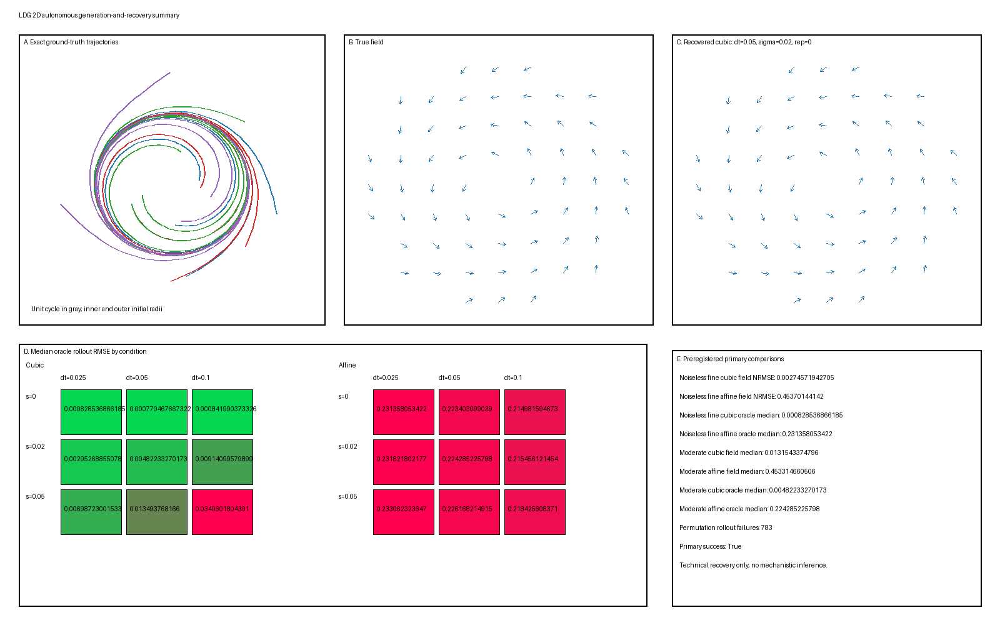

# 二维自治动力学：生成与恢复

这个 L1 对象既记录经审查的实现契约，也记录其有界可执行实现。其 `stable` 状态记录独立技术与实现/结果审查后由所有者授权的验收。生成结果检验声明模拟器与恢复管线；稳定状态不验证真实系统，也不把恢复表现变成机制性证据。

**假定背景：** 初等多变量微积分与极坐标；基本概率与线性代数；多项式回归与岭回归基础；有限差分与平滑；初等数值积分。这些外部基础不是仓库前置条件。

## 问题

透明三次多项式估计器能否从直接观测、有限采样、带噪状态坐标恢复已知非线性二维自治向量场及其留出轨迹，以及何时优于线性基线？

该演示刻意很窄。它询问方法是否在受控采样与噪声下恢复一个声明模拟器，而非自治模型是否适合真实系统。

## 真值

设 $z(t)=(x(t),y(t))\in\mathbb R^2$ 并定义

$$
\dot x=(\alpha-\beta r^2)x-\omega y,
$$

$$
\dot y=\omega x+(\alpha-\beta r^2)y,
$$

其中 $r^2=x^2+y^2$，固定参数

$$
\alpha=1,
\qquad
\beta=1,
\qquad
\omega=2.
$$

在极坐标中该场具有

$$
\dot r=r(1-r^2),
\qquad
\dot\theta=2.
$$

对 $r_0>0$，解析参考解是

$$
r(t)=\left[1+(r_0^{-2}-1)e^{-2t}\right]^{-1/2},
\qquad
\theta(t)=\theta_0+2t.
$$

因此原点是不动点，每个非零初始条件逆时针旋转，半径小于或大于一的轨迹接近孤立周期轨道 $r=1$。这些性质来自声明方程并作为模拟器检查；它们不是从生成图推断的。

状态空间是 $\mathbb R^2$。主训练与评估限于以 $0.35\le r_0\le1.65$ 初始化的轨迹。场误差在声明环域

$$
\mathcal D_{\mathrm{eval}}=\{(x,y):0.35\le\sqrt{x^2+y^2}\le1.65\},
$$

上评估，因此结论不自动扩展到原点或任意半径。

## 生成模型

生成与观测是独立步骤。

1. 从下方分布抽取初始状态 $z_0=(r_0\cos\theta_0,r_0\sin\theta_0)$。
2. 从 $t=0$ 到 $t=8$ 求解确定性初值问题 $\dot z=f(z)$。
3. 在所请求观测间隔 $\Delta t$ 处求同一连续潜解。
4. 生成直接观测

   $$
   y_k=z(t_k)+\varepsilon_k,
   \qquad
   \varepsilon_k\overset{\mathrm{iid}}\sim\mathcal N(0,\sigma^2I_2).
   $$

恒等观测映射固定潜坐标约定。采样间隔与观测噪声是测量过程的操控；它们不改变 $f$、其参数或潜初始条件律。

## 参数

| 分量 | 固定计划 |
|---|---|
| 真值场 | $f(x,y)=((1-r^2)x-2y,\;2x+(1-r^2)y)$ |
| 积分区间 | $t\in[0,8]$ |
| 主初始半径 | 精确半划分：$U[0.35,0.75]$ 与 $U[1.25,1.65]$ |
| 初始角度 | 独立于半径的 $U[0,2\pi)$ |
| 训练 / 测试轨迹 | 64 / 40 个独立初始条件 |
| 采样间隔 | $\Delta t\in\{0.025,0.05,0.10\}$ |
| 观测噪声尺度 | 状态坐标单位中的 $\sigma\in\{0,0.02,0.05\}$ |
| 噪声重复 | 每个非零噪声条件 10 个；$\sigma=0$ 时 1 个确定性重复 |
| 主恢复基 | $(x,y)$ 中总次数至多三的所有单项式 |
| 基线基 | 仅常数加一次项 |
| 岭惩罚 | 在训练数据上标准化非常数特征列后 $\lambda=10^{-4}$ |
| 平滑窗口 | $\Delta t=0.025,0.05,0.10$ 分别为 21、11、5 点；三次 Savitzky–Golay 多项式 |
| 评估网格 | $\rho_i=0.35+i(1.30/26)$，$i=0,\ldots,26$；$\theta_j=2\pi j/64$，$j=0,\ldots,63$ |

训练划分恰好包含来自每个区间的 32 个初始半径；主测试划分恰好各 20 个。角度独立采样。该精确分层强制两个划分都包含从两侧接近环的轨迹。测试初始条件使用独立种子，并作为完整轨迹留出。

对每个采样间隔，

$$
t_k=k\Delta t,
\qquad
k=0,\ldots,8/\Delta t,
$$

包括两个端点。三个条件因此分别包含 321、161 与 81 个观测时间。角度网格排除重复端点 $2\pi$；两个径向端点都被包含。

## 模拟

经审查计划指定 SciPy DOP853 用于数值生成。现有批准运行时没有 SciPy，且未安装依赖。可执行因此使用精确解析极化解作为主生成器，并用步长 $h=0.005$ 的 NumPy 固定步四阶 Runge–Kutta 积分器独立检查。这是显式实现实现，不是对真值场、时间支撑、采样条件或评估契约的静默改变。

实现为每个初始条件生成一次潜轨迹，并从同一连续解推导每个采样条件。独立配对标准正态抽样只在采样后添加并按声明 $\sigma$ 缩放。训练与测试数组保持分离；没有留出时间点进入特征缩放或回归拟合。平滑时长与每个恢复超参数保持固定，而非根据测试结果选择。

可执行源是 `two-dimensional-autonomous-dynamics.py`。它用 NumPy 伪逆实现中心化局部三次滤波器、用 NumPy 线性代数实现声明岭目标、用 RK4 实现恢复 rollout，并用已可用 Pillow 库生成复合 PNG。

## 可视化

有界复合诊断产生：

1. 带内外轨迹与单位环的真实相图；
2. 同一固定评估网格上的真实与恢复向量场箭头，显示在分离面板中而非视觉相减；
3. 三次与仿射神谕 rollout 误差在 $(\Delta t,\sigma)$ 上的度量热图；以及
4. 预注册主比较加显式导数置换失败计数。

留出轨迹级误差、拟合系数与所有失败标志/时域保留在 `metrics.csv`、`coefficients.csv` 与 `diagnostics.json` 中，而非压缩进单一有界 PNG。

可视化仅具诊断性。数值评估与阴性对照决定恢复是否成功。

## 预期行为

::: {.callout-tip title="LDG 设计预期"}
以下预期是可证伪的设计预测，不是生成结果。
:::

- 在无噪、最细采样条件中，三次恢复应近似真实多项式场，并在场与 rollout 误差上优于误设线性基线。
- 增大 $\sigma$ 或 $\Delta t$ 应恶化导数估计与下游场恢复，尽管趋势在每个有限重复中不必严格单调。
- 线性基线可以近似短局部段，但应错过整个环域上依赖半径的收缩与扩张。
- 导数置换阴性对照应丢失状态到速度结构，并比未洗牌三次拟合显著更差。
- 长 rollout 应放大小的场估计误差，因此一步误差可以在轨迹误差已变得可观时仍保持低。

这些预期不会通过看到结果后重调模拟器或估计器被强制执行。违反是需要诊断的结果。

## 参数操控

主有界因子设计包含九个采样/噪声条件：

$$
\Delta t\in\{0.025,0.05,0.10\}
\quad\times\quad
\sigma\in\{0,0.02,0.05\}.
$$

只有观测计划与观测噪声改变。潜场、积分区间、初始条件分布、数据划分大小、平滑器时长、特征基与岭惩罚保持固定。

一个标记外推压力检验使用从 $U[1.65,1.90]$ 抽取的 16 个额外留出初始半径与独立角度，在 $(\Delta t,\sigma)=(0.05,0.02)$ 处。它被单独报告，不是主成功准则的一部分，因为它从场评估环域之外开始。

## 健全性检查

在解读恢复之前，可执行单元必须通过这些生成器与数据检查：

1. **极坐标恒等：** 从解析场计算的数值 $\dot r$ 与 $\dot\theta$ 在远离原点处匹配 $r(1-r^2)$ 与 $2$。
2. **径向方向：** 在最细潜网格上，$r_0<1$ 时 $r_{k+1}-r_k\ge-10^{-10}$，$r_0>1$ 时 $r_{k+1}-r_k\le10^{-10}$。
3. **环检查：** 在更紧求解器诊断下，以 $r_0=1$ 初始化的轨迹在 $[0,8]$ 上保持距单位半径 $10^{-8}$ 以内。
4. **周期检查：** 从 $z_0=(1,0)$ 出发，用 RK4 步 $h=0.001$ 积分，检测 $t=0.1$ 后 $y(t)$ 首次负到非负穿越，在该步内线性插值，并要求与 $\pi$ 的相对误差低于 $10^{-6}$。
5. **划分检查：** 训练、主测试与外推初始条件记录与种子不相交，且具有声明精确层计数。
6. **噪声检查：** 报告每个 $\sigma$ 下所有生成观测的经验噪声均值与协方差；这是诊断，不是要求每个有限样本等于其总体矩。
7. **泄漏检查：** 特征缩放与回归只用训练轨迹。
8. **确定性检查：** 同一清单的两次执行产生逐字节相同表格度量与数值相同数组。

## 失效情形

实现必须报告而非隐藏至少这些失败：

- 三次估计器在无噪、最细采样条件中未击败线性基线。这表示实现、导数估计或评估缺陷，然后才支持科学结论。
- 粗采样与观测噪声产生有偏导数目标、不稳定系数或发散 rollout。条件 $(\Delta t,\sigma)=(0.10,0.05)$ 是显式压力条件，可能失败。
- 导数置换阴性对照匹配未洗牌估计器。这提示泄漏、不敏感度量或未使用状态–速度对应的恢复任务。
- Rollout 离开半径 3 或数值求解器失败。此类运行被计为失败并赋予无限 rollout 误差用于排序；其有限失败前时域也被记录。
- 平滑器抹去径向瞬态或制造原始观测不支持的表观光滑旋转。因此必须分别报告平滑状态误差与场误差。
- 良好观测重构与差场恢复重合。这不能通过选择视觉更好轨迹解决。

## 恢复任务

恢复在不向估计器提供 $f$ 的解析形式或系数的情况下执行。

1. 用中心化局部三次最小二乘独立平滑每个观测坐标。NumPy 通过在 $\Delta t=0.025,0.05,0.10$ 的 21、11、5 点窗口上伪逆三次设计矩阵计算状态与一阶导数滤波器系数。只保留公共内部区间 $0.30\le t_k\le7.70$；不拟合或评分任何填充边输出。
2. 以精确原始顺序构造特征

   $$
   \phi(z)=[1,x,y,x^2,xy,y^2,x^3,x^2y,xy^2,y^3].
   $$

3. 只保留满足 $0.30\le t\le2.0$ 的平滑训练样本用于向量场拟合，防止长近环尾部主导径向瞬态。如果有 $n$ 个保留行，对 $j=1,\ldots,9$ 设 $\mu_j=n^{-1}\sum_i\phi_{ij}$ 与 $s_j=[n^{-1}\sum_i(\phi_{ij}-\mu_j)^2]^{1/2}$；零 $s_j$ 是失败运行。定义 $X_{i0}=1$ 与 $X_{ij}=(\phi_{ij}-\mu_j)/s_j$。因此缩放只在训练行上使用总体标准差（`ddof=0`）。
4. 对每个速度分量 $v$，求解确定性岭问题

   $$
   \hat b
   =\arg\min_b
   \left\{n^{-1}\|Xb-v\|_2^2+\lambda b^TPb\right\},
   \qquad
   P=\operatorname{diag}(0,1,\ldots,1),
   \quad
   \lambda=10^{-4},
   $$

   使用线性求解而非显式矩阵逆。通过 $c_j=b_j/s_j$（$j\ge1$）与 $c_0=b_0-\sum_{j=1}^9b_j\mu_j/s_j$ 转换回原始系数。
5. 从公共网格对齐起点 $t=0.30$ 到 $t=8$ 为每个留出轨迹积分恢复自治场。
6. 产生两个 rollout 变体：**神谕初始化**，从已知留出 $z(0.30)$ 开始以隔离场恢复；**观测初始化**，从平滑估计 $\hat z(0.30)$ 开始以测量端到端退化。

恢复对象是声明观测/潜坐标中的向量场估计。单条拟合轨迹不被当作恢复场。

## 候选分析方法

只计划三种有界分析：

1. **主分析：** 对平滑导数估计的三次多项式岭回归。
2. **更简单基线：** 使用相同平滑状态、导数目标、惩罚、特征缩放规则与 rollout 规程的线性岭回归。
3. **阴性对照：** 对每个采集条件与噪声重复，合并保留训练行，抽取行索引的一个置换，并把它联合应用于配对二分量导数向量，同时保持状态/特征固定。缩放器、岭目标、求解器与评估其他不变。这是导数置换对照，不是每条轨迹内观测时间的置换。

不包含神经网络、流形学习器、稀疏回归库或宽超参数搜索。固定三次基包含真实场，但估计器不被告知哪些系数非零；这使该示例成为恢复与噪声敏感性演示，而非模型类发现基准。

## 评估

所有主度量使用与生成器相同声明坐标中的留出轨迹或固定评估网格。设 $\mathcal T_{\mathrm{state}}$ 是条件特定观测时间在 $[0.30,7.70]$ 中，公共 rollout 网格为

$$
\mathcal T_{\mathrm{roll}}=\{0.30+0.10m:m=0,\ldots,77\}.
$$

- **平滑状态 RMSE：** 对一条轨迹，

  $$
  \operatorname{RMSE}_{z}
  =\left[|\mathcal T_{\mathrm{state}}|^{-1}
  \sum_{t\in\mathcal T_{\mathrm{state}}}
  \|\hat z(t)-z(t)\|_2^2\right]^{1/2}.
  $$
- **向量场归一化 RMSE：**

  $$
  \operatorname{NRMSE}_f
  =
  \sqrt{
  \frac{\sum_{z\in\mathcal G}\|\hat f(z)-f(z)\|_2^2}
       {\sum_{z\in\mathcal G}\|f(z)\|_2^2}
  },
  $$

  在固定网格 $\mathcal G\subset\mathcal D_{\mathrm{eval}}$ 上。
- **一步状态 RMSE：** 对一条轨迹，从保留 $t_k$ 处每个真实状态、以 $t_{k+1}\le7.70$ 按该条件 $\Delta t$ 积分 $\hat f$，然后取平方欧氏下一状态误差的根均值。
- **Rollout 轨迹 RMSE：** 在 $\mathcal T_{\mathrm{roll}}$ 上对从 $t=0.30$ 开始的神谕与观测初始化 rollout 使用与 $\operatorname{RMSE}_z$ 相同公式。
- **径向误差：** 在 $\mathcal T_{\mathrm{roll}}$ 上取 $[\hat r(t)-r(t)]^2$ 的根均值，单独报告，因为该振荡器相位与半径误差具有不同解读。
- **系数误差：** 如果 $C$ 与 $\hat C$ 是声明特征顺序中的双输出原始系数矩阵，报告 $\|\hat C-C\|_F/\|C\|_F$。该度量在此有效仅因为生成器与估计器共享声明坐标与基。
- **失败率：** 越过半径 3、提前终止或产生非有限值的留出 rollout 比例。

对每个噪声重复，轨迹级状态、一步、rollout 与径向误差通过跨 40 条主测试轨迹的中位数与四分位距概括；失败率是那些轨迹的比例。向量场与系数误差每个拟合模型给出一个值。非零噪声条件随后由其十个重复级摘要的中位数与四分位距概括。无噪条件报告其单一拟合模型值与其轨迹中位数/四分位距。原始轨迹与重复值保持可用。

预注册主成功检查限于无噪细条件与中等条件 $(\Delta t,\sigma)=(0.05,0.02)$。在无噪条件中，单一三次拟合必须比线性基线具有更低向量场 NRMSE 与更低跨轨迹中位数神谕 rollout RMSE。在中等条件中，三次估计器必须比线性基线具有更低跨重复中位数向量场 NRMSE 与神谕 rollout RMSE。在两个条件中，导数置换对照不得优于未置换三次估计器。计划不要求每个带噪或外推条件成功。精确度量值与所有阴性结果必须被报告；检查后不回填任何阈值。

### 观测有界结果

::: {.callout-important title="已执行结果"}
这些值是主种子 `20260818` 下确定性模拟器与固定恢复管线的输出。它们是相对该实现的经验结果，不是其他系统的确立性质。
:::

预注册比较通过：

| 条件 | 模型 | 场 NRMSE | 中位神谕 rollout RMSE |
|---|---|---:|---:|
| $\Delta t=0.025$，$\sigma=0$ | 三次 | 0.00275 | 0.000829 |
| $\Delta t=0.025$，$\sigma=0$ | 仿射 | 0.45370 | 0.23136 |
| $\Delta t=0.025$，$\sigma=0$ | 导数置换 | 1.05446 | 1.40472 |
| $\Delta t=0.05$，$\sigma=0.02$ | 三次，10 重复中位数 | 0.01315 | 0.00482 |
| $\Delta t=0.05$，$\sigma=0.02$ | 仿射，10 重复中位数 | 0.45331 | 0.22429 |
| $\Delta t=0.05$，$\sigma=0.02$ | 导数置换，10 重复中位数 | 1.02738 | 1.41368 |

跨九个主条件，三次中位神谕 rollout RMSE 从无噪最细条件的 0.000829 增加到 $(\Delta t,\sigma)=(0.10,0.05)$ 的 0.03406。相应三次场 NRMSE 从 0.00275 增加到 0.07477。这支持计划的对采样与噪声的定性敏感性，而不蕴含每个重复严格单调。

对 $(0.05,0.02)$ 的单独外半径压力检验，三次中位神谕 rollout RMSE 为 0.00333，仿射基线为 0.34546。这是声明半径范围上的模拟器特定外推，不是外推鲁棒性的一般证据。没有三次或仿射 rollout 越过失败半径；导数置换 rollout 在 2680 个评估轨迹/模型实例中有 783 个失败，被保留为阴性对照行为而非丢弃。

解析生成器检查也通过：极坐标恒等残差 $1.33\times10^{-15}$，RK4 对解析最大欧氏误差 $1.33\times10^{-9}$，单位环径向误差 $1.11\times10^{-16}$，相对周期误差 $9.43\times10^{-12}$。

## 解读

在此执行运行中，当状态坐标被直接观测且真实场位于拟合三次函数类内时，透明导数回归管线在预注册条件下恢复声明模拟器的局部向量场与有限时间轨迹。与仿射基线的比较在该模拟器内隔离非线性项的价值，而压力条件显示对导数估计、采样与累积 rollout 误差的敏感性。这些结果仍特定于声明生成器、观测映射、估计器类与评估支撑。

该契约下失败运行仍将具信息性：相同度量分解会帮助诊断失败始于状态平滑、导数估计、场拟合还是有限时间积分。该反事实诊断结构防止一个有利可视化或重构得分掩盖另一个失败。

## 这个玩具模型并不确立

本玩具模型不确立：

- 真实神经或行为数据遵循该振荡器或任何自治 ODE；
- 低维可视化是流形或完整状态空间；
- 低轨迹误差识别唯一机制或潜坐标系；
- 三次估计器在模型类未知时发现正确模型类；
- 平滑诱导的正则性是光滑真实动力学的证据；
- 直接恒等观测代表真实传感器；
- $\mathcal D_{\mathrm{eval}}$ 内恢复蕴含其外推；
- 良好一步预测保证准确长时域流恢复；或
- 模拟吸引环验证观测数据中的极限环解读。

此处真值是模拟器相对的。它已知因为被声明，而非因为相同量在实验中可观测。

## 向真实数据的扩展

任何后续真实数据扩展首先需要站得住脚的状态描述、非平凡观测模型、不规则或缺失数据处理、不确定性量化与留出干预或条件。模型比较随后应包括非自治、随机与更简单非动力学替代。这些扩展都不由本对象授权。

## 可复现性

已执行实现使用：

- 主种子 `20260818` 与 NumPy `Generator(PCG64(SeedSequence(words)))`。初始条件生成器使用词语 `[20260818, 1, split_code]`，其中 `split_code` 1=训练、2=测试、3=外推。对每个划分与重复 $q=0,\ldots,9$，最细 $\Delta t=0.025$ 网格上的标准正态噪声使用 `[20260818, 2, split_code, q]`；更粗计划对相同噪声实现子采样，$\sigma=0.02$ 与 $0.05$ 缩放相同标准正态数组。这跨采样间隔与噪声尺度配对噪声。导数置换对照使用 `[20260818, 3, dt_code, sigma_code, q]`，其中 `dt_code` 为 25、50 或 100，`sigma_code` 为 0、20 或 50；
- 源目标 `toy-models/two-dimensional-autonomous-dynamics.py`；
- 生成产物目录 `toy-models/artifacts/two-dimensional-autonomous-dynamics/`；
- 必需输出 `manifest.json`、`latent-trajectories.npz`、`observations.npz`、`metrics.csv`、`coefficients.csv` 与版本化 `.png` 图；
- 捆绑 Python 3.12.13、NumPy 2.3.5 与 Pillow 12.3.0；SciPy 与 Matplotlib 不可用且未被安装。在本机上，批准运行时解释器是 `/Users/bytedance/.cache/codex-runtimes/codex-primary-runtime/dependencies/python/bin/python3`；该主机特定路径不是可移植性主张，另一环境必须匹配 `manifest.json` 中记录的版本；
- 从 `toy-models/` 目录，`/Users/bytedance/.cache/codex-runtimes/codex-primary-runtime/dependencies/python/bin/python3 two-dimensional-autonomous-dynamics.py --generate` 再生每个产物，`/Users/bytedance/.cache/codex-runtimes/codex-primary-runtime/dependencies/python/bin/python3 two-dimensional-autonomous-dynamics.py --verify` 检查哈希、科学诊断与确定性临时再生；
- 仅 CPU 默认使用单进程、无 GPU、峰值常驻内存低于 4 GB、四核笔记本级 CPU 上目标完整运行墙钟时间低于 15 分钟、验证目标低于 5 分钟。超出目标被报告，而非用未记录并发或近似绕过。

生成清单记录方程、参数、样本数、精确运行时版本、计划偏差、平滑规则、特征顺序、岭惩罚、评估支撑与 SHA-256 哈希。有界产物集是：

- `manifest.json`；
- `latent-trajectories.npz`；
- `observations.npz`，包含配对最细网格标准正态数组以及代表性观测，所有声明条件通过子采样与缩放重构；
- `metrics.csv`，带原始条件、重复、划分、模型、单位与度量记录；
- `coefficients.csv`；
- `diagnostics.json`；以及
- `summary.png`。

完整确定性再生与验证在现有运行时通过。实现在当前机器上每次生成约 33 秒完成，在声明资源目标内。

### 规划成熟度检查表

- [x] 精确 2D 自治真值与参数被固定。
- [x] 初始条件律、时间支撑、求解器、采样与观测噪声被固定。
- [x] 生成、观测、恢复、基线与阴性对照分离。
- [x] 声明留出条件与状态、场、一步和 rollout 度量。
- [x] 指定种子、产物路径、诊断与失败处理。
- [x] 解读界限与真值的模拟器相对意义显式。
- [x] 可执行生成、恢复、有界产物与确定性验证完整。
- [x] 独立玩具模型红队技术审查通过。
- [x] 在两轮有界修正周期后独立实现/结果审查通过。
- [x] 所有者于 2026-08-19 明确批准从 `L1/review` 晋升到 `L1/stable`；晋升不扩大上述解读界限。
